 
# 🚀 Week1  RTL-GLS 


To start the lab, clone the workshop repository from GitHub:

```bash
git clone https://github.com/kunalg123/sky130RTLDesignAndSynthesisWorkshop
cd sky130RTLDesignAndSynthesisWorkshop
````


# 📌 Task 1 – Yosys Optimization with `opt_clean -purge`

## 🎯 Objective

Explore how **Yosys** uses the `opt_clean -purge` command to **sweep away redundant wires, cells, and dead logic**, leaving behind a clean, efficient design.

---

## 🛠️ Flow & Commands

| Step | Command                                                             | Purpose                              |
| ---- | ------------------------------------------------------------------- | ------------------------------------ |
| 1️⃣  | `read_liberty -lib ../my_lib/lib/sky130_fd_sc_hd__tt_025C_1v80.lib` | Load standard cell library           |
| 2️⃣  | `read_verilog opt_check4.v`                                         | Load RTL design                      |
| 3️⃣  | `synth -top opt_check4`                                             | Run synthesis                        |
| 4️⃣  | `opt_clean -purge`                                                  | ✨ Remove unused nets, dangling cells |
| 5️⃣  | `abc -liberty ../my_lib/lib/sky130_fd_sc_hd__tt_025C_1v80.lib`      | Map to technology cells              |
| 6️⃣  | `show`                                                              | View netlist visually                |

👉 Repeated same flow for `multiple_module_opt.v`.

---

## 📊 Results

📌 **Case 1 – opt\_check4.v**

* ✅ After optimization, the new netlist (`opt_check4_net.v`) looks **much cleaner**, with unnecessary wires removed.

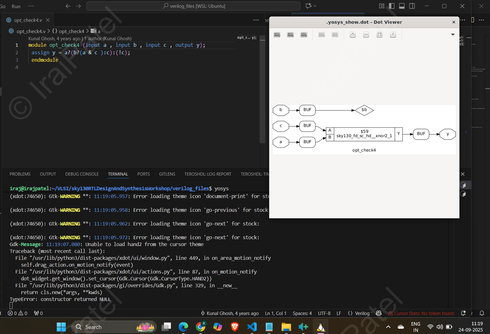

---

📌 **Case 2 – multiple\_module\_opt.v**

* ⚡ Before optimization → Netlist contained **extra redundant connections**.
* ✂️ After `opt_clean -purge` → Design became **simpler, faster, and easier to read**.

| Stage                      | Netlist Snapshot                                                                          |
| -------------------------- | ----------------------------------------------------------------------------------------- |
| Without `opt_clean -purge` | 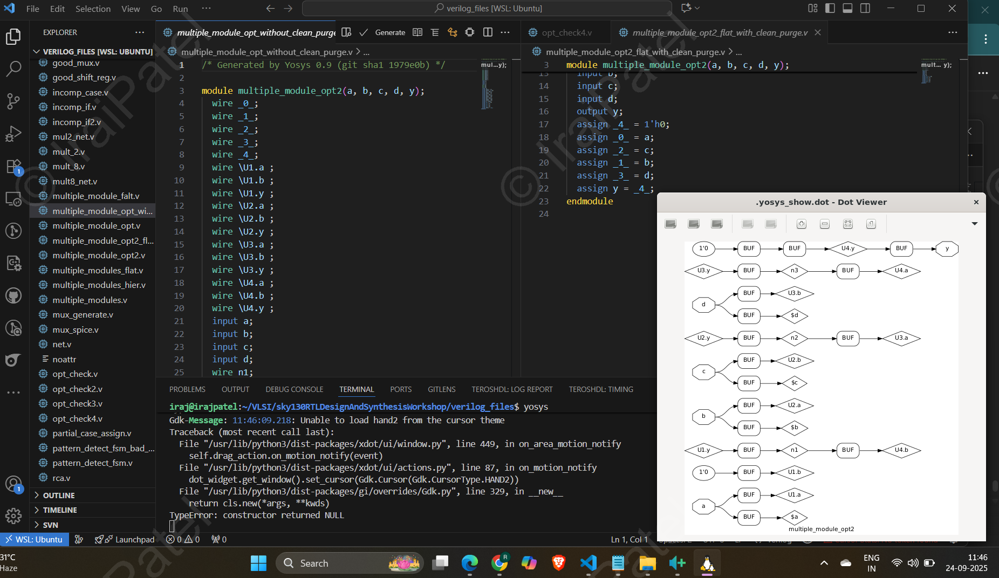 |
| With `opt_clean -purge`    | 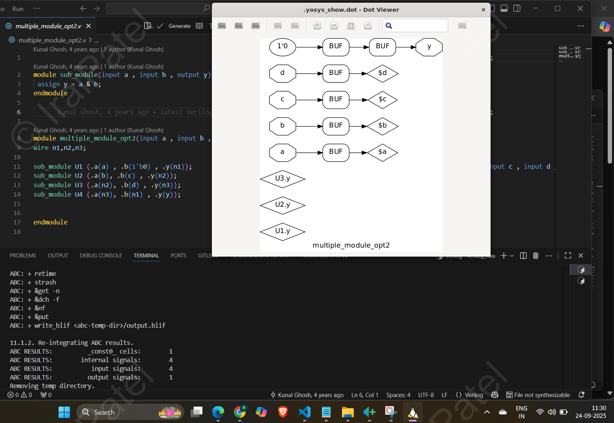                              |

---

## 🧠 Key Takeaways

* 🗑️ `opt_clean -purge` = **Garbage collector** for Yosys netlists.
* 🚦 Removes unused nets, floating signals, and redundant cells.
* 🎯 Leads to **smaller, faster, and easier-to-debug circuits**.
* 🔧 Especially useful when working with **multi-module designs** where intermediate wires are left unused.

---

✨ **In short**:
Think of `opt_clean -purge` as a **vacuum cleaner** for your design.
It sweeps away all the dust (redundant logic) so only the **essential circuitry** remains. 🧹⚡

---

Do you want me to also **explain with a simple mini-Verilog example** (before vs after optimization netlist), so it’s even clearer why the extra nets vanish?


# 🔧 Yosys Synthesis & GLS Flow

## 📜 [`Test_Synth.ys`](codes/Test_Synth.ys) Script Explanation

```tcl
# 1. Load the Sky130 liberty file (contains timing + logic info)
read_liberty -lib ../my_lib/lib/sky130_fd_sc_hd__tt_025C_1v80.lib

# 2. Load your RTL Verilog design
read_verilog mux_generate.v

# 3. Run generic synthesis
synth -top mux_generate

# 4. Flatten hierarchy (optional, removes module hierarchy)
flatten

# 5. Map flip-flops & latches to standard cells
dfflibmap -liberty ../my_lib/lib/sky130_fd_sc_hd__tt_025C_1v80.lib

# 6. Optimize the design by removing redundant logic
opt_clean -purge

# 7. Technology mapping using ABC (maps to Sky130 standard cells)
abc -liberty ../my_lib/lib/sky130_fd_sc_hd__tt_025C_1v80.lib

# 8. Remove unused cells/wires after mapping
clean

# 9. Optional: flatten hierarchy again
flatten

# 10. Write the final gate-level netlist
write_verilog -noattr mux_generate_GLS.v

# 11. Generate a schematic for visualization
show -format png -prefix mux_generate_show
```

---

👍 Run the [synthesis and generate](codes/Test_Synth.ys) the GLS netlist with:

```bash
yosys -s Test_Synth.ys
````

💡 **Tip:** Change the top module or input file in `Test_Synth.ys` to generate GLS for any design you want put this file in verilog_files folder.


# 📌 Task 2 – Constant DFF Mapping & GLS

## 🎯 Objective

Understand how **Yosys handles constant-driven flip-flops** (`const4.v`, `const5.v`) and verify the design with **Icarus Verilog simulation (GLS)**.

---

## ⚙️ Yosys Synthesis Flow

| Step | Command                                                              | Purpose                            |
| ---- | -------------------------------------------------------------------- | ---------------------------------- |
| 1️⃣  | `read_liberty -lib ../my_lib/lib/sky130_fd_sc_hd__tt_025C_1v80.lib`  | Load standard-cell library         |
| 2️⃣  | `read_verilog const4.v`                                              | Read RTL source                    |
| 3️⃣  | `synth -top const4`                                                  | Run synthesis                      |
| 4️⃣  | `dfflibmap -liberty ../my_lib/lib/sky130_fd_sc_hd__tt_025C_1v80.lib` | Map flip-flops to technology cells |
| 5️⃣  | `abc -liberty ../my_lib/lib/sky130_fd_sc_hd__tt_025C_1v80.lib`       | Optimize & tech-map logic          |
| 6️⃣  | `write_verilog const4_net.v`                                         | Save synthesized netlist           |

👉 Same process repeated for **`const5.v`**.

---

## 🖥️ Icarus Verilog GLS Flow

```bash
iverilog const4.v tb_const4.v
./a.out
```

(Similar commands used for `const5.v`).

---

## 📊 Results

📌 **Case 1 – `const4.v`**

* Both **`q` and `q1`** latch a constant `1`.
* Yosys maps this with a **buffer** to maintain the constant-driven path.

✅ Simulation confirms constant outputs:
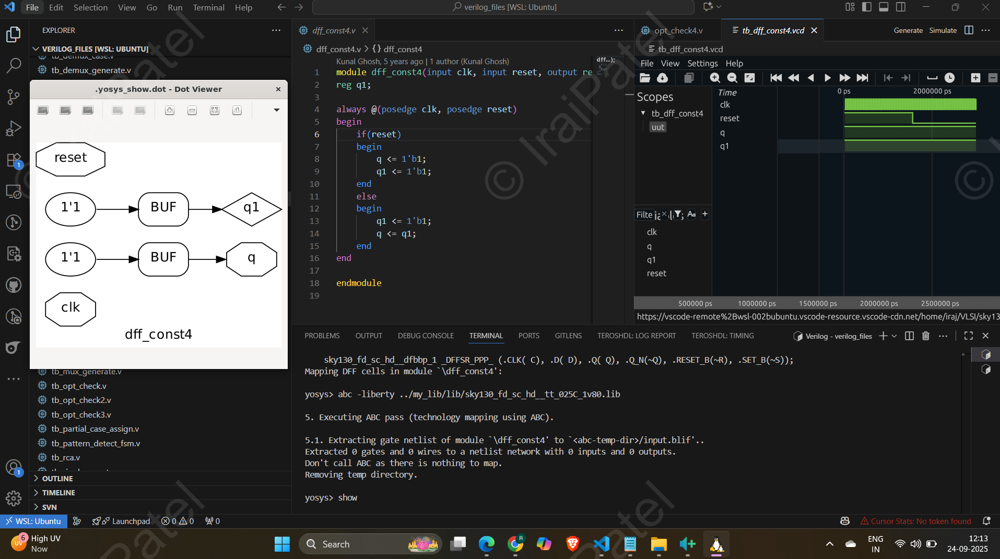

---

📌 **Case 2 – `const5.v`**

* When **reset = 1** → `q = q1 = 0`.
* When **reset = 0** → `q1 = 1` and `q = q1`.
* Yosys synthesis here correctly produces **two separate flip-flops**.

✅ Simulation matches expected reset behavior:
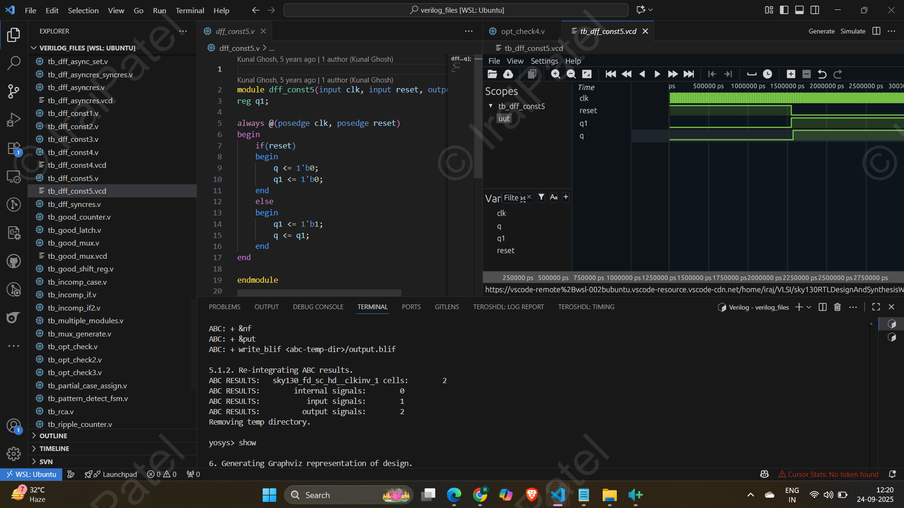

✅ Netlist shows **both DFFs correctly mapped**:
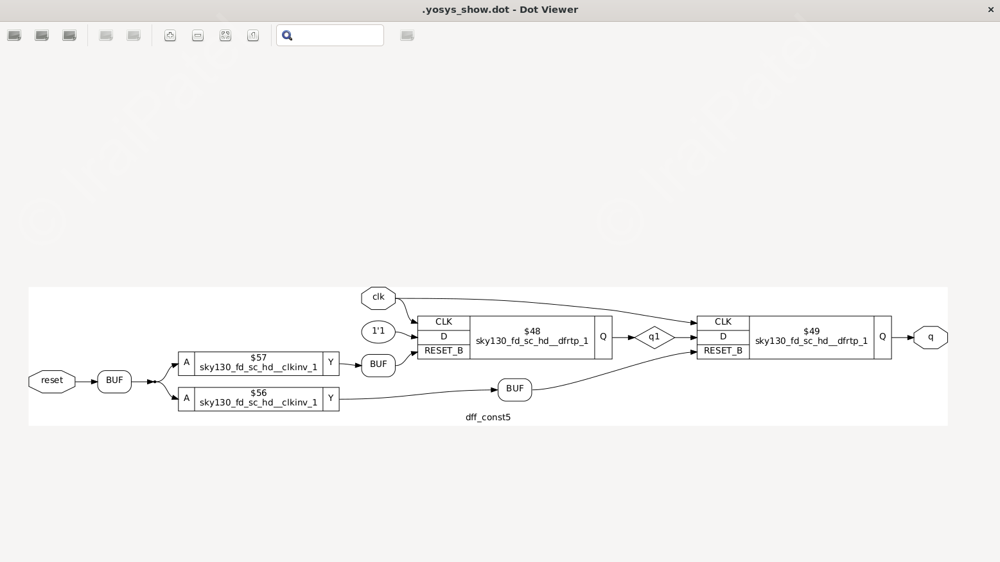

---

## 🧠 Key Learnings

* 🔗 **Constant propagation** works seamlessly in Yosys.
* 🧩 **Buffers may appear** when constants need to drive multiple outputs.
* 🕹️ **Reset handling** ensures flops behave exactly as written in RTL.
* ⏱️ GLS validates **functional correctness**, but **timing is not included** (since `.lib` doesn’t have delay models in this flow).

---

✨ **In short:**
Yosys doesn’t just “blindly” keep flip-flops—
it **optimizes constant values smartly** while still preserving reset-driven logic. Think of it like Yosys deciding:

* *“If a flop is just stuck at `1`, I’ll simplify it.”*
* *“If reset logic matters, I’ll keep the flops intact.”*


Nice 👍 These **Task 3–5 notes** can definitely be made more **engaging, structured, and visually clear**. Let’s transform them into something that feels like a **mini-lab notebook** with clear story flow, tables, and highlights 🚀.

Here’s a polished version:

---

# 📌 Task 3 – MUX Using `for-generate`

## 🛠️ Flow

| Step | Command                                                                                                                           | Purpose                    |
| ---- | --------------------------------------------------------------------------------------------------------------------------------- | -------------------------- |
| 1️⃣  | `yosys -s Test_Synth.ys`                                                                                                          | Run Yosys synthesis script |
| 2️⃣  | `iverilog .../my_lib/verilog_models/primitives.v ../my_lib/verilog_models/sky130_fd_sc_hd.v mux_generate_GLS.v tb_mux_generate.v` | Simulate GLS vs RTL        |

---


# ⚠️ ERROR & Clever Fix 🔧💡

During synthesis, Yosys stumbled on a **non-existent “_D_LATCH_P” latch** 🚫⚡ while mapping, causing simulation failures 😬. To tackle this, I **explored the SkyWater primitive library** 🔍📚 and found a similar latch performing the same function ✅✨.

```verilog
sky130_fd_sc_hd__udp_dlatch$lP _2_ (
    .D(_0_),
    .GATE(1'h1),
    .Q(y)
);
```

🚀 **Result:** The design **simulated flawlessly** 🎯🎉, turning a roadblock into a **hands-on learning experience** 🧠💪.


## 📊 Results

* ✅ **RTL and GLS waveforms match** → proves correctness of design.
* ⚡ **`for-generate` loop instantiates MUXes cleanly**, avoiding repetitive manual code.

📷 Simulation vs GLS:
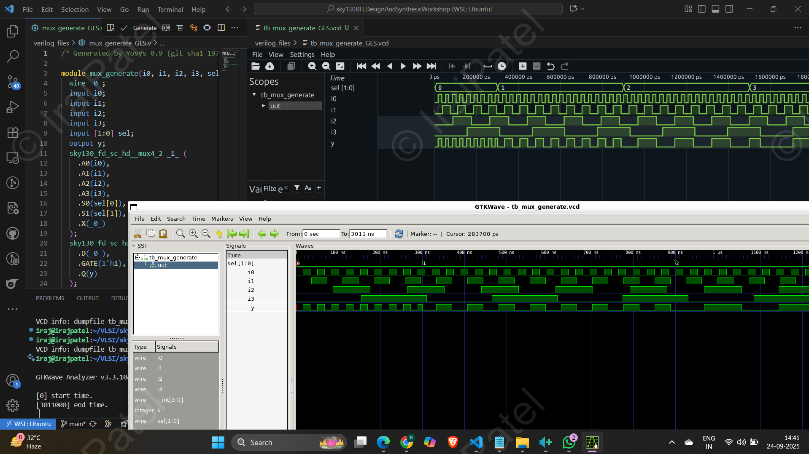


📷 Synthesized Netlist:
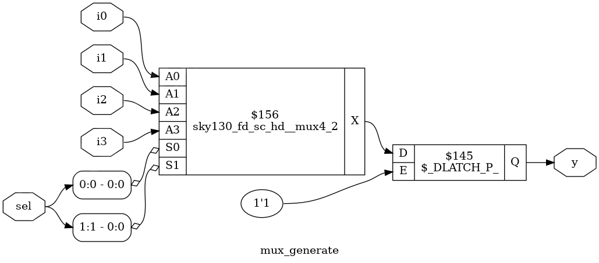

---

## 🎯 Conclusion

* `for-generate` = **scalable hardware construction**.
* Matching RTL & GLS confirms design **structural equivalence**.

---

# 📌 Task 4 – DEMUX Using `generate`

## 🛠️ Flow

* GLS requires including **primitives** + **cell models** during simulation:

```bash
iverilog .../my_lib/verilog_models/primitives.v ../my_lib/verilog_models/sky130_fd_sc_hd.v demux_generate_GLS.v tb_demux_generate.v
```

---

## 📊 Results

* ✅ **RTL and GLS outputs align perfectly**.
* 📐 Confirms that `generate` statements can **scale DEMUX instantiation** without error.

📷 Simulation (GLS vs RTL):
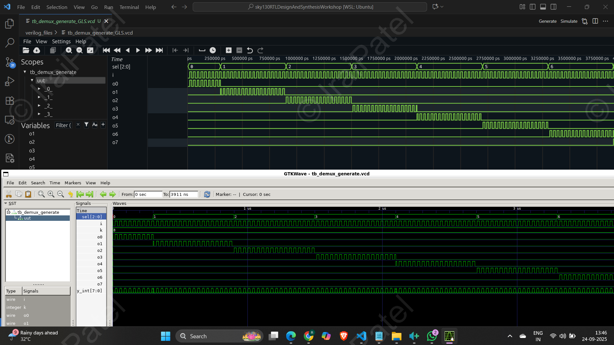

---

## 🎯 Conclusion

* DEMUX behaves correctly in both RTL & GLS.
* `generate` → **cleaner, modular code** while preserving correctness.

---

# 📌 Task 5 – Ripple Carry Adder (RCA)

## 🛠️ Flow

```bash
iverilog .../my_lib/verilog_models/primitives.v ../my_lib/verilog_models/sky130_fd_sc_hd.v rca_GLS.v tb_rca.v
```

---

## 📊 Results

* ✅ **RCA RTL vs GLS simulation matches** → functional correctness maintained.
* 🔧 Yosys synthesis maps RCA into **standard cell adders + carry chain**.

📷 Simulation (GLS + RTL):
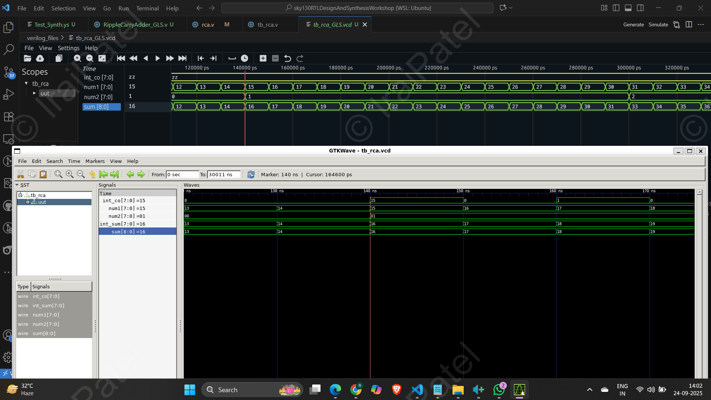

📷 Synthesized Netlist:
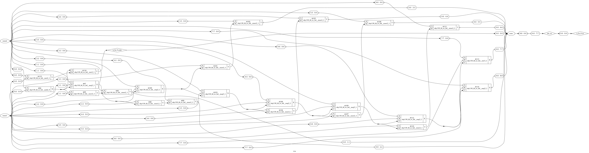

---

## 🎯 Conclusion

* RCA works exactly as expected in both RTL & GLS.
* Confirms **Yosys synthesis of arithmetic circuits** is robust.
---


# 📘 Theory Notes 

---

## 🎭 1. Behavioral Synthesis

| 🔎 What            | 💡 Explanation                                                                                        |
| ------------------ | ----------------------------------------------------------------------------------------------------- |
| **Definition**     | Converts behavioral Verilog (`always`, `if`, `case`) into RTL netlists (muxes, registers, FSMs).      |
| **Why important?** | Bridges the gap between **high-level intent** (what you want) and **actual hardware** (what you get). |

---

## ⏱️ 2. Timing Basics

| Concept                 | Meaning                            | Violation When…                        |
| ----------------------- | ---------------------------------- | -------------------------------------- |
| **Setup Time (Tsetup)** | Data stable **before** clock edge  | Path delay is **too long**             |
| **Hold Time (Thold)**   | Data stable **after** clock edge   | Path delay is **too short**            |
| **Clock Frequency**     | Limited by **critical path delay** | Longest combinational path is too slow |

⚖️ **Cell tradeoff:**

* ⚡ *Fast cells* → better setup, worse hold, more power.
* 🐢 *Slow cells* → better hold, less power, but may fail setup.

---

## 📚 3. Liberty File (`.lib`)

| 🔎 Stores         | 💡 Details                      |
| ----------------- | ------------------------------- |
| **Timing**        | Setup, hold, propagation delays |
| **Power**         | Dynamic & leakage               |
| **Functionality** | Boolean functions, FF types     |

✅ Used for:

* RTL → Gate mapping
* Power/timing estimation
* Flip-flop mapping with `dfflibmap`

---

## 🏗️ 4. Hierarchical vs Flat Synthesis

| Mode             | Description                                         | Best Use                         |
| ---------------- | --------------------------------------------------- | -------------------------------- |
| **Hierarchical** | Keeps module boundaries (`synth -top submodule`)    | When submodules are reused often |
| **Flat**         | Flattens everything into one netlist (`synth_flat`) | For **global optimization**      |

---

## ⚡ 5. Stacked PMOS

* ❌ Stacking increases **resistance**.
* 🚫 Leads to **slower switching** and degraded performance.

---

## 🔧 6. Submodule-Level Synthesis

* Reuse by synthesizing **one module once**:

```tcl
synth -top submodule_name
```

* Future idea: stitch multiple netlists with `hierarchy -libdir`.

---

## 🧩 7. Flip-Flop Mapping Flow

```tcl
read_liberty -lib ../my_lib/lib/sky130_fd_sc_hd__tt_025C_1v80.lib
read_verilog flop.v
synth -top flop
dfflibmap -liberty ../my_lib/lib/sky130_fd_sc_hd__tt_025C_1v80.lib
abc -liberty ../my_lib/lib/sky130_fd_sc_hd__tt_025C_1v80.lib
```

👉 `$dff` → replaced with **real flops from `.lib`**.

---

## 📈 8. Optimization Experiments

| Example                                  | What Yosys Does                                    |
| ---------------------------------------- | -------------------------------------------------- |
| **Multiplier (`mul2.v`, `mult_8.v`)**    | Constant folding, resource sharing, simplification |
| **Constant propagation (`opt_check.v`)** | Removes unused logic/nets                          |

---

## 📝 9. Quick Command Reference

```tcl
# Load cell library
read_liberty -lib ../my_lib/lib/sky130_fd_sc_hd__tt_025C_1v80.lib

# Read design
read_verilog design.v

# Run synthesis
synth -top design

# Map flops
dfflibmap -liberty ../my_lib/lib/sky130_fd_sc_hd__tt_025C_1v80.lib

# Optimize
abc -liberty ../my_lib/lib/sky130_fd_sc_hd__tt_025C_1v80.lib
opt_clean -purge
```

---

## ⏱️ Why Gate-Level Simulation (GLS)?

| Aspect           | Explanation                                        |
| ---------------- | -------------------------------------------------- |
| **Purpose**      | Confirms **RTL vs Netlist functional match**       |
| **Timing Check** | If delays exist, validates setup/hold              |
| **Why needed**   | RTL sim = *intent*, GLS sim = *real gates & flops* |
| **Without GLS**  | Risk of sim–synth mismatch 🛑                      |

---

## ⚡ Latch Inference & Sensitivity Issues

### Example 1 – Two Flops

```verilog
always @(*) begin
  q = q0;
  q0 = d;
end
```

| Step                | Explanation                               |
| ------------------- | ----------------------------------------- |
| **Execution order** | `q` sees **old** `q0` → then `q0` updates |
| **Effect**          | `q` lags by 1 cycle                       |
| **Synthesis**       | Needs storage for both → **2 flops**      |

---

### Example 2 – One Flop

```verilog
always @(*) begin
  q0 = d;
  q  = q0;
end
```

| Step                | Explanation                             |
| ------------------- | --------------------------------------- |
| **Execution order** | `q0` updates first → `q` uses new value |
| **Effect**          | No lag, only one flop needed            |
| **Result**          | ✅ One flop total                        |

👉 Rule of Thumb:

* `=` (blocking) → sequential dependency
* `<=` (non-blocking) → parallel updates

---

## ⚠️ Blocking Caveat

```verilog
always @(*) begin
  d = x & c;
  x = a | b;
end
```

| View         | What Happens                  |          |
| ------------ | ----------------------------- | -------- |
| **RTL sim**  | `d` uses **old x**, mismatch  |          |
| **Synth**    | Tools optimize → \`d = (a     | b) & c\` |
| **Mismatch** | Yes → sim ≠ hardware          |          |
| **Fix**      | Use `<=` or reorder carefully |          |

---

## 🔄 Incomplete `if` / `case` → Latch

```verilog
case(sel)
  2'b00: y = i0;
  2'b01: y = i1;
  // Missing others
endcase
```

| Problem            | Why                                       |
| ------------------ | ----------------------------------------- |
| Missing assignment | `y` not updated → must remember old value |
| Hardware fix       | Synthesis infers a **latch**              |
| Issue              | Latches = level-sensitive, cause hazards  |
| Fix                | Cover all cases OR add `default`          |

✅ Corrected:

```verilog
case(sel)
  2'b00: y = i0;
  2'b01: y = i1;
  2'b10: y = i2;
  2'b11: y = i3;
  default: y = 0;
endcase
```

---

## 📝 Key Lessons (Quick Recap)

| Concept            | Bad Practice                     | Correct Practice                         |
| ------------------ | -------------------------------- | ---------------------------------------- |
| Blocking assigns   | `q = q0; q0 = d;` (lag, 2 flops) | Use `<=` or reorder                      |
| Non-blocking       | —                                | `q0 <= d; q <= q0;` (parallel)           |
| Incomplete case/if | Leads to latch                   | Always add `default`                     |
| GLS                | Ignored                          | Always run GLS to confirm RTL = hardware |

---


