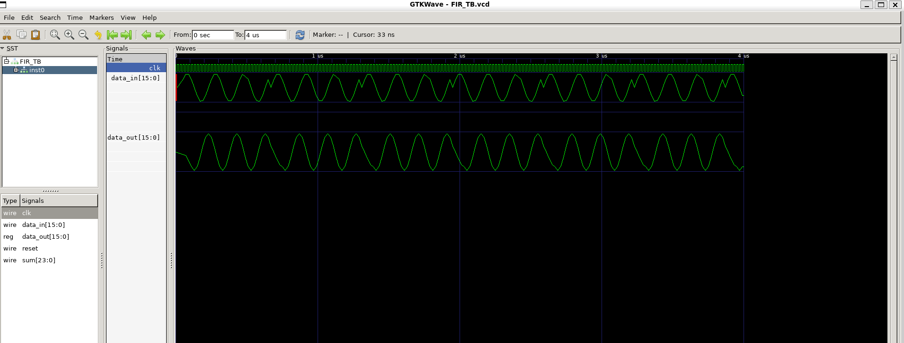

# 🎶 FIR Filter Design & Validation

This project implements a **4-tap Moving Average FIR Filter**, showcasing the **implementation of knowledge gained in Week 1**. It is verified through **RTL simulation**, **Yosys synthesis**, and **Gate-Level Simulation (GLS)** using the **Sky130 standard cell library**, demonstrating the end-to-end flow from design to hardware-ready verification.

---

## 🧮 FIR Filter Design

### 🔹 Key Parameters

* **Input/Output width:** 16-bit signed
* **Taps (filter order):** 4
* **Coefficient value:** `1/4` → scaled by `128` = `32`
* **Implementation:** Multiply-Accumulate (MAC) with shift-register delay line

### 🔹 Working Principle

1. **Delay Line** → past 3 input samples stored using D-FFs.
2. **MAC Unit** → multiplies each sample with coefficient (`32`) and sums them up.
3. **Scaling** → result shifted right by `7` bits (`log2(128)`) to restore correct range.

Effectively, the output is the **average of the last 4 input samples**, smoothing the signal.

---

## ⚡ Design Flow

### 1️⃣ RTL Simulation (Behavioral Check)

Run directly on `FIR_Filters.v` with testbench `FIR_TB.v`.
Validates **functionality** (filter output matches moving average).

```sh
iverilog FIR_Filters.v FIR_TB.v
./a.out
gtkwave dump.vcd
```

---

### 2️⃣ Yosys Synthesis

Your synthesis script `Test_synth.ys` maps the design to **Sky130 standard cells**.

**Example flow:**

```tcl
read_liberty -lib ../../my_lib/sky130_fd_sc_hd__tt_025C_1v80.lib
read_verilog FIR_Filters.v
synth -top FIR_Filters
abc -liberty ../../my_lib/sky130_fd_sc_hd__tt_025C_1v80.lib
write_verilog FIR_Filters_GLS.v
show
```

This produces the synthesized **gate-level netlist** `FIR_Filters_GLS.v`.

---

### 3️⃣ Gate Level Simulation (GLS)

To run GLS, include **primitives** + **Sky130 standard cells** + **GLS netlist** + **testbench**:

```sh
iverilog ../../my_lib/verilog_model/primitives.v \
         ../../my_lib/verilog_model/sky130_fd_sc_hd.v \
         FIR_Filters_GLS.v FIR_TB.v
./a.out
gtkwave dump.vcd
```

This ensures post-synthesis netlist behaves **identically** to RTL.

---


| Stage                                         | Output                                                                       |
| --------------------------------------------- | ---------------------------------------------------------------------------- |
| **Yosys Netlist View**                        |                |
| **RTL Simulation** (behavioral filter output) |                       |
| **GLS Simulation** (post-synthesis output)    |  |

---

## 🚀 Key Takeaways

* **RTL Simulation** ✅ verifies the algorithm.
* **Synthesis with Yosys** 🔧 maps design to Sky130 cells.
* **GLS Simulation** 🔍 validates correctness **after synthesis**, ensuring **design intent = real hardware**.

By validating at both RTL and GLS levels, we confirm that the **moving average FIR filter** works consistently from **high-level Verilog to gate-level hardware implementation**.

##  🔮 Future Work
| 🔮 Future Work | 🚀 Description                                                             |
| -------------- | -------------------------------------------------------------------------- |
| **DFT**        | Analyze signal frequency components with **Discrete Fourier Transform**.   |
| **FFT**        | Enable fast, real-time spectral analysis using **Fast Fourier Transform**. |


