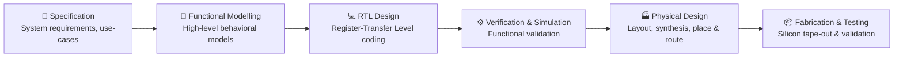
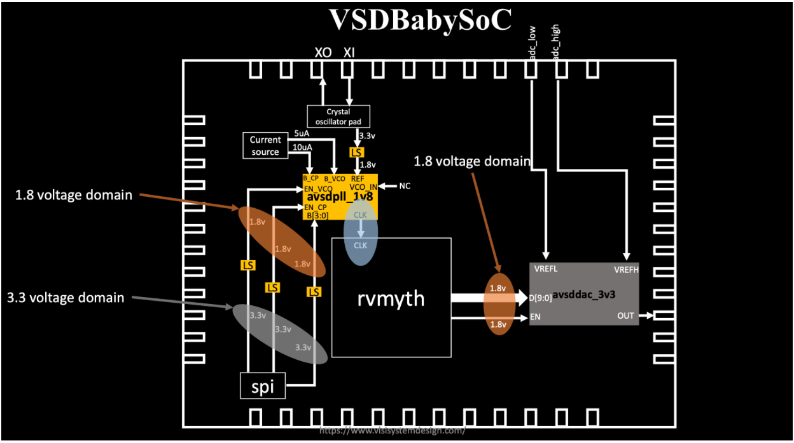

# 🌟 System-on-Chip (SoC) Design Basics


## 🧐 What is a System-on-Chip (SoC)?  

⚡ **A System-on-Chip (SoC) is essentially an entire computer integrated into a single silicon chip.**  
It brings together **CPU, memory, I/O interfaces, GPU, DSP, power management, and connectivity modules** into one highly optimized package.  

### 🎯 Why SoCs?  
- 📦 **Compactness** → Perfect for mobile & embedded devices  
- 🔋 **Energy Efficiency** → Extends battery life in wearables, IoT, smartphones  
- ⚡ **High Performance** → Reduced latency with on-chip communication  
- 💰 **Cost-Effective** → One chip instead of multiple discrete components  

---

## 🧩 Core Components of an SoC  

| 🔧 Tools | 📝 Role in the System |
|--------------|-----------------------|
| 🖥 **CPU** | General-purpose processing & control logic |
| 💾 **Memory (RAM/ROM/Flash)** | Stores instructions and runtime data |
| 🔌 **I/O Interfaces** | Bridges external peripherals (USB, Camera, Sensors) |
| 🎮 **GPU** | Handles rendering, imaging, and parallel workloads |
| 🎵 **DSP** | Optimized for real-time signal and multimedia processing |
| 🔋 **Power Management** | Ensures low-power operation and thermal balance |
| 📡 **Connectivity** | Supports Wi-Fi, Bluetooth, 5G, and secure data transfer |

💡 **Analogy**: Think of an SoC as a **self-sustaining smart city 🏙️**:  
- CPU = City Hall (decision-making)  
- Memory = Library (knowledge storage)  
- I/O = Roads & Highways (transportation)  
- GPU = Art District (visual creativity)  
- DSP = Concert Hall (sound & signals)  
- Power Mgmt. = Power Station (energy supply)  
- Connectivity = Airport/Ports (global communication)  

---

## 🔥 Types of SoCs  

- 🔧 **Microcontroller-based SoC** → Small-scale, low-power control (IoT nodes, appliances)  
- ⚡ **Microprocessor-based SoC** → Runs OS, multitasking (smartphones, tablets)  
- 🎯 **Application-Specific SoC (ASIC SoC)** → Domain-optimized (AI accelerators, automotive, networking)  

---

## 🌀 The SoC Design Flow  



---
SoCs represent the **convergence of hardware and system intelligence on a single die**, enabling the modern era of **smartphones, wearables, AI accelerators, and IoT devices**.  

## 👶⚡ VSDBabySoC – A Tiny but Powerful RISC-V SoC  

---

## 🌟 Introduction  

In the world of chip design, even the simplest SoC can teach us **how digital and analog domains come together on silicon**.  
**VSDBabySoC** is one such platform — a **compact educational SoC** that integrates three key blocks:  

- 🧠 **RVMYTH Core** – a lightweight RISC-V CPU  
- ⏱️ **8× PLL** – stable clock generation  
- 🎚 **10-bit DAC** – digital-to-analog interface  

👉 The mission: **test open-source IPs in combination** and **demonstrate digital-to-analog control** on Sky130 technology.  

  

---

## 🧩 What Makes Up VSDBabySoC?  

At its heart, VSDBabySoC is a **mini-System-on-Chip**:  

1. **RVMYTH (RISC-V CPU Core)** 🧠  
   - Fetches & executes instructions.  
   - Drives output data through register `r17`.  

2. **Phase-Locked Loop (PLL)** ⏱️  
   - Generates a clean, stable internal clock from an input source.  

3. **Digital-to-Analog Converter (DAC)** 🎚  
   - Takes the 10-bit value from the CPU (`r17`) and outputs a proportional analog voltage.  

💡 **Concept:**  
Think of the CPU as the **brain**, the PLL as the **heartbeat**, and the DAC as the **voice** — all working together to make the chip “speak” in analog.  

---


## 📂 Project Structure

```txt
VSDBabySoC/
├── src/
│   ├── include/      # Header files (*.vh)
│   ├── module/       # Verilog + TLV modules
│   │   ├── vsdbabysoc.v   # Top-level module
│   │   ├── rvmyth.v       # CPU
│   │   ├── avsdpll.v      # PLL
│   │   ├── avsddac.v      # DAC
│   │   └── testbench.v    # Testbench
└── output/           # Simulation outputs
```

---

## 🛠️ Setup
### 📥 Cloning the Project

```bash
cd ~/VLSI
git clone https://github.com/manili/VSDBabySoC.git
cd VSDBabySoC/
```

📂 You’ll see:

* `src/` (modules)
* `images/` (visuals)
* `output/` (simulation results)

---

## 🔧 TLV → Verilog Conversion

Since **RVMYTH** is written in **TL-Verilog (.tlv)**, we need to convert it to Verilog before simulating.

```bash
# Install tools
sudo apt update
sudo apt install python3-venv python3-pip

# Create virtual env
python3 -m venv sp_env
source sp_env/bin/activate

# Install SandPiper-SaaS
pip install pyyaml click sandpiper-saas

# Convert TLV → Verilog
sandpiper-saas -i ./src/module/*.tlv -o rvmyth.v --bestsv --noline -p verilog --outdir ./src/module/
```

✅ Now you’ll have `rvmyth.v` alongside your other Verilog files.

---

## 🧪 Simulation Flow

### 🔹 Pre-Synthesis Simulation

```bash
mkdir -p output/pre_synth_sim

iverilog -o output/pre_synth_sim/pre_synth_sim.out \
  -DPRE_SYNTH_SIM \
  -I src/include -I src/module \
  src/module/testbench.v

cd output/pre_synth_sim
./pre_synth_sim.out
```

📊 View in GTKWave:

```bash
gtkwave output/pre_synth_sim/pre_synth_sim.vcd
```

### 🔍 Signals to Observe

* ⏱️ **CLK** → Input clock (from PLL)
* 🔄 **reset** → Reset signal
* 🎚 **OUT (DAC)** → Output from DAC (appears digital in sim)
* 🔢 **RV_TO_DAC[9:0]** → 10-bit RVMYTH output → DAC input

---
### 🧠 The Instruction Program Driving BabySoC  

1. Increment counters,
2. Accumulate values into `r17`,
3. Oscillate them to generate analog waveforms,
4. Hold in a final loop.

| #  | Instruction         | Action                  |
| -- | ------------------- | ----------------------- |
| 0  | `ADDI r9, r0, 1`    | r9 = 1 (decrement step) |
| 1  | `ADDI r10, r0, 43`  | r10 = 43 (loop limit)   |
| 2  | `ADDI r11, r0, 0`   | r11 = 0 (counter)       |
| 3  | `ADDI r17, r0, 0`   | r17 = 0 (DAC input)     |
| 4  | `ADD r17, r17, r11` | Accumulate into r17     |
| 5  | `ADDI r11, r11, 1`  | Increment counter       |
| 6  | `BNE r11, r10, -4`  | Repeat until r11=43     |
| 7  | `ADD r17, r17, r11` | r17 += r11              |
| 8  | `SUB r17, r17, r11` | r17 -= r11              |
| 9  | `SUB r11, r11, r9`  | r11--                   |
| 10 | `BNE r11, r9, -4`   | Loop until r11=1        |
| 11 | `SUB r17, r17, r11` | Final adjust            |
| 12 | `BEQ r0, r0, ...`   | Infinite loop           |

---

## 🔄 Execution Timeline

| Phase                   | Registers  | r17 Value          | Behavior           |
| ----------------------- | ---------- | ------------------ | ------------------ |
| **Ramp (Loop1)**        | r11 = 0→42 | r17 = Σ0..42 = 903 | Monotonic increase |
| **Peak**                | r11 = 43   | r17 = 946          | Transient maximum  |
| **Oscillation (Loop2)** | r11 = 43→1 | r17 = 903 ± r11    | Oscillating decay  |
| **Final**               | r11 = 1    | r17 adjusted       | Holds steady       |

---

**Data Flow:**
Instruction Memory → CPU Pipeline → Register r17 → DAC → Analog OUT

---


## 📈 Pre_synth_sim Waveform


### ⚖️ Numerics for DAC Conversion

#### Scaling:
$$
V_{OUT} = \frac{r_{17}}{1023} \times V_{REF\_SPAN} \quad (\text{with } V_{REF\_SPAN} = 1.0\ \text{V})
$$

#### For **r17 = 903**:
$$
V_{OUT} = \frac{903}{1023} \times 1.0 = 0.88221\ \text{V}
$$

#### For the peak **r17 = 946**:
$$
V_{OUT} = \frac{946}{1023} \times 1.0 = 0.92502\ \text{V}
$$

#### 📊 Example Output Values (VREF = 1.0 V)

| r17 Value | DAC Output Voltage |
|-----------|------------------|
| 903       | 0.882 V          |
| 946 (peak)| 0.925 V          |


👉 Switch `OUT` format → **Analog Step** in GTKWave for DAC output visualization.

---

## 🛠️ Troubleshooting

* ⚠️ **Module Redefinition** → Ensure files are included only once.
* 🛤 **Path Issues** → Use absolute paths if relative ones fail.
* ⏱️ **Waveform Mismatch** → Verify proper GTKWave format selection.

---

