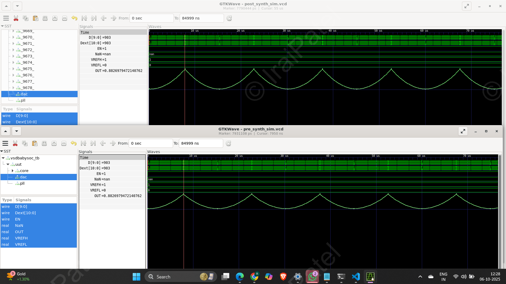
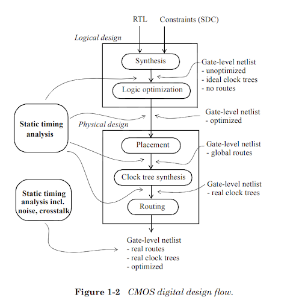
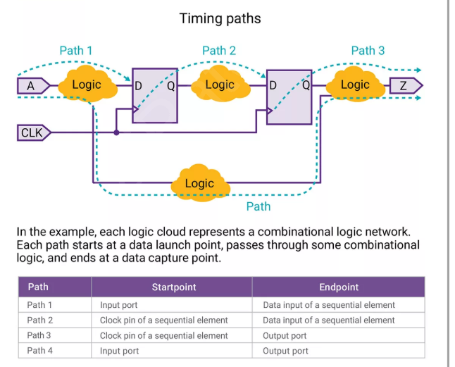
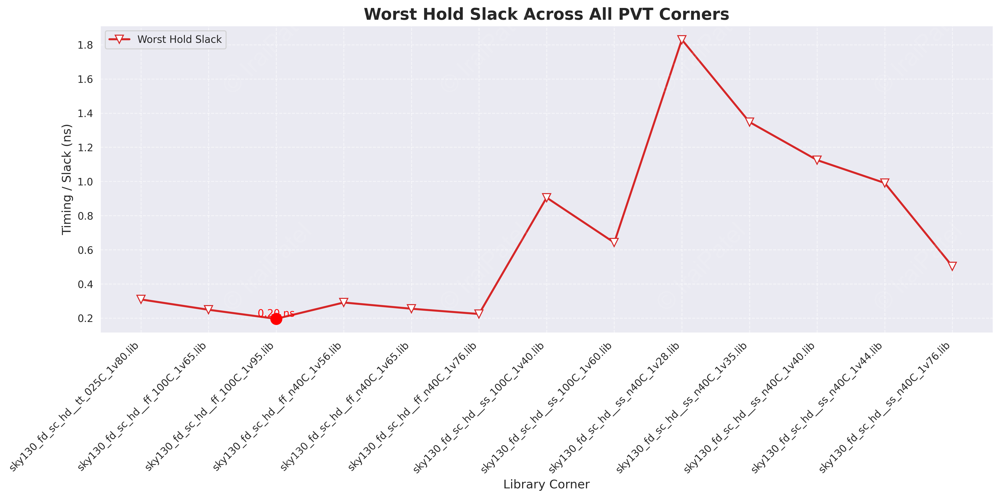
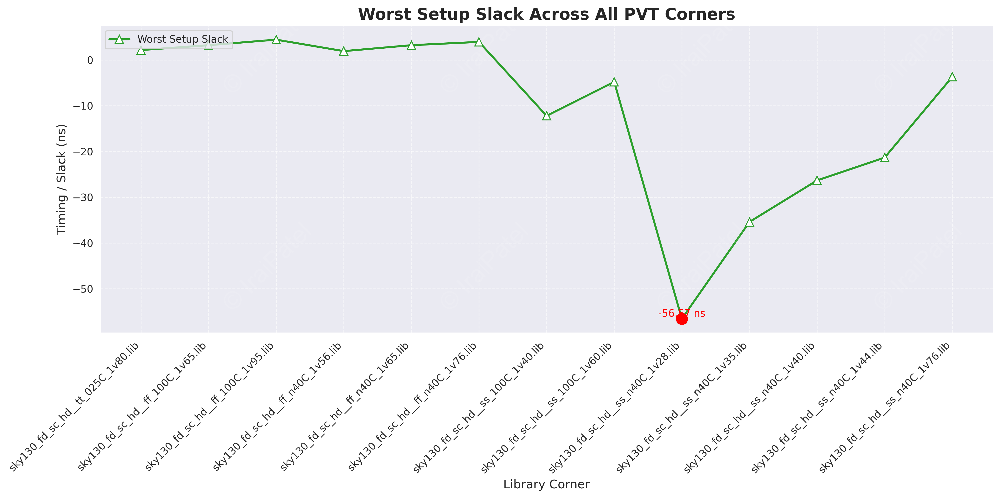
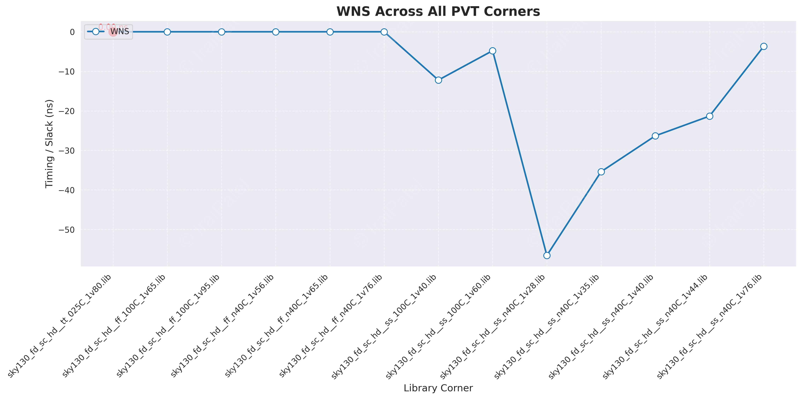
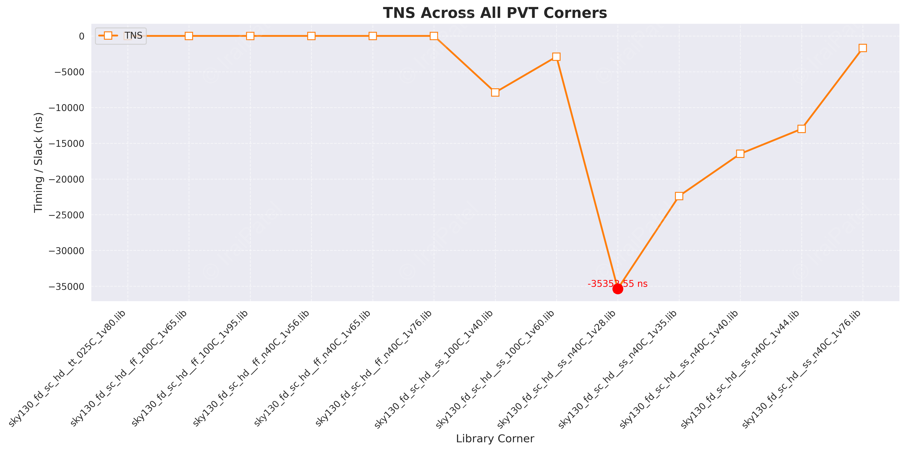
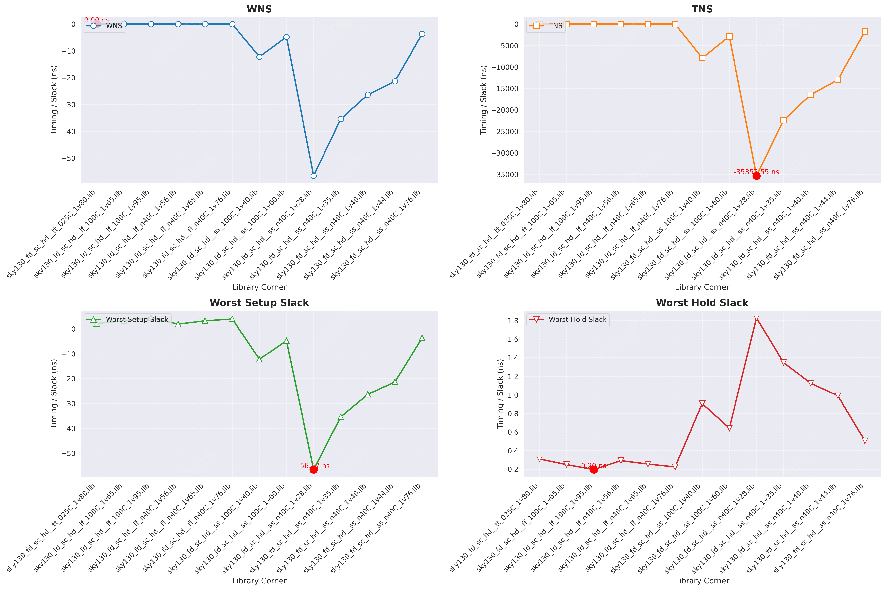

<h1 align="center"> Gate-Level Simulation (GLS) of BabySoC ⚡️</h1>
<p align="center">
  🧩 <b>Post-Synthesis Functional Verification</b> using <b>Yosys</b>, <b>Icarus Verilog</b>, and <b>GTKWave</b>  
</p>

<p align="center">
  
  
  
</p>

---

## 🎯 Purpose of GLS

Gate-Level Simulation (**GLS**) verifies the functionality of a design **after synthesis**.
Unlike RTL simulation, GLS runs on a **gate-level netlist**, incorporating real gate delays and mapped cells to ensure **timing accuracy** and **functional consistency**.

| 🧠 Aspect                        | 💡 Description                                                                                    |
| :------------------------------- | :------------------------------------------------------------------------------------------------ |
| 🕒 **Timing Verification**       | Uses **SDF** (Standard Delay Format) to validate setup/hold timing and propagation delays.        |
| ✅ **Functional Validation**      | Ensures logical correctness after synthesis and technology mapping.                               |
| ⚙️ **Tools Used**                | **Yosys**, **Icarus Verilog**, **GTKWave**                                                        |
| 🧩 **Why Important for BabySoC** | Confirms correct operation of integrated modules like **RISC-V processor**, **PLL**, and **DAC**. |

---

<details open>
<summary><b>🏗️ Yosys Synthesis & Netlist Generation Flow</b></summary>

### ⚙️ Step 1: Load Standard Cell Libraries

```bash
read_liberty -lib /home/iraj/VLSI/VSDBabySoC/src/lib/avsdpll.lib        # PLL cell library
read_liberty -lib /home/iraj/VLSI/VSDBabySoC/src/lib/avsddac.lib        # DAC cell library
read_liberty -lib /home/iraj/VLSI/VSDBabySoC/src/lib/sky130_fd_sc_hd__tt_025C_1v80.lib  # Sky130 standard cell library
```

### 🧠 Step 2: Read Verilog Design Files

```bash
# Top-level SoC module
read_verilog /home/iraj/VLSI/VSDBabySoC/src/module/vsdbabysoc.v

# CPU core (RISC-V Myth)
read_verilog -I /home/iraj/VLSI/VSDBabySoC/src/include /home/iraj/VLSI/VSDBabySoC/src/module/rvmyth.v

# Clock gating module
read_verilog -I /home/iraj/VLSI/VSDBabySoC/src/include /home/iraj/VLSI/VSDBabySoC/src/module/clk_gate.v
```

### 🧮 Step 3: Synthesis

```bash
synth -top vsdbabysoc
dfflibmap -liberty /home/iraj/VLSI/VSDBabySoC/src/lib/sky130_fd_sc_hd__tt_025C_1v80.lib
opt
```

### ⚡ Step 4: Technology Mapping using ABC

```bash
abc -liberty /home/iraj/VLSI/VSDBabySoC/src/lib/sky130_fd_sc_hd__tt_025C_1v80.lib
```

> 🧩 Performs logic optimization and maps design to Sky130 standard cells.

### 🧹 Step 5: Post-Processing

```bash
flatten
setundef -zero
clean -purge
rename -enumerate
```

### 🧾 Step 6: Reporting and Writing Output

```bash
stat
write_verilog -noattr /home/iraj/VLSI/VSDBabySoC/output/post_synth_sim/vsdbabysoc.synth.v
```

✅ **Result:** `vsdbabysoc.synth.v` generated successfully — ready for Gate-Level Simulation.

| 🔢 Stage             | 📝 Description                                          |
| :------------------- | :------------------------------------------------------ |
| 🧱 **Flatten**       | Converts hierarchical design into single-level netlist. |
| 🧹 **Clean**         | Removes unused/dangling nets and logic.                 |
| 📊 **Stat**          | Reports cell count, area, and hierarchy.                |
| 💾 **Write Netlist** | Saves final synthesized Verilog for simulation.         |

📸 **Snapshots:**

* 🧩 *Design Hierarchy:* 
* ⚙️ *After ABC Mapping:* 
* 📊 *Module Stats:* , , 

</details>

---

<details open>
<summary><b>🧪 Post-Synthesis Simulation Flow</b></summary>

| ⚙️ Step                | 🧾 Command                                                                                                                                                                                                                                                                                | 💬 Description                                         |
| :--------------------- | :---------------------------------------------------------------------------------------------------------------------------------------------------------------------------------------------------------------------------------------------------------------------------------------- | :----------------------------------------------------- |
| **1️⃣ Compile**        | `iverilog -o /home/iraj/VLSI/VSDBabySoC/output/post_synth_sim/post_synth_sim.out -DPOST_SYNTH_SIM -DFUNCTIONAL -DUNIT_DELAY=#1 -I /home/iraj/VLSI/VSDBabySoC/output/src/include -I /home/iraj/VLSI/VSDBabySoC/output/src/module /home/iraj/VLSI/VSDBabySoC/output/src/module/testbench.v` | Compiles testbench with synthesized gate-level design. |
| **2️⃣ Navigate**       | `cd /home/iraj/VLSI/VSDBabySoC/output/post_synth_sim/`                                                                                                                                                                                                                                    | Go to simulation directory.                            |
| **3️⃣ Run Simulation** | `./post_synth_sim.out`                                                                                                                                                                                                                                                                    | Executes the compiled simulation binary.               |
| **4️⃣ View Waveforms** | `gtkwave post_synth_sim.vcd`                                                                                                                                                                                                                                                              | Opens simulation waveforms in GTKWave.                 |

</details>

---

## 📊 Pre vs Post Synthesis Comparison

| 🧠 Simulation Type         | 🔍 Level   | 🎯 Purpose                              | 📁 Output            |
| :------------------------- | :--------- | :-------------------------------------- | :------------------- |
| 🌿 **Pre-Synthesis (RTL)** | Behavioral | Functional check before synthesis       | `pre_synth_sim.vcd`  |
| ⚡ **Post-Synthesis (GLS)** | Structural | Checks real gate-level timing and logic | `post_synth_sim.vcd` |

📈 **Waveform Comparison:**


---


<p align="center">
  💡 <b>Conclusion:</b> Gate-Level Simulation ensures BabySoC’s synthesized design meets both functional and timing specifications before tape-out.<br>
  🧮 Verified Logic • 🕒 Accurate Timing • ⚙️ Real Hardware Behavior
</p>

---

# ⏱️ Timing Graphs using **OpenSTA**

---

## 🧩 Introduction

**Static Timing Analysis (STA)** is a key technique used to verify the timing of digital designs **without requiring simulation vectors**.  
Unlike **timing simulation**, STA analyzes all possible timing paths statically, ensuring the design meets setup and hold time constraints across all conditions.

📊 **Comparison Overview**

| Method | Depends on Input Data | Type | Purpose |
|:-------|:---------------------:|:----:|:---------|
| **Static Timing Analysis** | ❌ No | Deterministic | Fast and exhaustive timing verification |
| **Timing Simulation** | ✅ Yes | Dynamic | Validates timing *and* functionality |

---

## 🏗️ STA in CMOS Design Flow

Timing verification can occur at multiple design stages.  
Below shows a typical **CMOS digital design flow**.

<p align="center">
  
</p>

---

## ⚙️ What is **OpenSTA**?

**OpenSTA** is an **open-source static timing analyzer** that verifies **timing performance at gate-level** using timing constraints and library data.  
It uses a **TCL interface** for design reading, constraint definition, and reporting.

<p align="center">
  
</p>

---

## 📥 Input Files

| File Type | Description |
|:-----------|:-------------|
| `*.v` | Gate-level Verilog Netlist |
| `*.lib` | Liberty Timing Libraries |
| `*.sdc` | Synopsys Design Constraints |
| `*.sdf` | Annotated Delay File *(optional)* |
| `*.spef` | RC Parasitic Extraction |
| `*.vcd` / `*.saif` | Switching Activity for Power Analysis |

---

## ⏰ Clock Modeling Features

- 🧮 **Generated Clocks:** Derived from base clocks  
- 🕒 **Latency & Source Latency:** Clock propagation and insertion delays  
- ⚖️ **Uncertainty:** Models jitter/skew margins  
- 🔄 **Propagated vs. Ideal:** Realistic or ideal clock tree  
- 🚦 **Gated Clock Checks:** Verifies conditional enable clocks  
- 🧭 **Multi-Frequency Domains:** Handles multiple asynchronous clocks  

---

## 🧩 Exception Paths

Refines timing to account for **real behavior**:

| Command | Description |
|:----------|:-------------|
| `set_false_path` | Ignores invalid or unused functional paths |
| `set_multicycle_path` | Allows multiple clock cycles |
| `set_max_delay` / `set_min_delay` | Defines custom path delays |

---

## 📐 Delay Calculation

- ⚡ **Dartu/Menezes/Pileggi Algorithm** — models RC networks using effective capacitance for realistic gate/net delays.  
- 🧰 **External Delay Calculator API** — allows integration of layout or temperature-aware delay models.

---

Got it ✅ — your document is already well-structured and technically correct, but there are a few **minor syntax and markdown fixes** needed (extra backticks, spacing, and a small formatting issue).
Here’s the **corrected and polished version** with syntax consistency maintained:

---

## 🧾 Timing Analysis & Reporting

**OpenSTA** provides powerful commands for timing evaluation:

```tcl
report_checks -from [get_pins U1/Q] -to [get_pins U2/D]
```

Reports setup/hold violations and detailed path timing data.

---

## 🔗 Timing Paths

A **timing path** is the route a signal takes through the design — from source to destination — including both combinational and sequential elements.

| Path Type           | Description                     |
| :------------------ | :------------------------------ |
| Input → Register    | Input captured into a register  |
| Register → Register | Data transfer between registers |
| Register → Output   | Registered output path          |
| Input → Output      | Pure combinational path         |

<p align="center">
  
</p>

---

## 📉 Setup and Hold Checks

| Type           | Meaning                                    | Violation Cause        |
| :------------- | :----------------------------------------- | :--------------------- |
| **Setup Time** | Data must be stable *before* clock edge    | Data arrives too late  |
| **Hold Time**  | Data must remain stable *after* clock edge | Data changes too early |

✅ Proper setup/hold ensures reliable storage in sequential elements and prevents metastability.

---

## 🧮 Slack Calculation

Slack quantifies timing margin.

> **Setup Slack** = Data Required Time − Data Arrival Time
> **Hold Slack** = Data Arrival Time − Data Required Time

| Slack Type         | Interpretation                    |
| :----------------- | :-------------------------------- |
| **Positive Slack** | Design meets timing (safe margin) |
| **Zero Slack**     | Critical path (operating limit)   |
| **Negative Slack** | Timing violation (failure)        |

---

## 🧠 Key Concepts

| Term                   | Meaning                                                    |
| :--------------------- | :--------------------------------------------------------- |
| **Data Arrival Time**  | Time taken for signal to travel from source to destination |
| **Data Required Time** | Time for the clock to propagate through the clock path     |
| **Slack**              | Difference between expected and actual arrival times       |

---

## 🧾 Common SDC Constraints

SDC defines **timing, environment, and power requirements** of a design.

| Category                 | Example Commands                                                             |
| :----------------------- | :--------------------------------------------------------------------------- |
| **Operating Conditions** | `set_operating_conditions`                                                   |
| **Wire-load Models**     | `set_wire_load_mode`, `set_wire_load_model`, `set_wire_load_selection_group` |
| **Environmental**        | `set_drive`, `set_driving_cell`, `set_load`, `set_input_transition`          |
| **Design Rules**         | `set_max_capacitance`, `set_max_fanout`, `set_max_transition`                |
| **Timing**               | `create_clock`, `set_clock_latency`, `set_input_delay`, `set_output_delay`   |
| **Exceptions**           | `set_false_path`, `set_multicycle_path`, `set_max_delay`                     |
| **Power**                | `set_max_dynamic_power`, `set_max_leakage_power`                             |

---

## 🧭 Summary

OpenSTA enables efficient **post-synthesis timing verification** by:

* Ensuring design meets **setup/hold timing** across all paths
* Supporting **complex clock models** and **multi-cycle exceptions**
* Allowing flexible **delay calculation** and **constraint definition**

---

<p align="center">
  
</p>

> 📘 *Static Timing Analysis ensures your design performs reliably at its target clock frequency.*

---

## 🧩 Installation of OpenSTA

**Reference:** For full documentation, follow this link —
🔗 [OpenSTA Guide (spatha_vsd-hdp)](https://github.com/spatha0011/spatha_vsd-hdp/blob/main/Day7/README.md#installation-of-opensta)

---

### **1️⃣ Clone the Repository**

```bash
git clone https://github.com/parallaxsw/OpenSTA.git
cd OpenSTA
```

### **2️⃣ Build the Docker Image**

```bash
docker build --file Dockerfile.ubuntu22.04 --tag opensta .
```

### **3️⃣ Run the OpenSTA Container**

```bash
docker run -i -v $HOME:/data opensta
```

Once inside the container (`%` prompt), OpenSTA is ready to use.

---

## ⚙️ Basic Inline Timing Analysis

Use the following commands inside the OpenSTA shell:

```bash
read_liberty /OpenSTA/examples/nangate45_slow.lib.gz
read_verilog /OpenSTA/examples/example1.v
link_design top
create_clock -name clk -period 10 {clk1 clk2 clk3}
set_input_delay -clock clk 0 {in1 in2}
report_checks
```

To analyze both **setup and hold** paths:

```bash
report_checks -path_delay min_max
```

For more detailed command explanations, refer to the above GitHub guide.

---

## 🧮 Yosys Synthesis Example

```bash
cd ~/VLSI/VSDBabySoC/OpenSTA/examples/
yosys
yosys> read_liberty -lib nangate45_slow.lib
yosys> read_verilog example1.v
yosys> synth -top top
yosys> show
```

The netlist diagram and report outcomes can be viewed here:
🔗 [Analyzing report outcomes](https://github.com/spatha0011/spatha_vsd-hdp/blob/main/Day7/README.md#analyzing-report-outcomes)

---

## 🧠 TCL Script-Based Timing Analysis

Create a script `min_max_delays.tcl`:

```tcl
read_liberty -max /data/VLSI/VSDBabySoC/OpenSTA/examples/nangate45_slow.lib.gz
read_liberty -min /data/VLSI/VSDBabySoC/OpenSTA/examples/nangate45_fast.lib.gz
read_verilog /data/VLSI/VSDBabySoC/OpenSTA/examples/example1.v
link_design top
create_clock -name clk -period 10 {clk1 clk2 clk3}
set_input_delay -clock clk 0 {in1 in2}
report_checks -path_delay min_max
```

Run it inside Docker:

```bash
docker run -it -v $HOME:/data opensta /data/VLSI/VSDBabySoC/OpenSTA/examples/min_max_delays.tcl
```

This runs a complete **setup and hold analysis** automatically.

---

✅ For **advanced commands** (e.g., `report_power`, `report_pulse_width_checks`, `report_units`, SPEF-based analysis),
please refer to the original guide:
🔗 [Detailed OpenSTA Commands and Outputs](https://github.com/spatha0011/spatha_vsd-hdp/blob/main/Day7/README.md)

---


# ⚙️ **VSDBabySoC — Basic Timing Analysis with OpenSTA**

This guide walks you through performing **Static Timing Analysis (STA)** for the **VSDBabySoC** design using **OpenSTA** — from preparing libraries to running full PVT corner timing reports.

---

## 🧩 **1. Prepare Required Files**

Before running STA, ensure your directory structure is well organized:

```bash
# Create a directory to store Liberty timing libraries
/VLSI/VSDBabySoC/OpenSTA$ mkdir -p examples/timing_libs/
/VLSI/VSDBabySoC/OpenSTA/examples$ ls timing_libs/
avsddac.lib  avsdpll.lib  sky130_fd_sc_hd__tt_025C_1v80.lib

# Create a directory to store synthesized netlist and constraint files
/VLSI/VSDBabySoC/OpenSTA$ mkdir -p examples/BabySoC
/VLSI/VSDBabySoC/OpenSTA/examples$ ls BabySoC/
gcd_sky130hd.sdc  vsdbabysoc_synthesis.sdc  vsdbabysoc.synth.v
```

📦 **File Overview**

* 🧱 **Standard Cell Library:** `sky130_fd_sc_hd__tt_025C_1v80.lib`
* ⚙️ **IP-Specific Libraries:** `avsdpll.lib`, `avsddac.lib`
* 🧠 **Synthesized Netlist:** `vsdbabysoc.synth.v`
* ⏱️ **Timing Constraints:** `vsdbabysoc_synthesis.sdc`

---

## 🕒 **2. Run Min/Max Delay Timing Checks**

Below is the TCL script to perform **complete min/max timing analysis** on the SoC:

📜 vsdbabysoc_min_max_delays.tcl

```shell
read_liberty -min /data/VLSI/VSDBabySoC/OpenSTA/examples/timing_libs/sky130_fd_sc_hd__tt_025C_1v80.lib
read_liberty -max /data/VLSI/VSDBabySoC/OpenSTA/examples/timing_libs/sky130_fd_sc_hd__tt_025C_1v80.lib

read_liberty -min /data/VLSI/VSDBabySoC/OpenSTA/examples/timing_libs/avsdpll.lib
read_liberty -max /data/VLSI/VSDBabySoC/OpenSTA/examples/timing_libs/avsdpll.lib

read_liberty -min /data/VLSI/VSDBabySoC/OpenSTA/examples/timing_libs/avsddac.lib
read_liberty -max /data/VLSI/VSDBabySoC/OpenSTA/examples/timing_libs/avsddac.lib

read_verilog /data/VLSI/VSDBabySoC/OpenSTA/examples/BabySOC/vsdbabysoc.synth.v
link_design vsdbabysoc

read_sdc /data/VLSI/VSDBabySoC/OpenSTA/examples/BabySOC/vsdbabysoc_synthesis.sdc

report_checks
```


| 🔧 **Command**  | 📝 **Purpose**      | 💡 **Description**                                                                    |
| --------------- | ------------------- | ------------------------------------------------------------------------------------- |
| `read_liberty`  | Load .lib files     | Loads **standard cell and IP libraries** for both min (hold) and max (setup) analysis |
| `read_verilog`  | Read netlist        | Loads the **synthesized gate-level design**                                           |
| `link_design`   | Link top module     | Sets `vsdbabysoc` as the **top-level module**                                         |
| `read_sdc`      | Read constraints    | Loads **clock, delay, and exception constraints**                                     |
| `report_checks` | Run timing analysis | Generates **setup and hold timing reports**                                           |

---

### 🐳 **Execute Inside Docker**

```bash
docker run -it -v $HOME:/data opensta /data/VLSI/VSDBabySoC/OpenSTA/examples/BabySoC/vsdbabysoc_min_max_delays.tcl
```

---

## ⚠️ **3. Common Errors & Fix**

If you encounter this error:

```shell
Warning: /data/VLSI/VSDBabySoC/OpenSTA/examples/timing_libs/sky130_fd_sc_hd__tt_025C_1v80.lib line 23, default_fanout_load is 0.0.
Warning: /data/VLSI/VSDBabySoC/OpenSTA/examples/timing_libs/sky130_fd_sc_hd__tt_025C_1v80.lib line 1, library already exists.
Error: /data/VLSI/VSDBabySoC/OpenSTA/examples/timing_libs/avsdpll.lib line 54, syntax error
```

🧠 **Cause:**
Liberty format doesn’t allow `//` for comments — it must use `/* ... */`.

❌ Incorrect:

```shell
//pin (GND#2) {
//  direction : input;
//  max_transition : 2.5;
//  capacitance : 0.001;
//}
```

✅ Correct:

```shell
/*
pin (GND#2) {
  direction : input;
  max_transition : 2.5;
  capacitance : 0.001;
}
*/
```

Fixing this syntax will resolve the parsing error and allow OpenSTA to continue analysis smoothly.

📸 **Example Result:**


---

## 🌡️ **4. VSDBabySoC PVT Corner Analysis (Post-Synthesis Timing)**

STA is performed across **Process–Voltage–Temperature (PVT)** corners to ensure robustness under all conditions.

### 🔻 **Setup-Critical (Max Path) Corners**

* `ss_LowTemp_LowVolt`
* `ss_HighTemp_LowVolt`
  🕰️ Represent **slowest** operating conditions.

### ⚡ **Hold-Critical (Min Path) Corners**

* `ff_LowTemp_HighVolt`
* `ff_HighTemp_HighVolt`
  🚀 Represent **fastest** operating conditions.

📦 **Timing libraries**:
🔗 [Sky130_fd_sc_hd PVT Libraries (GitHub)](https://github.com/efabless/skywater-pdk-libs-sky130_fd_sc_hd/tree/master/timing)

---

## 🧠 **5. Automated STA Across All PVT Corners**

📜 sta_across_pvt.tcl

```shell
 # List of standard cell liberty files
set list_of_lib_files(1) "sky130_fd_sc_hd__tt_025C_1v80.lib"
set list_of_lib_files(2) "sky130_fd_sc_hd__ff_100C_1v65.lib"
set list_of_lib_files(3) "sky130_fd_sc_hd__ff_100C_1v95.lib"
set list_of_lib_files(4) "sky130_fd_sc_hd__ff_n40C_1v56.lib"
set list_of_lib_files(5) "sky130_fd_sc_hd__ff_n40C_1v65.lib"
set list_of_lib_files(6) "sky130_fd_sc_hd__ff_n40C_1v76.lib"
set list_of_lib_files(7) "sky130_fd_sc_hd__ss_100C_1v40.lib"
set list_of_lib_files(8) "sky130_fd_sc_hd__ss_100C_1v60.lib"
set list_of_lib_files(9) "sky130_fd_sc_hd__ss_n40C_1v28.lib"
set list_of_lib_files(10) "sky130_fd_sc_hd__ss_n40C_1v35.lib"
set list_of_lib_files(11) "sky130_fd_sc_hd__ss_n40C_1v40.lib"
set list_of_lib_files(12) "sky130_fd_sc_hd__ss_n40C_1v44.lib"
set list_of_lib_files(13) "sky130_fd_sc_hd__ss_n40C_1v76.lib"

# Read custom libs first
read_liberty /data/VLSI/VSDBabySoC/OpenSTA/examples/timing_libs/avsdpll.lib
read_liberty /data/VLSI/VSDBabySoC/OpenSTA/examples/timing_libs/avsddac.lib

# Loop over standard cell libraries
for {set i 1} {$i <= [array size list_of_lib_files]} {incr i} {

    read_liberty /data/VLSI/VSDBabySoC/OpenSTA/examples/timing_libs/$list_of_lib_files($i)
    read_verilog /data/VLSI/VSDBabySoC/OpenSTA/examples/BabySOC/vsdbabysoc.synth.v
    link_design vsdbabysoc
    current_design
    read_sdc /data/VLSI/VSDBabySoC/OpenSTA/examples/BabySOC/vsdbabysoc_synthesis.sdc

    check_setup -verbose

    report_checks -path_delay min_max -fields {nets cap slew input_pins fanout} -digits {4} \
        > /data/VLSI/VSDBabySoC/OpenSTA/examples/BabySOC/STA_OUPUT/min_max_$list_of_lib_files($i).txt

    exec echo "$list_of_lib_files($i)" >> /data/VLSI/VSDBabySoC/OpenSTA/examples/BabySOC/STA_OUPUT/sta_worst_max_slack.txt
    report_worst_slack -max -digits {4} >> /data/VLSI/VSDBabySoC/OpenSTA/examples/BabySOC/STA_OUPUT/sta_worst_max_slack.txt

    exec echo "$list_of_lib_files($i)" >> /data/VLSI/VSDBabySoC/OpenSTA/examples/BabySoC/STA_OUPUT/sta_worst_min_slack.txt
    report_worst_slack -min -digits {4} >> /data/VLSI/VSDBabySoC/OpenSTA/examples/BabySoC/STA_OUPUT/sta_worst_min_slack.txt

    exec echo "$list_of_lib_files($i)" >> /data/VLSI/VSDBabySoC/OpenSTA/examples/BabySoC/STA_OUPUT/sta_tns.txt
    report_tns -digits {4} >> /data/VLSI/VSDBabySoC/OpenSTA/examples/BabySoC/STA_OUPUT/sta_tns.txt

    exec echo "$list_of_lib_files($i)" >> /data/VLSI/VSDBabySoC/OpenSTA/examples/BabySoC/STA_OUPUT/sta_wns.txt
    report_wns -digits {4} >> /data/VLSI/VSDBabySoC/OpenSTA/examples/BabySoC/STA_OUPUT/sta_wns.txt
}
```


---

| 🧩 **Command**            | 🧭 **Purpose**       | 🧠 **Explanation**                                |
| ------------------------- | -------------------- | ------------------------------------------------- |
| `report_worst_slack -max` | Worst Setup Slack    | Finds the **most negative setup slack (WNS)**     |
| `report_worst_slack -min` | Worst Hold Slack     | Finds the **most negative hold slack**            |
| `report_tns`              | Total Negative Slack | Sums all violations (indicates design robustness) |
| `report_wns`              | Worst Negative Slack | Shows single **worst-case violation**             |

---

### 🐳 **Run the Automated Script**

```shell
docker run -it -v $HOME:/data opensta /data/VLSI/VSDBabySoC/OpenSTA/examples/BabySoC/sta_across_pvt.tcl
```

📂 **Generated Output Directory:**

```shell
/VLSI/VSDBabySoC/OpenSTA/examples/BabySoC/STA_OUTPUT$ ls
min_max_sky130_fd_sc_hd__ff_100C_1v65.lib.txt
min_max_sky130_fd_sc_hd__ss_100C_1v40.lib.txt
sta_worst_max_slack.txt
sta_worst_min_slack.txt
sta_tns.txt
sta_wns.txt
```

| 🗂️ **File Name**         | 📘 **Description**                         |
| ------------------------- | ------------------------------------------ |
| `min_max_<lib>.txt`       | Detailed timing report for each PVT corner |
| `sta_worst_max_slack.txt` | Worst setup slack across corners           |
| `sta_worst_min_slack.txt` | Worst hold slack across corners            |
| `sta_tns.txt`             | Total Negative Slack summary               |
| `sta_wns.txt`             | Worst Negative Slack summary               |

---

## 📈 **6. Timing Summary & Visualizations**

The following plots summarize the timing results across 13 PVT corners.

| 📊 **Metric**              | 📉 **Visualization**                      |
| -------------------------- | ----------------------------------------- |
| Worst Hold Slack           |   |
| Worst Setup Slack          |  |
| WNS (Worst Negative Slack) |                |
| TNS (Total Negative Slack) |                |
| Combined STA Metrics       |    |

---

✅ **Final Summary:**
With the above automation and scripts, your **VSDBabySoC STA flow** ensures:

* Robustness across multiple PVT corners
* Accurate setup/hold verification
* Fully reproducible, Docker-based analysis

---

© Copyrights Reserved Umapathy T K 2025