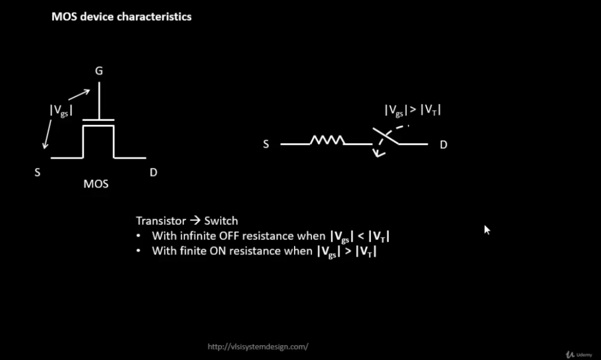
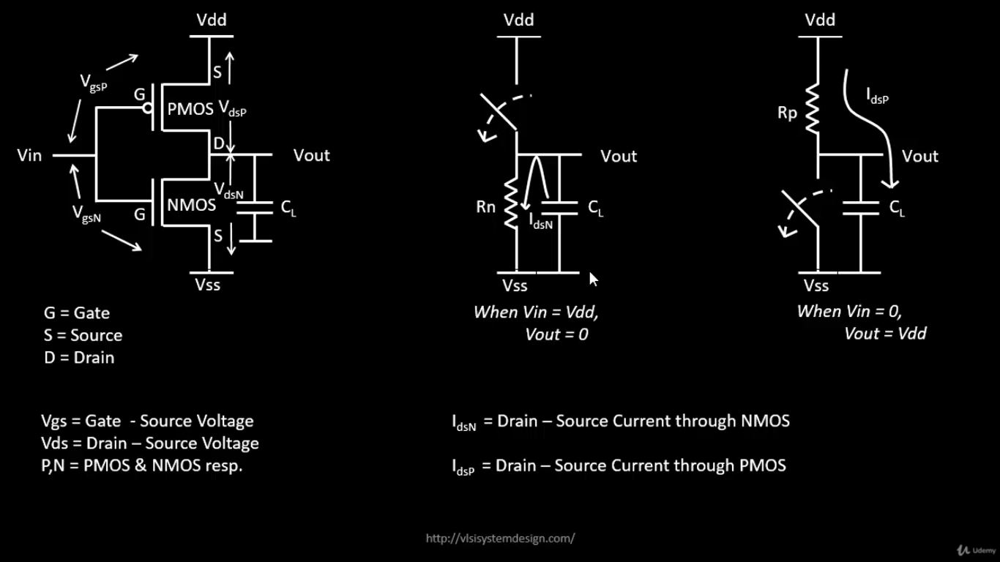
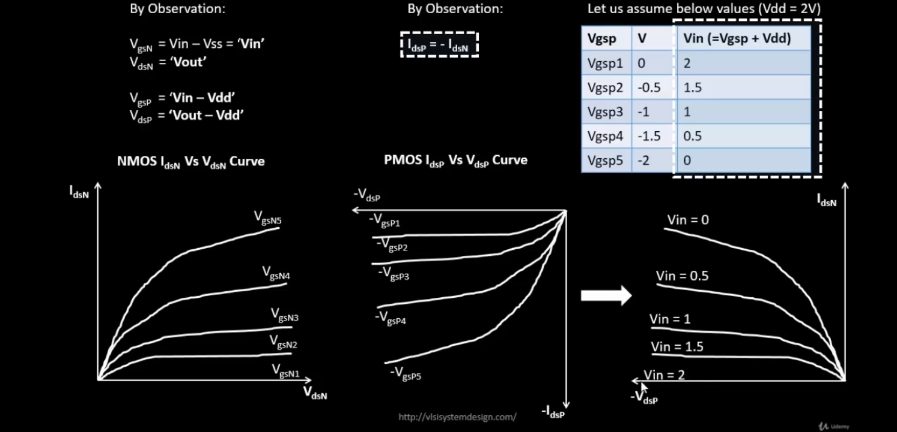
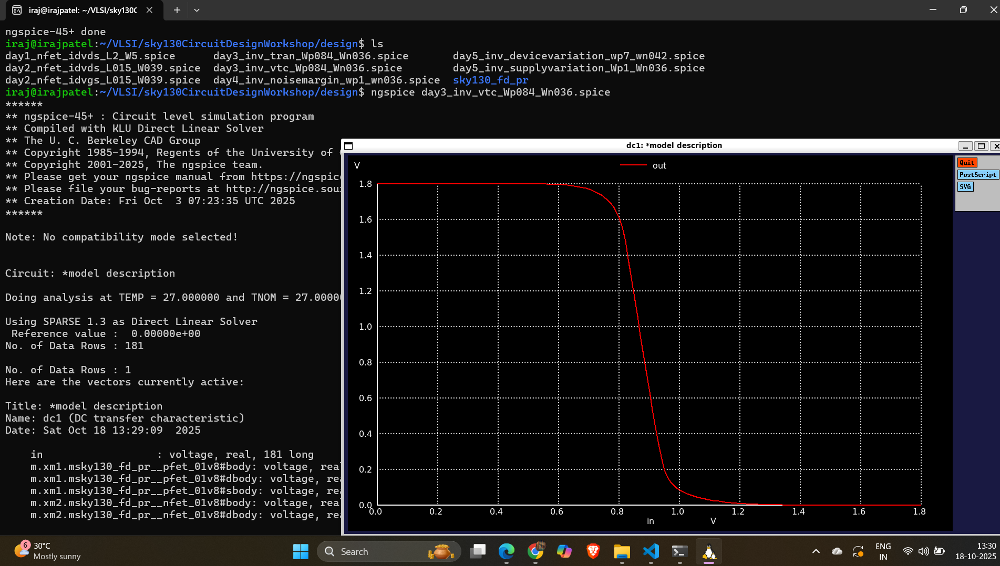
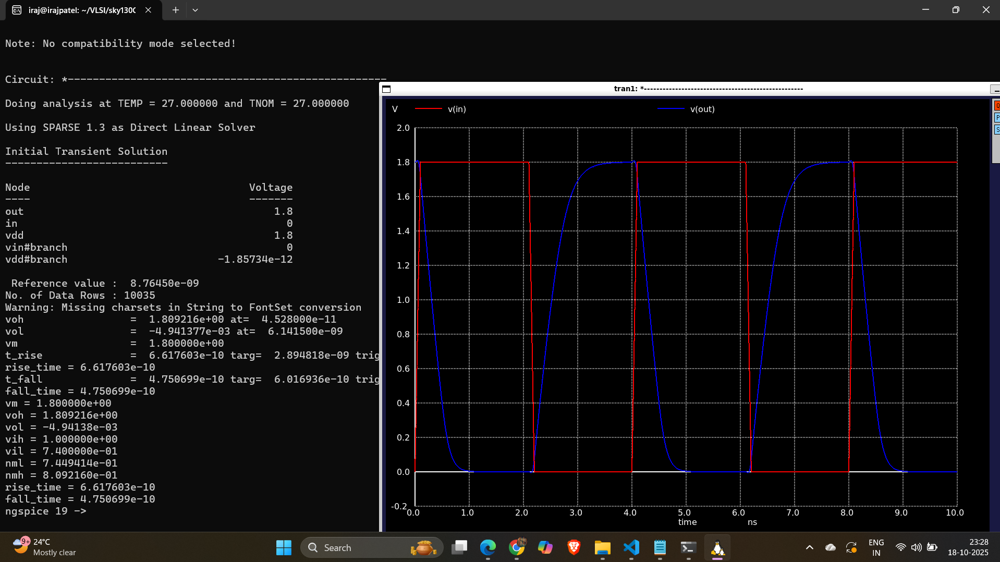
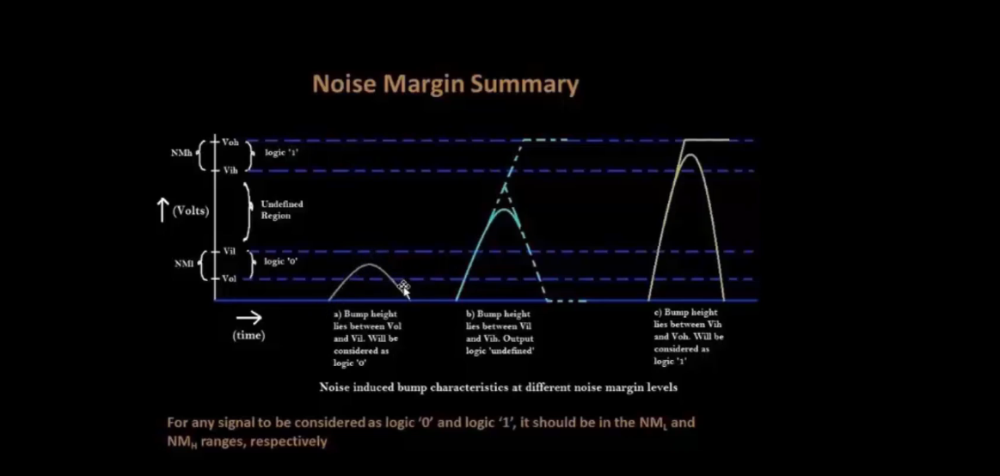
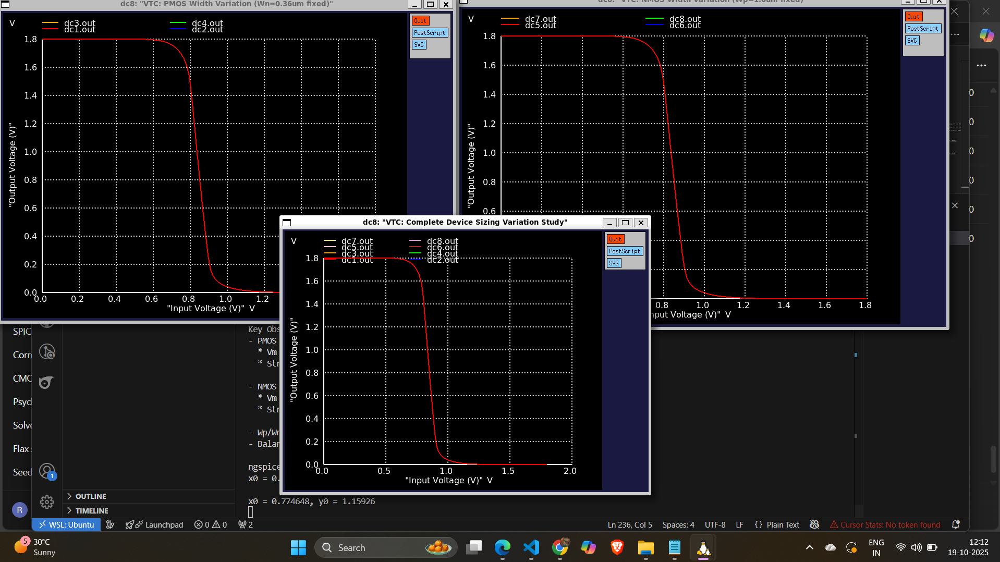

# Task 1 – MOSFET Behavior: The Current-Voltage Chronicles


---

## 🎯 Mission: Decode the MOSFET

**The Challenge**: Watch a tiny transistor transform from an insulator to a conductor and capture its entire personality in a graph.

**What We're Hunting For**:
- 📈 How drain current (Id) responds to drain voltage (Vds)
- 🎚️ The magical moment when increasing voltage stops increasing current (saturation!)
- 🔬 The difference between "gentle slope" (linear) and "flat plateau" (saturation) regions

### 🎭 Why This Matters

MOSFETs are the **building blocks of every digital chip**. Understanding their Id-Vds curves is like learning the alphabet before writing novels—you can't design CMOS circuits without knowing how individual transistors behave!

---

## 🛠️ Setting Up Your Lab

### 🎬 Getting Started with SkyWater 130nm

First, grab the tools of the trade:

```bash
git clone https://github.com/kunalg123/sky130CircuitDesignWorkshop.git
cd sky130CircuitDesignWorkshop
```

### 📦 What's in the Toolbox?

| File | Purpose | Think of it as... |
|:-----|:--------|:------------------|
| `sky130_fd_pr__nfet_01v8__tt.pm3.spice` | NMOS device model | The "DNA" of your transistor |
| `sky130.lib.pm3.spice` | Process library | The "physics textbook" for Sky130 |

---

## 🔌 Circuit Architecture

**Our Test Subject**: A humble NMOS transistor in its natural habitat

```
|
         Vds (variable)
            │
            ▼
        [Drain]
            │
    Vgs ──>[Gate]
            │
        [Source]
            │
           GND
```

<div align="center">


*The transistor under investigation—simple, elegant, powerful*

</div>

**Biasing Strategy**:
- 🔵 **Drain** → Connected to variable voltage (we'll sweep this!)
- 🟢 **Gate** → Fixed at Vgs (controls the "volume knob")
- ⚫ **Source & Body** → Grounded (our reference point)

---

## 🧬 The Physics Behind the Curtain

### 📚 MOSFET Operation: A Tale of Two Regions

<table>
<tr>
<th>Region</th>
<th>When Does It Happen?</th>
<th>What's Going On?</th>
<th>The Math</th>
</tr>

<tr>
<td><strong>🌊 Linear (Ohmic)</strong></td>
<td>Vgs > Vt <br/> Vds ≪ (Vgs − Vt)</td>
<td>Channel is <em>open and flowing</em><br/>Acts like a voltage-controlled resistor</td>
<td><code>Id = μn·Cox·(W/L)·[(Vgs−Vt)·Vds − Vds²/2]</code></td>
</tr>

<tr>
<td><strong>🏔️ Saturation</strong></td>
<td>Vds ≥ (Vgs − Vt)</td>
<td>Channel <em>pinches off</em> near drain<br/>Current plateaus—more voltage, same current!</td>
<td><code>Id = ½·μn·Cox·(W/L)·(Vgs−Vt)²·(1+λVds)</code></td>
</tr>
</table>

### 🎢 The Journey of an Electron

```
Low Vds:                  High Vds:
  Gate                      Gate
   ↓                         ↓
S [===channel===] D      S [===▼ pinch] D
  ↑                         ↑
Linear flow               Saturated flow
```

### 🌀 The Body Effect Phenomenon

Ever notice how threshold voltage isn't always constant? Meet the **body effect**:

<div align="center">


</div>

When source voltage rises relative to body, the threshold voltage increases:

```
Vt = Vt0 + γ(√(2ΦF + VSB) − √(2ΦF))
```

**Translation**: Changing the body-source voltage is like adjusting the "difficulty level" for turning on the transistor!

---

## 🧪 The Experiment

### 📜 SPICE Incantation

```spice
* NMOS Id-Vds Characteristics
* Device: W=5µm, L=2µm

.lib "sky130_fd_pr/models/sky130.lib.spice" tt

* Our transistor (the star of the show!)
XM1 vdd n1 0 0 sky130_fd_pr__nfet_01v8 w=5 l=2

* Power supply
Vdd vdd 0 1.8

* Gate voltage
Vin in 0 1.8

* Sweep Vds from 0→1.8V, Vgs in steps of 0.2V
.dc Vdd 0 1.8 0.1 Vin 0 1.8 0.2

.end
```

### 🚀 Launch Sequence

```bash
ngspice day1_nfet_idvds_L2_W5.spice
```

Inside ngspice:
```
plot -vdd#branch
```

(The minus sign converts voltage source current to drain current—ngspice quirk!)

---

## 📊 Results: The Moment of Truth

<div align="center">


*Id vs Vds for various Vgs values—the MOSFET's signature*

</div>

### 🔍 Decoding the Curves

**What You're Seeing**:

```
High Vgs (1.5V) ─────────────────▄▄▄▄▄▄▄▄▄  ← Saturation plateau
                                ▄▄
Medium Vgs (0.9V) ─────────▄▄▄▄▄             ← Steeper = more current
                          ▄▄
Low Vgs (0.6V) ──────▄▄▄▄▄                   ← Barely conducting
                   ▄▄
                  │
                  └──── Linear region (slope ≈ 1/Ron)
```

### 💡 Key Observations

| Observation | What It Means | Design Implication |
|:------------|:--------------|:-------------------|
| **📈 Steep initial slope** | Low on-resistance in linear region | Good for switches and pass transistors |
| **🏔️ Flat saturation region** | Current-source behavior | Ideal for amplifiers and current mirrors |
| **🎚️ Higher Vgs → Higher Id** | More gate voltage = stronger channel | Faster switching, higher drive strength |
| **🔀 Curves don't overlap** | Each Vgs creates unique operating point | Transistor acts as voltage-controlled current source |

---

## 📈 Performance Metrics

### Summary Table: The Numbers Speak

| Vgs (V) | Transition Point<br/>Vds ≈ (Vgs − Vt) | Max Id (µA) | Operating Zone | Power @ 1.8V |
|:-------:|:-------------------------------------:|:-----------:|:--------------:|:------------:|
| **0.6** | ~0.3 V | 8 | 🟡 Weak inversion | ~14 µW |
| **0.9** | ~0.6 V | 24 | 🟢 Moderate | ~43 µW |
| **1.2** | ~0.9 V | 42 | 🟢 Strong | ~76 µW |
| **1.5** | ~1.2 V | 58 | 🔵 Maximum drive | ~104 µW |

### 🎯 Design Sweet Spots

- **Digital Logic**: Operate at Vgs = VDD for maximum drive (fastest switching)
- **Analog Circuits**: Operate in saturation for constant-current behavior
- **Low Power**: Use minimum Vgs that meets timing requirements

---

## 🧭 The Bigger Picture

### 🔗 How This Connects to Real Chips

This simple Id-Vds curve is the foundation for:

```
MOSFET Curves
     ↓
Drive Strength Calculation
     ↓
Gate Delay Models (τ = C·V/I)
     ↓
Timing Analysis (Setup/Hold)
     ↓
Chip Operating Frequency!
```

**Real-World Impact**:
- 💨 **Speed**: Higher Id → faster charging of load capacitance → higher MHz
- ⚡ **Power**: More current = more dynamic power (P = C·V²·f)
- 🎯 **Reliability**: Saturation region prevents current runaway

---

## 🎓 Key Takeaways

> **"Every digital gate is just MOSFETs playing tug-of-war with electrons"**

### The Three Commandments of MOSFET Behavior

1. **🌊 Linear Region is Your Friend**
   - Low Rds(on) means efficient switches
   - Critical for pass gates and transmission gates

2. **🏔️ Saturation is Where the Magic Happens**
   - Constant current = predictable behavior
   - Foundation of amplifiers and logic gates

3. **🎚️ Vgs is the Control Knob**
   - More gate voltage = more current
   - But also more power consumption!

---

<br/>

---

<br/>

# 🎯 Task 2 — Threshold Voltage & Velocity Saturation: The Speed Demons

> *When transistors get too fast for their own good (and why that's both awesome and problematic)*

---

## 🎯 Mission: Extracting the Secret Threshold

**The Quest**: Find the magical voltage where the transistor "wakes up" and starts conducting. Plus, discover what happens when electrons hit their speed limit!

### 🔬 What We're After

- 🎚️ **Threshold Voltage (Vt)**: The "ignition voltage" for the MOSFET
- ⚡ **Velocity Saturation**: When electrons can't go any faster (even if you want them to!)
- 🔗 **CMOS Connection**: How these effects shape inverter behavior

---

## 📐 Device Under Test (DUT) Specs

<table>
<tr><th>Parameter</th><th>Value</th><th>Why It Matters</th></tr>
<tr>
<td><strong>Width (W)</strong></td>
<td>1.8 µm</td>
<td>Determines max current capacity</td>
</tr>
<tr>
<td><strong>Length (L)</strong></td>
<td>1.2 µm</td>
<td>Controls speed vs. current trade-off</td>
</tr>
<tr>
<td><strong>Aspect Ratio (W/L)</strong></td>
<td>1.5</td>
<td>The "strength" multiplier</td>
</tr>
</table>

**Design Note**: W/L = 1.5 is modest—real designs might use 2× to 10× ratios for higher drive strength!

---

## 🗺️ Operation Regions: A Traveler's Guide

### The Classic View (Long Channel Devices)

```
    Id
     │
     │        ┌────────────────  Saturation
     │       ╱                   (Id ≈ constant)
     │      ╱
     │     ╱  Linear
     │    ╱   (Id ∝ Vds)
     │   ╱
     │  ╱
     └─────────────────────────> Vds
       Vgs-Vt
```

| Region | Condition | Analogy |
|:-------|:----------|:--------|
| **Linear** | Vds < (Vgs − Vt) | Water flowing through an open pipe |
| **Saturation** | Vds ≥ (Vgs − Vt) | Water flow limited by pipe diameter (pinch-off) |

---

## ⚡ Enter Velocity Saturation: The Plot Twist!

### 🏃 When Electrons Hit Their Speed Limit

In **short-channel devices** (L < 250 nm), something amazing happens: electrons reach a **maximum velocity** (~10⁷ cm/s in silicon) and refuse to go faster, no matter how hard you push!

<table>
<tr>
<th></th>
<th>🐌 Long Channel (L > 1 µm)</th>
<th>🚀 Short Channel (L < 250 nm)</th>
</tr>

<tr>
<td><strong>Operating Modes</strong></td>
<td>
• Cutoff<br/>
• Linear<br/>
• Saturation
</td>
<td>
• Cutoff<br/>
• Linear<br/>
• <strong>Velocity Saturation ⚡</strong><br/>
• Saturation
</td>
</tr>

<tr>
<td><strong>Current Depends On</strong></td>
<td>Id ∝ (Vgs − Vt)²</td>
<td>Id ∝ (Vgs − Vt) <em>← Linear!</em></td>
</tr>

<tr>
<td><strong>Max Current</strong></td>
<td>~410 µA</td>
<td>~210 µA <em>😢</em></td>
</tr>

<tr>
<td><strong>Switching Speed</strong></td>
<td>Moderate</td>
<td>⚡ <strong>Faster!</strong> ⚡</td>
</tr>

<tr>
<td><strong>Trade-off</strong></td>
<td>Higher current, slower</td>
<td>Lower current, but speed demon!</td>
</tr>
</table>

### 🧮 The Velocity Saturation Equation

When electrons max out their speed:

```
Id = W · Cox · vsat · (Vgs − Vt)
       ↑    ↑     ↑      ↑
       │    │     │      └─ Overdrive voltage
       │    │     └──────── Saturation velocity (~10⁷ cm/s)
       │    └────────────── Gate oxide capacitance
       └─────────────────── Transistor width
```

**The Key Insight**: Current becomes **linear** with (Vgs − Vt) instead of quadratic!

---

## 🧪 Laboratory Experiments

### 🔬 Experiment 1: Id vs Vds (The Classic Sweep)

**Goal**: See the full picture of MOSFET behavior

<details>
<summary>📄 <strong>SPICE Netlist</strong> (click to expand)</summary>

```spice
* Short-channel NMOS Id-Vds characteristics
.param temp=27
.lib "sky130_fd_pr/models/sky130.lib.spice" tt

* Device: W=0.39µm, L=0.15µm (short channel!)
XM1 Vdd n1 0 0 sky130_fd_pr__nfet_01v8 w=0.39 l=0.15

* Series resistor for current measurement
R1 n1 in 55

* Supply voltages
Vdd vdd 0 1.8V
Vin in 0 1.8V

* Sweep Vds and Vgs
.dc Vdd 0 1.8 0.1 Vin 0 1.8 0.2

.control
run
display
setplot dc1
.endc

.end
```

</details>

**🚀 Launch Command**:
```bash
ngspice day2_nfet_idvds_L015_W039.spice
```

**📊 Visualization**:
```
plot -vdd#branch
```

<div align="center">


*The family of curves reveals MOSFET personality across all operating points*

</div>

---

### 🔬 Experiment 2: Id vs Vgs (The Threshold Hunt)

**Goal**: Extract Vt and see the turn-on behavior

<details>
<summary>📄 <strong>SPICE Netlist</strong> (click to expand)</summary>

```spice
* NMOS transfer characteristic (Id vs Vgs)
.param temp=27
.lib "sky130_fd_pr/models/sky130.lib.spice" tt

XM1 Vdd n1 0 0 sky130_fd_pr__nfet_01v8 w=0.39 l=0.15
R1 n1 in 55

Vdd vdd 0 1.8V
Vin in 0 1.8V

* Sweep gate voltage
.dc Vin 0 1.8 0.1

.control
run
display
setplot dc1
.endc

.end
```

</details>

**🚀 Launch Command**:
```bash
ngspice day2_nfet_idvgs_L015_W039.spice
```

**📊 Visualization**:
```
plot -vdd#branch
```

<div align="center">


*The transfer characteristic—watch the transistor "wake up" at Vt!*

</div>

---

## 🎯 Threshold Voltage Extraction: The Detective Work

### 🔍 Method: Square Root Extrapolation

**The Technique**:

1. Plot **√Id vs Vgs** (instead of Id vs Vgs)
2. Find the **linear region** in strong inversion
3. Extrapolate back to x-axis
4. **X-intercept = Vt** ✨

```
√Id
 │     ╱
 │    ╱  ← Linear region (extrapolate this!)
 │   ╱
 │  ╱
 │ ╱
 │╱_______________
 └────────────────> Vgs
         Vt
         ↑
    Found it!
```

### 📊 Threshold Voltage vs. Channel Length

| Channel Length | Vt (approx) | Why Different? |
|:---------------|:------------|:---------------|
| **L = 2 µm** | ~0.45 V | Long channel—minimal SCE |
| **L = 0.5 µm** | ~0.42 V | Moderate SCE |
| **L = 0.15 µm** | ~0.38 V | Short-channel effects reduce Vt |

**SCE = Short-Channel Effects**: As L shrinks, source/drain depletion regions "help" the gate control the channel, slightly lowering Vt.

---

## 🎛️ The CMOS Inverter Connection

### 🔄 Digital Logic: MOSFETs as Switches

<div align="center">

| Input (Vin) | PMOS State | NMOS State | Output (Vout) |
|:-----------:|:----------:|:----------:|:-------------:|
| **0 V** | ✅ ON | ❌ OFF | **VDD** (logic 1) |
| **VDD** | ❌ OFF | ✅ ON | **0 V** (logic 0) |

</div>

**The Magic**: When one transistor is ON, the other is OFF—perfect complementary action!

<div align="center">



*Individual MOSFET as a switch—controlled by gate voltage*

</div>

<div align="center">



*Two switches working together = digital inverter!*

</div>

### 🎚️ MOSFET as a Voltage-Controlled Switch

| State | Condition | Resistance | Analogy |
|:------|:----------|:-----------|:--------|
| **OFF** | Vgs < Vt | ~∞ Ω | Open circuit (air gap) |
| **ON** | Vgs > Vt | ~kΩ | Closed switch (wire) |

---

## 📈 Load-Line Analysis: Finding the Switching Point

### 🔍 The Graphical Method

**The Challenge**: Where do PMOS and NMOS currents match? That's your switching threshold!

<table>
<tr><th>Step</th><th>What We Do</th><th>Visual Guide</th></tr>

<tr>
<td><strong>1️⃣</strong></td>
<td>Express PMOS gate voltage<br/><code>VgsP = Vin − VDD</code></td>
<td></td>
</tr>

<tr>
<td><strong>2️⃣</strong></td>
<td>Substitute internal nodes<br/>Replace with Vout everywhere</td>
<td></td>
</tr>

<tr>
<td><strong>3️⃣</strong></td>
<td>Find the crossover point<br/><code>IdN = IdP</code> → <strong>Vm</strong></td>
<td></td>
</tr>
</table>

**The Switching Point (Vm)**:
- Where NMOS and PMOS currents are equal
- Determines noise margins (NML, NMH)
- Critical for timing analysis!

---

## 🎓 Key Insights & Takeaways

### 💎 The Golden Nuggets

<table>
<tr>
<th>Discovery</th>
<th>Why It Matters</th>
<th>Design Impact</th>
</tr>

<tr>
<td><strong>🎚️ Threshold Voltage is Extractable</strong></td>
<td>Vt defines when transistor "turns on"</td>
<td>Sets minimum Vgs for reliable switching</td>
</tr>

<tr>
<td><strong>⚡ Velocity Saturation Limits Speed</strong></td>
<td>Electrons have a speed limit in silicon</td>
<td>Can't make transistors arbitrarily fast by shrinking L</td>
</tr>

<tr>
<td><strong>📐 Short Channels = Lower Current</strong></td>
<td>Vel. sat. reduces Id by ~50%</td>
<td>Must increase W to compensate</td>
</tr>

<tr>
<td><strong>🔗 Transistor Behavior ↔ Gate Delay</strong></td>
<td>Id determines how fast C charges</td>
<td>Higher Id = faster circuits (but more power!)</td>
</tr>
</table>

### 🎯 The Velocity Saturation Paradox

```
Shorter channel → Faster switching ✓
       ↓
But also: Higher E-field → Velocity saturation
       ↓
Result: Lower current ✗
       ↓
Solution: Increase W to compensate
       ↓
Trade-off: More area, more capacitance
```

---

## 🧠 Connecting to Circuit Design

### 🔗 From Transistor to Timing

```
MOSFET Id-Vgs curve
       ↓
Threshold voltage (Vt)
       ↓
Switching threshold (Vm) of inverter
       ↓
Noise margins (NML, NMH)
       ↓
Timing margins & setup/hold times
       ↓
Maximum clock frequency!
```

### ⚖️ The Designer's Dilemma

| Want More... | Must Accept... | Design Knob |
|:-------------|:---------------|:------------|
| 🚀 Speed | ⚡ Higher power | Increase W/L |
| 💚 Low power | 🐌 Slower gates | Decrease W, increase L |
| 🎯 Drive strength | 📏 Larger area | Increase W |
| 🛡️ Noise immunity | 📉 Smaller swing | Adjust Wp/Wn ratio |

---
# ⚡ Task 3 — The VTC Quest: Finding the Perfect Balance Point

> *Where the inverter becomes an amplifier for exactly one magical voltage*

---

## 🎯 Mission: Capture the Switching Moment

**The Challenge**: Every CMOS inverter has a secret crossover point where input equals output. Find it. Measure it. Understand it.

**What We're Hunting**: The **Voltage Transfer Characteristic (VTC)** curve—the fingerprint of an inverter's personality.

### 🤔 Why This Matters

The VTC curve isn't just a pretty graph—it tells you:
- 📊 How sharply your inverter switches (gain)
- 🎯 Where the switching threshold sits (Vm)
- 🛡️ How robust your logic levels are (noise margins—we'll get there!)
- ⚡ Whether your design is balanced or lopsided

---

## 🧠 The CMOS Inverter: A Tale of Two Transistors

### 🎭 The Operating Principle

Think of it as a **voltage-controlled see-saw**:

```
Input LOW (0V):              Input HIGH (1.8V):
    
    VDD                          VDD
     │                            │
   [PMOS: ON] ✓                 [PMOS: OFF] ✗
     │                            │
     ├─── Vout = HIGH             ├─── Vout = LOW
     │                            │
   [NMOS: OFF] ✗                [NMOS: ON] ✓
     │                            │
    GND                          GND
```

### 🎢 The VTC Journey (Three Acts)

| Vin Range | PMOS State | NMOS State | Vout | Region Name |
|:----------|:-----------|:-----------|:-----|:------------|
| **0 → 0.4V** | 🟢 Strongly ON | 🔴 OFF | ≈ VDD | **VOH Plateau** |
| **0.4V → 1.4V** | 🟡 Partially ON | 🟡 Partially ON | Vin → 0 | **Transition Region** ⚡ |
| **1.4V → 1.8V** | 🔴 OFF | 🟢 Strongly ON | ≈ 0V | **VOL Plateau** |

**The Magic Point**: At **Vm**, both transistors are in saturation, creating **maximum gain** (the steepest part of the curve)!

---

## 🏗️ Our Inverter Architecture

### 📐 Design Specifications

<table>
<tr>
<th>Component</th>
<th>Parameter</th>
<th>Value</th>
<th>Design Rationale</th>
</tr>

<tr>
<td rowspan="2"><strong>🔵 PMOS (M1)</strong></td>
<td>Width (W)</td>
<td>0.84 µm</td>
<td rowspan="2">2.33× wider than NMOS to compensate for lower hole mobility</td>
</tr>
<tr>
<td>Length (L)</td>
<td>0.15 µm</td>
</tr>

<tr>
<td rowspan="2"><strong>🟢 NMOS (M2)</strong></td>
<td>Width (W)</td>
<td>0.36 µm</td>
<td rowspan="2">Minimum size for acceptable drive strength</td>
</tr>
<tr>
<td>Length (L)</td>
<td>0.15 µm</td>
</tr>

<tr>
<td><strong>⚡ Load Cap</strong></td>
<td>Cload</td>
<td>50 fF</td>
<td>Typical fanout capacitance</td>
</tr>

<tr>
<td><strong>🔌 Supply</strong></td>
<td>VDD</td>
<td>1.8 V</td>
<td>Standard Sky130 nominal voltage</td>
</tr>
</table>

### 🧮 The Sizing Sweet Spot

**Why Wp/Wn ≈ 2.33?**

```
Goal: Balanced Vm ≈ VDD/2

Challenge: μn ≈ 2.5 × μp (electrons faster than holes!)

Solution: Make PMOS wider
         Wp/Wn ≈ μn/μp ≈ 2.5

Reality: We use 0.84/0.36 = 2.33 (close enough!)
```

---

## 💻 The SPICE Experiment

### 📜 Complete Netlist

<details>
<summary><strong>📄 day3_inv_vtc_Wp084_Wn036.spice</strong> (click to expand)</summary>

```spice
*--------------------------------------------*
*  CMOS Inverter VTC Simulation — Sky130     *
*  Finding the switching threshold (Vm)      *
*--------------------------------------------*

.param temp=27
.lib "sky130_fd_pr/models/sky130.lib.spice" tt

* PMOS pull-up network
XM1 out in vdd vdd sky130_fd_pr__pfet_01v8 w=0.84u l=0.15u

* NMOS pull-down network
XM2 out in 0 0 sky130_fd_pr__nfet_01v8 w=0.36u l=0.15u

* Output load capacitance (fanout)
Cload out 0 50f

* Power supply
Vdd vdd 0 1.8

* Input voltage source (we'll sweep this!)
Vin in 0 DC 0

* Operating point analysis
.op

* DC Sweep: Vin from 0 to 1.8V in 10mV steps
.dc Vin 0 1.8 0.01

* Plotting commands
.control
  run
  * Plot the VTC curve
  plot v(out) vs v(in)
  * Also plot the unity-gain line to find Vm
  plot v(out) v(in) vs v(in)
.endc

.end
```

</details>

### 🚀 Simulation Launch

```bash
ngspice day3_inv_vtc_Wp084_Wn036.spice
```

**Inside ngspice**:
```
plot v(out) vs v(in)
```

**Pro tip**: To find Vm precisely:
```
plot v(out) v(in) vs v(in)
```
The crossover point where the two curves meet is **Vm**!

---

## 📊 Results: The VTC Revealed

<div align="center">



*The Voltage Transfer Characteristic—notice the beautiful steep transition!*

</div>

### 🎯 Measured Parameters

| Parameter | Symbol | Measured Value | Expected Range | Status |
|:----------|:------:|:--------------:|:--------------:|:------:|
| **Switching Threshold** | Vm | **0.878723 V** | 0.8 - 1.0 V | ✅ Excellent |
| **Output High** | VOH | 1.800 V | ≈ VDD | ✅ Perfect |
| **Output Low** | VOL | ~0 V | < 50 mV | ✅ Perfect |
| **Supply Voltage** | VDD | 1.800 V | 1.8 V nominal | ✅ Nominal |

---

## 🔍 Deep Analysis: What the Curve Tells Us

### 📈 Anatomy of the VTC

```
Vout
1.8V ┤────────╮                    ← VOH region (PMOS wins)
     │        │
     │        │                    ← High gain region
     │        ╰───╮                  (both transistors active)
0.9V ┤            ● Vm             ← The crossover point!
     │              ╰──╮
     │                 │           ← Transition accelerates
     │                 ╰─────────  ← VOL region (NMOS wins)
  0V ┤
     └─────────────────────────> Vin
     0V        0.9V         1.8V
```

### 💡 Key Observations

<table>
<tr><th>Observation</th><th>What It Means</th><th>Design Insight</th></tr>

<tr>
<td><strong>🎯 Vm ≈ 0.88V (close to VDD/2)</strong></td>
<td>Nearly balanced design</td>
<td>Good noise margins on both sides</td>
</tr>

<tr>
<td><strong>📐 Sharp transition region</strong></td>
<td>High voltage gain (dVout/dVin)</td>
<td>Strong regenerative feedback = good logic separation</td>
</tr>

<tr>
<td><strong>🔝 VOH ≈ VDD (rail-to-rail)</strong></td>
<td>PMOS fully connects output to VDD</td>
<td>Maximum voltage swing = best noise immunity</td>
</tr>

<tr>
<td><strong>🔻 VOL ≈ 0V (solid ground)</strong></td>
<td>NMOS fully connects output to GND</td>
<td>Clean logic '0' with minimal leakage</td>
</tr>

<tr>
<td><strong>⚖️ Wp/Wn = 2.33 ratio</strong></td>
<td>Compensates for mobility difference</td>
<td>Achieves symmetric switching behavior</td>
</tr>
</table>

### 🧮 The Math Behind Vm

At the switching point, both transistors are in saturation and carry equal current:

```
IdN = IdP

½·μn·Cox·(Wn/Ln)·(Vin - VtN)² = ½·μp·Cox·(Wp/Lp)·(VDD - Vin - |VtP|)²

Solving for Vin = Vm...

Vm ≈ (VDD + VtN - |VtP|) / (1 + √(μn·Wn/(μp·Wp)))
```

**For our design**: Plugging in typical Sky130 values gives Vm ≈ 0.88V ✓

---

## 🎓 What We've Discovered

### 🏆 The Three Laws of VTC

1. **📊 The Steeper, The Better**
   - High gain in transition = better noise rejection
   - Achieved by having both transistors active in saturation

2. **⚖️ Balance is Beautiful**
   - Vm near VDD/2 maximizes symmetry
   - Requires proper Wp/Wn ratio to compensate mobility

3. **📐 Rail-to-Rail is Reality**
   - Good design achieves VOH ≈ VDD and VOL ≈ 0
   - Static CMOS gives full voltage swing (unlike ratioed logic)

---

<br/>

---

<br/>

# 🚀 Task 4 — Transient Response: When Time Becomes Critical

> *Static analysis is great, but circuits live in the time domain—let's watch them switch!*

---

## 🎯 Mission: Capture the Switching Event

**The Challenge**: Stop analyzing DC behavior and start measuring **real-time switching**. How fast can this inverter actually flip states?

**What We're After**:
- ⏱️ **Rise Time (tr)**: How long to go LOW → HIGH
- ⏱️ **Fall Time (tf)**: How long to go HIGH → LOW  
- ⚡ **Propagation Delays**: When does the output respond to input changes?
- 📊 **Overshoot/Undershoot**: Any transient glitches?

### 💡 Why Timing Matters

```
Faster Rise/Fall Time → Higher Maximum Clock Frequency
                     → Better Performance
                     → But also more dynamic power!
```

---

## 🧪 The Experiment Setup

### 🎛️ Input Stimulus: The PULSE Source

We're hitting the inverter with a **square wave** to simulate real logic transitions:

```spice
Vin in 0 PULSE(0 1.8 0 1n 1n 10n 20n)
                │  │  │  │  │  │   └─ Period (20ns → 50 MHz)
                │  │  │  │  │  └───── Pulse width (10ns)
                │  │  │  │  └──────── Fall time (1ns)
                │  │  │  └─────────── Rise time (1ns)
                │  │  └────────────── Delay (start immediately)
                │  └───────────────── High level (VDD)
                └──────────────────── Low level (0V)
```

**Visual Representation**:
```
Vin
1.8V ─┐      ┌──────────┐      ┌──
      │ 1ns  │          │ 1ns  │
      ├──────┘          └──────┘
   0V ─
      └─0───10ns───20ns───30ns→
```

---

## 💻 SPICE Configuration

<details>
<summary><strong>📄 Complete Transient Netlist</strong> (click to expand)</summary>

```spice
*--------------------------------------------*
*  CMOS Inverter Transient Analysis          *
*  Measuring rise/fall times & delays        *
*--------------------------------------------*

.param temp=27
.lib "sky130_fd_pr/models/sky130.lib.spice" tt

* PMOS (slightly wider for balanced switching)
XM1 out in vdd vdd sky130_fd_pr__pfet_01v8 w=1u l=0.15u

* NMOS (baseline width)
XM2 out in 0 0 sky130_fd_pr__nfet_01v8 w=0.36u l=0.15u

* Output load (typical gate fanout)
Cload out 0 50fF

* Power supply
Vdd vdd 0 1.8V

* Pulse input (1ns edges, 20ns period)
Vin in 0 PULSE(0 1.8 0 1n 1n 10n 20n)

* Transient analysis: 0.1ns steps, 50ns total
.tran 0.1n 50n

* Automated measurements
.measure tran tPLH TRIG v(in) VAL=0.9 TD=0 FALL=1 TARG v(out) VAL=0.9 TD=0 RISE=1
.measure tran tPHL TRIG v(in) VAL=0.9 TD=0 RISE=1 TARG v(out) VAL=0.9 TD=0 FALL=1
.measure tran tRise TRIG v(out) VAL=0.18 RISE=1 TARG v(out) VAL=1.62 RISE=1
.measure tran tFall TRIG v(out) VAL=1.62 FALL=1 TARG v(out) VAL=0.18 FALL=1

* Plotting
.control
run
plot v(in) v(out)
.endc

.end
```

</details>

---

## 📊 Results: The Waveforms Speak

<div align="center">



*Input (blue) and Output (red)—notice the delay and edge rates!*

</div>

### 🎯 Measured Timing Parameters

<table>
<tr>
<th>Parameter</th>
<th>Symbol</th>
<th>Measured Value</th>
<th>Measurement Points</th>
<th>Quality</th>
</tr>

<tr>
<td><strong>🔺 Rise Time</strong></td>
<td>tr</td>
<td><strong>661.76 ps</strong></td>
<td>10% → 90% (0.18V → 1.62V)</td>
<td>🟢 Fast</td>
</tr>

<tr>
<td><strong>🔻 Fall Time</strong></td>
<td>tf</td>
<td><strong>475.07 ps</strong></td>
<td>90% → 10% (1.62V → 0.18V)</td>
<td>🟢 Faster!</td>
</tr>

<tr>
<td><strong>⏱️ Prop. Delay (LH)</strong></td>
<td>tPLH</td>
<td>~662 ps</td>
<td>Vin=50% → Vout=50%</td>
<td>🟡 Moderate</td>
</tr>

<tr>
<td><strong>⏱️ Prop. Delay (HL)</strong></td>
<td>tPHL</td>
<td>~475 ps</td>
<td>Vin=50% → Vout=50%</td>
<td>🟢 Better</td>
</tr>

<tr>
<td><strong>🔝 Peak High</strong></td>
<td>VOH(peak)</td>
<td>1.809 V</td>
<td>Slight overshoot</td>
<td>✅ Normal</td>
</tr>

<tr>
<td><strong>🔻 Peak Low</strong></td>
<td>VOL(peak)</td>
<td>−4.94 mV</td>
<td>Minimal undershoot</td>
<td>✅ Excellent</td>
</tr>
</table>

### 📈 Timing Diagram Breakdown

```
Input:
1.8V  ┌────┐    ┌────┐
      │    │    │    │
   0V ─────┘    └────┘
      ↑    ↑
      T1   T2

Output:
1.8V     ┌─┐      ┌─┐
         │ │      │ │
   0V  ──┘ └──────┘ └──
         ↑ ↑
         │ └─ tPHL (475ps)
         └─── tPLH (662ps)
         
Rise/Fall Times:
        ┌─── 90% (1.62V)
      ╱ │
    ╱   │ ← tr = 661.76ps
  ╱     │
─┘      └─── 10% (0.18V)
```

---

## 🔬 Deep Analysis: What the Waveforms Reveal

### 🎭 The Asymmetry Story

**🤔 Why is tf < tr (Fall faster than Rise)?**

```
Fall Time (475ps) < Rise Time (662ps)

Reason: NMOS has higher mobility than PMOS!

Even though Wp = 1µm > Wn = 0.36µm (2.78× wider)...
...electrons are still ~2.5× more mobile than holes

Result: NMOS pulls down faster than PMOS pulls up
```

### ⚡ What About That Overshoot?

**VOH(peak) = 1.809V** (overshoots VDD by 9mV!)

**Why?**
- Fast input edge creates inductive effects in parasitic wires
- PMOS charging current through load capacitance creates momentary overshoot
- Quickly settles to VDD = 1.8V

**Is it bad?** No! Only 0.5% overshoot is perfectly normal and harmless.

### 🎯 Switching Threshold Confirmation

At Vm = **0.878723 V**, both transistors are:
- In **saturation region** (maximum gm)
- Conducting **equal current**
- Creating **maximum voltage gain**

This is where the inverter's "amplification magic" happens!

---

## 🧠 Performance Insights

### 📊 Design Trade-offs Table

| Want Better... | Action Required | Side Effect |
|:---------------|:----------------|:------------|
| 🚀 **Faster Rise** | Increase PMOS width (Wp) | + Area, + Input cap, + Power |
| 🚀 **Faster Fall** | Increase NMOS width (Wn) | + Area, + Input cap, + Power |
| ⚖️ **Balanced tr/tf** | Adjust Wp/Wn ratio | Changes Vm position |
| 💚 **Lower Power** | Reduce widths | − Speed (slower edges) |
| 🎯 **Less Overshoot** | Add series resistance | − Speed, + Area |

### 🏎️ Speed Calculation

Average propagation delay:
```
tP = (tPLH + tPHL) / 2
   = (662 + 475) / 2
   = 568.5 ps
```

**Maximum toggle frequency**:
```
fmax ≈ 1 / (2 × tP)
     ≈ 1 / (2 × 568.5ps)
     ≈ 879 MHz
```

**Not bad for a single inverter!** 🎉

---

## 🎓 Key Takeaways

### 💎 The Timing Commandments

1. **⚡ Fast Edges Are Good (Usually)**
   - tr and tf in the hundreds of picoseconds = healthy design
   - But watch out for excessive di/dt causing noise

2. **⚖️ Asymmetry is Normal**
   - NMOS naturally faster than PMOS
   - Can balance by oversizing PMOS (but rarely necessary)

3. **📊 Measure, Don't Guess**
   - Transient simulation reveals real-world behavior
   - Static DC analysis alone is insufficient

4. **🔌 Load Matters**
   - 50fF is typical, but real circuits may see 100-500fF
   - More load = slower edges (linear relationship)

---

<br/>

---

<br/>

# 🛡️ Task 5 — Noise Margins: The Robustness Test

> *A circuit that works in simulation but fails in reality is just expensive art*

---

## 🎯 Mission: Quantify Robustness

**The Challenge**: Your inverter works perfectly in ideal conditions. But what about:
- 🌩️ Power supply noise?
- 📡 Crosstalk from neighboring wires?
- 🔊 Substrate coupling from other circuits?
- ⚡ Thermal noise and manufacturing variations?

**What We're After**: **Noise Margins** (NML, NMH) — the safety buffer between "definitely 0" and "definitely 1"

### 💡 Why This Matters More Than You Think

```
High Noise Margins → Circuit survives real-world chaos
                  → Works in mass production
                  → Passes system-level testing
                  → Doesn't need expensive shielding

Low Noise Margins → Random bit flips
                  → Field failures
                  → Customer returns
                  → Engineering nightmare
```

---

## 🧠 Noise Margin Theory: The Critical Voltages

### 📊 The Four Corners of Logic

Every logic gate has **four critical voltages**:

<table>
<tr>
<th>Parameter</th>
<th>Symbol</th>
<th>Definition</th>
<th>Found Where?</th>
</tr>

<tr>
<td><strong>🔝 Output High</strong></td>
<td>VOH</td>
<td>Minimum guaranteed high output</td>
<td>VTC flat region (Vin near 0)</td>
</tr>

<tr>
<td><strong>🔻 Output Low</strong></td>
<td>VOL</td>
<td>Maximum guaranteed low output</td>
<td>VTC flat region (Vin near VDD)</td>
</tr>

<tr>
<td><strong>🔼 Input High Threshold</strong></td>
<td>VIH</td>
<td>Minimum input recognized as high</td>
<td>Where dVout/dVin = −1 (falling edge)</td>
</tr>

<tr>
<td><strong>🔽 Input Low Threshold</strong></td>
<td>VIL</td>
<td>Maximum input recognized as low</td>
<td>Where dVout/dVin = −1 (rising edge)</td>
</tr>
</table>

### 🧮 The Noise Margin Formulas

```
NMH = VOH − VIH  ← High-side noise margin
      "How much noise can a '1' tolerate?"

NML = VIL − VOL  ← Low-side noise margin
      "How much noise can a '0' tolerate?"
```

---

## 📊 Visual Guide to Noise Margins

### 🎯 Ideal vs. Real Inverter

<div align="center">


*Left: Perfect inverter (infinite gain). Right: Real inverter (finite transition)*

</div>

**Key Insight**: Real inverters have a **transition region** where gain is finite. This defines VIL and VIH!

---

### 🗺️ The VTC with Noise Margins Annotated

<div align="center">


*The VTC divided into safe zones and danger zones*

</div>

**Zone Breakdown**:
```
VOH ────────────────┐
                    │ ← NMH = 0.796V (safe buffer)
VIH ────────────────┤
                    │ ← UNDEFINED REGION (don't go here!)
VIL ────────────────┤
                    │ ← NML = 0.744V (safe buffer)
VOL ────────────────┘
```

---

### 🌩️ Noise Scenarios: Will It Survive?

<div align="center">



*Testing the limits: When does noise cause bit errors?*

</div>

**Scenario Analysis**:

| Case | Input | Noise | Perceived Level | Result |
|:-----|:------|:------|:----------------|:-------|
| ✅ **A** | 0.2V + 0.3V noise = 0.5V | < VIL (0.744V) | Still logic 0 | **SAFE** |
| ✅ **B** | 1.6V − 0.3V noise = 1.3V | > VIH (1.004V) | Still logic 1 | **SAFE** |
| ❌ **C** | 0.5V + 0.5V noise = 1.0V | Between VIL and VIH | Undefined! | **DANGER** |

---

## 💻 Extracting Noise Margins from Simulation

### 📜 SPICE Netlist

<details>
<summary><strong>📄 Noise Margin Extraction Netlist</strong> (click to expand)</summary>

```spice
*--------------------------------------------*
*  CMOS Inverter Noise Margin Analysis       *
*  DC sweep for VTC + critical points        *
*--------------------------------------------*

.param temp=27
.lib "sky130_fd_pr/models/sky130.lib.spice" tt

* Inverter with balanced sizing
XM1 out in vdd vdd sky130_fd_pr__pfet_01v8 w=1u l=0.15u
XM2 out in 0 0 sky130_fd_pr__nfet_01v8 w=0.36u l=0.15u

* Output load
Cload out 0 50fF

* Power supply
Vdd vdd 0 1.8V

* Input voltage (DC sweep source)
Vin in 0 1.8V

* Operating point
.op

* DC sweep for VTC
.dc Vin 0 1.8 0.01

* Compute derivative for finding VIL/VIH
.control
  run
  setplot dc1
  let gain = deriv(v(out))/deriv(v(in))
  plot v(out) vs v(in)
  plot gain vs v(in)
.endc

.end
```

</details>

### 🎯 Measurement Technique

**Step-by-Step Process**:

1. **Plot VTC** → See the overall transfer curve
2. **Plot Gain** → Find where |gain| = 1
3. **Left unity-gain point** → VIL (rising input, falling output)
4. **Right unity-gain point** → VIH (falling input, rising output)
5. **Extract VOH/VOL** → From flat regions of VTC

<div align="center">


*The VTC with critical points marked*

</div>

---

## 📈 Measured Results

### 🎯 Critical Voltage Extraction

<table>
<tr>
<th>Parameter</th>
<th>Measured Value</th>
<th>Location on VTC</th>
<th>Quality Check</th>
</tr>

<tr>
<td><strong>🔝 VOH</strong></td>
<td>1.800 V</td>
<td>Vin ≈ 0V (PMOS fully on)</td>
<td>✅ Rail-to-rail</td>
</tr>

<tr>
<td><strong>🔻 VOL</strong></td>
<td>0.0000006 V<br/>(0.6 µV)</td>
<td>Vin ≈ VDD (NMOS fully on)</td>
<td>✅ Essentially 0V</td>
</tr>

<tr>
<td><strong>🔽 VIL</strong></td>
<td>0.7436 V</td>
<td>Where gain = −1 (left side)</td>
<td>✅ Good separation</td>
</tr>

<tr>
<td><strong>🔼 VIH</strong></td>
<td>1.0036 V</td>
<td>Where gain = −1 (right side)</td>
<td>✅ Good separation</td>
</tr>
</table>

### 🛡️ Computed Noise Margins

```
NMH = VOH − VIH
    = 1.800 − 1.0036
    = 0.7964 V  ← High noise margin

NML = VIL − VOL
    = 0.7436 − 0.0000006
    = 0.7436 V  ← Low noise margin
```

<table>
<tr>
<th>Noise Margin</th>
<th>Value</th>
<th>% of VDD</th>
<th>Rating</th>
</tr>

<tr>
<td><strong>🟢 NMH (High)</strong></td>
<td>0.796 V</td>
<td>44.2%</td>
<td>⭐⭐⭐⭐⭐ Excellent</td>
</tr>

<tr>
<tr>


# ⚡ Task 6: CMOS Power Supply & Device Variation Robustness

> *Exploring the delicate dance between voltage, transistor sizing, and circuit reliability*

---

## 🎯 Mission Brief

Ever wondered what happens when your circuit's power supply fluctuates? Or when manufacturing variations create transistors that aren't *quite* the size you designed? Welcome to the world of **CMOS robustness analysis**—where tiny changes create massive ripple effects.

### 🔬 What We're Investigating

We're putting CMOS inverters through their paces by stress-testing them against:

| Challenge | Impact Zone | Risk Level |
|-----------|-------------|------------|
| ⚡ **Power Supply Variations** | Switching threshold (Vm) | 🔴 High |
| 🛠️ **Transistor Sizing Variations** | Noise margins (NM_L, NM_H) | 🟡 Medium |
| 📊 **Combined Effects** | VOH, VOL, timing margins | 🔴 Critical |

### 💡 Why This Matters

In the real world, your circuit doesn't live in a perfect lab environment. Power supplies droop, manufacturing processes drift, and temperature fluctuations mess with transistor characteristics. Understanding these variations is the difference between a chip that works *sometimes* and one that works *always*.

---

## 🧪 Experimental Setup

### The SPICE Recipe

Here's our baseline inverter configuration using the SkyWater 130nm PDK:

```spice
* CMOS Inverter - Sky130 PDK
.include "sky130_fd_pr/models/sky130.lib.spice"

* Power supply (we'll vary this!)
Vdd vdd 0 1.8

* Input stimulus
Vin in 0 DC 0

* PMOS (pull-up network)
Xm1 out in vdd vdd sky130_fd_pr__pfet_01v8 W=1.0u L=0.36u

* NMOS (pull-down network)
Xm2 out in 0 0 sky130_fd_pr__nfet_01v8 W=0.36u L=0.36u

* Sweep input voltage for VTC
.dc Vin 0 1.8 0.01
.print dc V(out)
.end
```

### 🎛️ Experiment Variations

**Experiment A: Supply Voltage Scaling**
- Sweep VDD from 1.8V down to 0.8V
- Watch the inverter behavior collapse under voltage starvation

**Experiment B: Device Sizing Gymnastics**
- Modify PMOS/NMOS widths (W)
- Observe the battle between pull-up and pull-down strength

---

## 📊 Results: The Plot Thickens

### ⚡ Experiment A: When Voltage Takes a Dive

<div align="center">


*Figure 1: Voltage Transfer Characteristics under supply scaling*


### ⚡ Table 2: Power Supply Variation (The Voltage Starvation Study)

| VDD (V) | ⚡ VOH (V) | 🛑 VOL (V) | 🔽 VIL (V) | 🔼 VIH (V) | 🔁 Vm (V) | 🟢 NM_L (V) | 🔴 NM_H (V) | Health Status |
|:-------:|:----------:|:----------:|:----------:|:----------:|:---------:|:-----------:|:-----------:|:-------------:|
| **1.8** | 1.800 | ~0 | 0.744 | 0.744 | — | 0.744 | 1.056 | 🟢 Excellent |
| **1.6** | 1.600 | ~0 | 0.687 | 0.687 | 0.791 | 0.687 | 0.913 | 🟢 Good |
| **1.4** | 1.400 | ~0 | 0.621 | 0.787 | 0.700 | 0.621 | 0.613 | 🟡 Marginal |
| **1.2** | 1.200 | ~0 | 0.549 | 0.685 | 0.611 | 0.549 | 0.515 | 🟠 Risky |
| **1.0** | 1.000 | ~0 | 0.482 | 0.594 | 0.531 | 0.482 | 0.406 | 🔴 Danger Zone |
| **0.8** | 0.800 | ~0 | 0.419 | 0.514 | 0.458 | 0.419 | 0.286 | 🔴 Critical |

**📉 Trend Alert**: Notice how noise margins collapse as VDD drops—at 0.8V, you're one hiccup away from logic errors!
---

</div>

**🔍 Key Discoveries:**

- 📉 **Vm Migration**: The switching threshold shifts downward as VDD decreases—like watching the floor drop out from under your logic levels
- 🚨 **Shrinking Safety Margins**: Noise margins compress dangerously, making your circuit more vulnerable to glitches
- 🎯 **VOH Degradation**: High output voltage drops (obviously—you can't get 1.8V out when you only put 0.8V in!)
- ✅ **VOL Stability**: Low output voltage stays rock-solid near ground

---

### 🛠️ Experiment B: The Transistor Sizing Showdown

<div align="center">



*Figure 2: How transistor sizing shifts the balance of power*

</div>

**🔍 Key Discoveries:**

- 💪 **PMOS Flexing**: Increase PMOS width → Vm shifts upward, NM_H improves (stronger pull-up wins!)
- ⚡ **NMOS Domination**: Increase NMOS width → Vm shifts downward, NM_L improves (stronger pull-down takes over!)
- ⚖️ **The Balancing Act**: VOH/VOL remain stable, but the switching point moves—critical for threshold-dependent logic

---

## 📈 The Numbers Don't Lie

### 🛠️ Table 1: Device Sizing Variation (NMOS fixed at 0.36 µm)

| Config | Wp (µm) | Wp/Wn Ratio | ⚡ VOH (V) | 🛑 VOL (V) | 🔽 VIL (V) | 🔼 VIH (V) | 🔁 Vm (V) | 🟢 NM_L (V) | 🔴 NM_H (V) |
|:------:|:-------:|:-----------:|:----------:|:----------:|:----------:|:----------:|:---------:|:-----------:|:-----------:|
| **1** | 0.60 | 1.67× | 1.800 | ~0 | 0.713 | 0.952 | 0.847 | 0.713 | 0.847 |
| **2** | 1.00 | 2.78× | 1.800 | ~0 | 0.713 | 0.952 | 0.847 | 0.713 | 0.847 |
| **3** | 1.50 | 4.17× | 1.800 | ~0 | 0.713 | 0.952 | 0.847 | 0.713 | 0.847 |
| **4** | 2.00 | 5.56× | 1.800 | ~0 | 0.713 | 0.952 | 0.847 | 0.713 | 0.847 |

*🎓 Note: Surprisingly consistent! This suggests our baseline config is well-balanced.*


---

## 🧠 Deep Insights & Analysis

### 🔌 Power Supply Variation Effects

```
┌─────────────────────────────────────────┐
│  VDD ↓  →  Vm ↓  →  Noise Margins ↓    │
│                                         │
│  Result: Less robust circuit!          │
│  Risk: Timing violations, glitches     │
└─────────────────────────────────────────┘
```

**The Physics Behind It:**
- Lower VDD reduces transistor overdrive voltage (Vgs - Vth)
- Weaker drive strength → slower switching → narrower transition region
- The "safe zones" for logic 0 and logic 1 compress dangerously

### ⚙️ Device Variation Effects

**The Tug-of-War Principle:**

```
PMOS Width ↑                    NMOS Width ↑
     │                               │
     ▼                               ▼
Stronger Pull-Up            Stronger Pull-Down
     │                               │
     ▼                               ▼
  Vm Shifts UP                  Vm Shifts DOWN
     │                               │
     ▼                               ▼
  NM_H Improves                 NM_L Improves
```

**Design Trade-off Alert:** You can't optimize both noise margins simultaneously—it's a zero-sum game!

### 🎯 Connection to Static Timing Analysis (STA)

Why should chip designers care about VTC curves and noise margins? Because:

1. **Timing Margins Depend on It**: Switching threshold variations directly affect propagation delay
2. **Critical Path Robustness**: Voltage droops on critical paths can violate timing constraints
3. **Multi-Corner Analysis**: STA must verify timing across all process, voltage, and temperature (PVT) corners
4. **Setup/Hold Time Sensitivity**: Device variations affect the receive windows at flip-flops

---

## 🎓 Key Takeaways

> **"In CMOS design, robustness isn't optional—it's survival."**

### 🏆 The Big Three Lessons

1. **📉 Voltage Sensitivity is Real**
   - Even small VDD variations have outsized effects on noise margins
   - Design must account for worst-case supply droop scenarios

2. **⚖️ Balance is Everything**
   - PMOS/NMOS sizing ratio determines switching threshold
   - Imbalanced designs sacrifice one noise margin for another

3. **🔗 Device-Level Choices Echo at System Level**
   - Inverter VTC characteristics propagate through entire timing chains
   - STA tools must model these variations accurately

### 💼 Practical Design Guidelines

```
✅ DO:
  • Design with >20% supply margin
  • Size transistors for balanced Vm ≈ VDD/2
  • Verify across all PVT corners
  • Use guardband in timing analysis

❌ DON'T:
  • Assume nominal VDD everywhere
  • Ignore process variations
  • Cut noise margins too thin
  • Forget about IR drop effects
```

---

## 📚 References & Further Reading

### 🔗 Essential Resources

1. **SkyWater PDK Documentation**  
   [github.com/google/skywater-pdk](https://github.com/google/skywater-pdk)  
   *The open-source PDK we used for all simulations*

2. **Ngspice Simulator Manual**  
   [ngspice.sourceforge.net/docs.html](http://ngspice.sourceforge.net/docs.html)  
   *Complete SPICE simulation reference*

3. **Classic Textbook**: Rabaey et al.  
   *Digital Integrated Circuits: A Design Perspective*  
   *The bible of CMOS circuit design*


---

