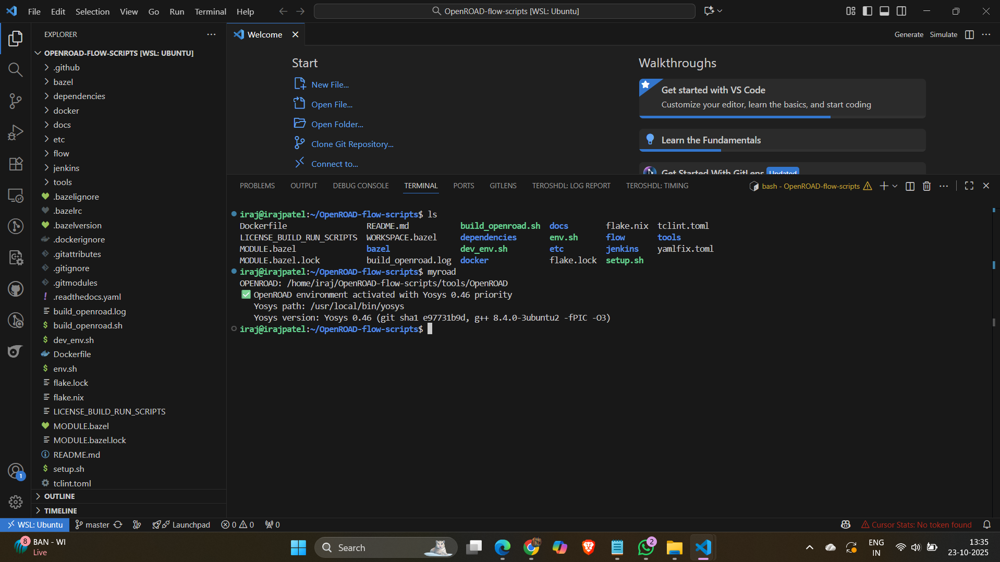
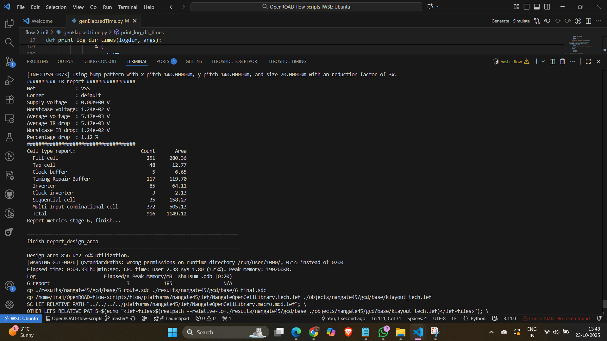
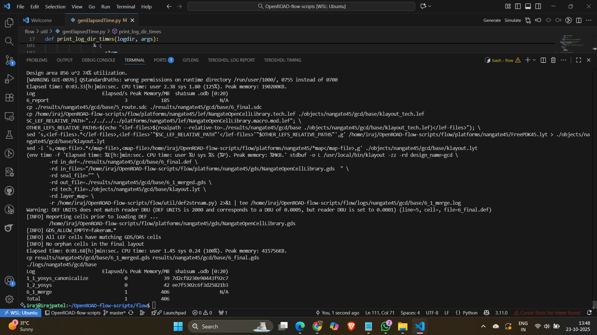
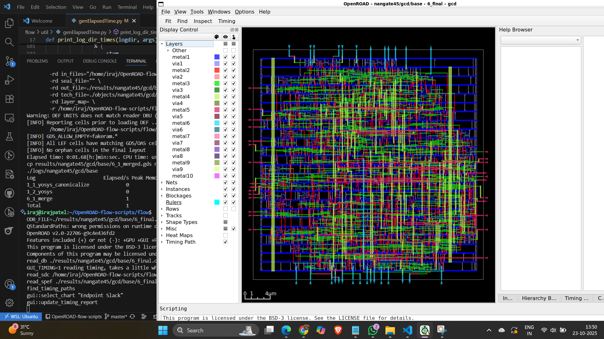
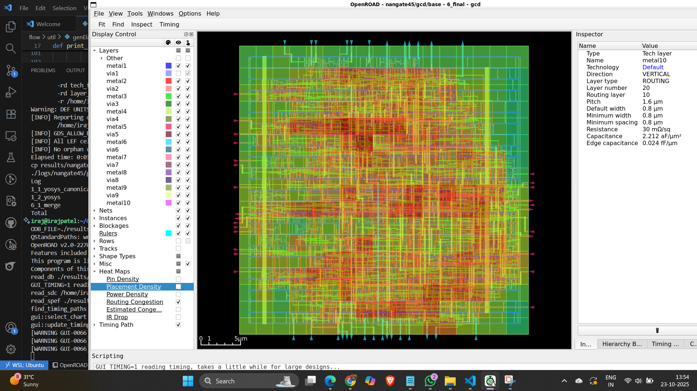

#  Week 5: OpenROAD Flow Setup - Floorplan & Placement

> **🎯 Mission:** Install OpenROAD Flow Scripts and execute **ONLY** Floorplan + Placement stages

---

## 🔄 The Physical Design Journey

```
📝 RTL Code → 🔨 Synthesis → 📐 Floorplan → 📍 Placement → 🛣️ Routing → 💾 GDSII
                              [WE ARE HERE ✋]        [STOP HERE!]
```

---

## 🌟 What is OpenROAD?

**OpenROAD** is an open-source, fully automated **RTL-to-GDSII flow** for digital IC design. It transforms your hardware description into actual silicon layout through synthesis, floorplanning, placement, clock tree synthesis, routing, and final layout generation.

✨ **Why OpenROAD?**
- 🚀 Rapid design iterations
- 🎓 Perfect for academic research
- 🏭 Industry-standard prototyping
- 🆓 Completely open-source

---

## 📂 Understanding ORFS Directory Structure

### 🗂️ Root Level Organization
```plaintext
OpenROAD-flow-scripts/
├── 🐳 docker/          → Docker-based installation & run scripts
├── 📚 docs/            → Complete documentation
├── ⚡ flow/            → Core RTL-to-GDS flow files
├── 🧪 jenkins/         → Regression tests for builds
├── 🛠️ tools/           → Required tools for the flow
├── ⚙️ etc/             → Dependency installers
└── 📌 setup_env.sh     → Environment configuration script
```

### 📁 Inside `flow/` Directory
```plaintext
flow/
├── 🎨 designs/         → Built-in design examples across technology nodes
├── 📝 Makefile         → Automated flow execution
├── 🏭 platforms/       → Technology libraries (LEF, GDS, etc.)
├── 📖 tutorials/       → Learning resources
├── 🔧 util/            → Utility scripts
└── 📜 scripts/         → Flow automation scripts
```

---

## 🚀 Installation & Execution Flow

### **Step 1️⃣: Clone the Repository**
```bash
git clone --recursive https://github.com/The-OpenROAD-Project/OpenROAD-flow-scripts
cd OpenROAD-flow-scripts
```
📥 Downloads complete OpenROAD ecosystem with all dependencies

---

### **Step 2️⃣: Run Setup Script**
```bash
sudo ./setup.sh
```
⚙️ Installs all prerequisites and configures system dependencies

---

### **Step 3️⃣: Build OpenROAD**
```bash
./build_openroad.sh --local
```
🔨 Compiles OpenROAD tools from source for your system

---

### **Step 4️⃣: Verify Installation**
```bash
source ./env.sh
yosys -help  
openroad -help
```
✅ Confirms tools are properly installed and accessible


*Terminal showing successful tool verification with visible username*

---

### **Step 5️⃣: Execute Floorplan + Placement** ⚠️
```bash
cd flow
make
```

🎯 **What Happens Here:**
- 📐 **Floorplan Stage:** Defines core area, die dimensions, I/O placement
- 📍 **Placement Stage:** Arranges standard cells to minimize delay & congestion
- ⛔ **STOPS Before Routing** (as required)


*Floorplan stage completion*


*Placement stage completion logs*

---

### **Step 6️⃣: Visualize Results in GUI** 👁️
```bash
make gui_final
```


*Main layout view showing placed standard cells*


*Visual representation of pin distribution*


*Congestion analysis (for future routing stages)*

---

## 📊 What We Accomplished

| Stage | Status | Output |
|-------|--------|--------|
| 📥 Installation | ✅ Complete | Tools verified & operational |
| 📐 Floorplan | ✅ Complete | Core area & die dimensions defined |
| 📍 Placement | ✅ Complete | Standard cells optimally placed |
| 🛣️ Routing | ⏸️ **Not Done** | Stopped as per requirements |

---

## 🎓 Key Learnings

### 🔍 **What is Floorplanning?**
- Defines chip boundaries and core area
- Places I/O pads and power rails
- Establishes placement blockages
- **Impact:** Determines overall design feasibility

### 🔍 **What is Placement?**
- Arranges standard cells within core area
- Optimizes for timing, area, and power
- Considers routing congestion
- **Impact:** Directly affects design performance

---

## 🎉 Conclusion

Successfully installed **OpenROAD Flow Scripts** and completed **Floorplan + Placement** stages. The design is now ready for Clock Tree Synthesis and Routing in future weeks. This exercise bridges the gap between logical design and physical implementation, demonstrating how RTL translates to actual silicon geometry.

**Next Steps:** CTS & Routing (Week 6) 🔜

---
