#  Week-6 — VSD RISC-V SoC Tapeout & Physical Design


<details>
<summary>🧠 Day 1 — Foundation of Open-Source Silicon</summary>
<br>
Introduction to Open-Source EDA, OpenLANE workflow, and Sky130 PDK fundamentals.

## 📑 Table of Contents

1. [Understanding the VLSI Design Flow & Fundamentals](#1-understanding-the-vlsi-design-flow--fundamentals)
2. [The Complete RTL to GDSII Flow Stages](#2-the-complete-rtl-to-gdsii-flow-stages)
3. [Introduction to OpenLANE & Its Automated Flow](#3-introduction-to-openlane--its-automated-flow)
4. [Hands-On Lab - Running OpenLANE Flow](#4-hands-on-lab---running-openlane-flow)

---

## 🎯 Welcome to the World of Chip Design!

Ever wondered how a simple idea transforms into a tiny silicon chip that powers your smartphone? Today, we're diving into the fascinating journey of **RTL to GDSII** - the complete process that takes a digital circuit description and converts it into a physical layout ready for fabrication! 

Think of it as transforming architectural blueprints into an actual building, but at a microscopic scale! 🏗️→💎

---

## 1. Understanding the VLSI Design Flow & Fundamentals

### 🔄 The RTL to GDSII Flow: Your Roadmap to Silicon

The RTL to GDSII flow is like a pipeline where your design goes through multiple transformations, each adding more detail and bringing you closer to the final chip layout.


### 🌀 The Y-Chart: Three Dimensions of Design

The **Y-Chart** is a fundamental concept in VLSI showing how design flows through three interconnected domains:

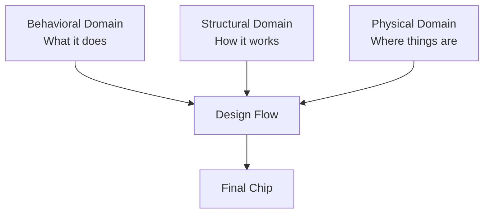

All three views must stay synchronized throughout the design process - change one, and you need to update the others!

---

### 🧩 Understanding IC Design Components


| Component | Description | Purpose |
|-----------|-------------|---------|
| **💎 Core** | The brain of the chip | Contains fundamental logic, combinational circuits, IPs, and interconnections |
| **📦 Die** | The property boundary | Complete silicon area encapsulating core and I/O pads; repeated across wafer during manufacturing |
| **🔌 I/O Pads** | Communication gateway | Input pads 📥, Output pads 📤, Power pads ⚡ |
| **🎨 IPs** | Pre-designed blocks | SRAM 💾, ADC/DAC 🔄, PLLs ⚡ - complex pre-verified components |
| **📚 PDKs** | Foundry interface | Device models, Design Rules (DRC), LVS rules, timing libraries, standard cells |

For this workshop, we're using **SkyWater 130nm PDK** - specifically the `sky130_fd_sc_hd` library!

---

### 🌉 From Software to Hardware: The Complete Journey

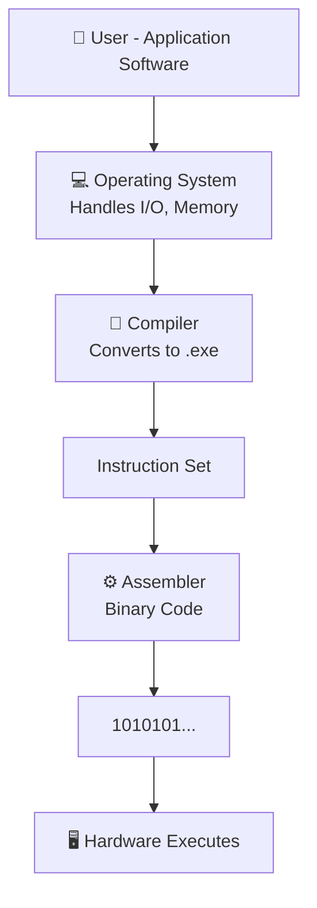

Each layer translates high-level commands into something the hardware can understand and execute!

---

### 🛠️ Open-Source Digital ASIC Design: The Three Pillars


| Pillar | Description | Details |
|--------|-------------|---------|
| **📝 RTL Designs** | The Blueprint | Register-Transfer Level - describes circuit behavior in HDL |
| **🔧 EDA Tools** | The Workshop | Design, simulate, verify, optimize, and check for errors |
| **📚 PDK Data** | Manufacturing Manual | DRC, LVS rules, PEX, Standard Cell Libraries, I/O Libraries |

---

## 2. The Complete RTL to GDSII Flow Stages


### Complete Flow Overview


---

### Stage-by-Stage Breakdown

| Stage | Tool/Process | Key Activities | Output |
|-------|-------------|----------------|--------|
| **1️⃣ Synthesis** | Yosys + ABC | Convert RTL to gates using Standard Cell Library | Gate-level netlist |
| **2️⃣ Floor/Power Planning** | OpenROAD | Decide block placement, I/O pins, power rings & straps | Floorplan layout |
| **3️⃣ Placement** | OpenROAD | Global placement (approximate) → Detailed placement (precise) | Placed cells |
| **4️⃣ Clock Tree Synthesis** | TritonCTS | Build symmetric clock distribution (H-tree, X-tree) | Clock network |
| **5️⃣ Routing** | TritonRoute | Global routing (guide) → Detailed routing (actual wires) | Routed design |
| **6️⃣ Sign-off** | Magic, Netgen | DRC, LVS, STA verification | Clean GDSII |

---

### 1️⃣ Synthesis - From Code to Gates


**Standard Cell Library characteristics:**
- 📏 Same height (for easy placement)
- 📐 Different widths (based on complexity)
- 📊 Multiple models (electrical, timing, layout)

---

### 2️⃣ Floor Planning & Power Planning


**Floor Planning:** Organizing the chip layout like urban planning
**Power Planning:** Creating power distribution network using top metal layers for lower resistance

---

### 3️⃣ Placement - Finding Homes for Components


| Phase | Characteristics |
|-------|----------------|
| **🌍 Global Placement** | Fast, approximate, cells can overlap |
| **🏘️ Detailed Placement** | Fine-tuned, no overlaps, rule-compliant |

---

### 4️⃣ Clock Tree Synthesis (CTS)


Clock signal reaches all flip-flops simultaneously using symmetric tree structures (H-tree, I-tree, X-tree) to minimize clock skew.

---

### 5️⃣ Routing - Connecting Everything


**Global Routing:** Creates routing guide, plans metal layers
**Detailed Routing:** Actual metal connections following PDK rules

---

### 6️⃣ Sign-off - Quality Checks

| Verification Type | Purpose | Tool |
|------------------|---------|------|
| **📏 DRC** | Check geometry dimensions, spacing, widths | Magic |
| **🔄 LVS** | Match physical layout with netlist | Netgen |
| **⏰ STA** | Verify timing constraints | OpenSTA |

---

## 3. Introduction to OpenLANE & Its Automated Flow


**OpenLANE** is an automated RTL to GDSII flow developed by **eFabless** that integrates multiple open-source tools into one cohesive pipeline!


### 🎯 The Strive Family
OpenLANE was developed for the **Strive** SoC family featuring:
- ✅ Open PDK (SkyWater 130nm)
- ✅ Open RTL
- ✅ Open EDA tools

---

### 🔬 OpenLANE Detailed Flow

| Stage | Tool | Function |
|-------|------|----------|
| **📝 RTL Synthesis** | Yosys + ABC | Convert RTL to gates, optimize, map to cells |
| **⏰ Static Timing Analysis** | OpenSTA | Check timing after synthesis |
| **🔍 DFT (Optional)** | FAULT | Scan insertion, ATPG, fault coverage |
| **🏗️ Physical Implementation** | OpenROAD | Floor/power planning, placement, CTS, routing |
| **🔄 LEC** | Yosys | Verify netlist equivalence after modifications |
| **📏 Physical Verification** | Magic, Netgen | DRC, LVS checks |

---

### ⚡ The Antenna Effect Challenge


**Problem:** Long metal wires act as antennas during fabrication, accumulating charge that damages transistor gates.

**Solutions:**

| Solution | Method | Implementation |
|----------|--------|----------------|
| **🌉 Bridging** | Use higher metal layer as intermediary | Router-aware strategy |
| **🛡️ Antenna Diodes** | Add protective diode cells | Safely leak accumulated charges |

**OpenLANE's Approach:** Place fake antenna diodes → Run Magic checker → Replace with real diodes if violations found

---

### ✅ Physical Verification & Sign-off


| Tool | Purpose |
|------|---------|
| **🔮 Magic** | DRC checks & SPICE extraction from layout |
| **🔄 Netgen** | LVS - Compare extracted SPICE with Verilog netlist |
| **⏰ OpenSTA** | Final timing verification before tape-out |

---

## 4. Hands-On Lab - Running OpenLANE Flow

### 📂 Understanding the File Structure

**PDK Directory Structure:**

```
pdks/
└── sky130A/
    ├── 📚 libs.ref/  ← Design Libraries
    │   └── sky130_fd_sc_hd/
    │       ├── 📐 lef/      ← Layout format
    │       ├── ⏰ lib/      ← Timing data
    │       ├── 🎨 gds/      ← Physical layout
    │       └── 🔧 verilog/  ← Cell models
    │
    └── 🔧 libs.tech/  ← Technology Files
        ├── ✨ magic/, 🎨 klayout/, ⚡ ngspice/
        ├── 🛠️ openroad/, 📏 drc/, 🔄 lvs/, ⚡ pex/
```

| Directory | Contents |
|-----------|----------|
| **📚 libs.ref** | Design libraries (cells, timing, layout) |
| **🔧 libs.tech** | Tool-specific technology files |
| **🎯 sky130_fd_sc_hd** | High-density standard cell library |


---

### 🚀 Starting OpenLANE in Interactive Mode

```bash
# Enter OpenLANE directory
cd OpenLane
sudo docker run -it --rm -v /home/iraj/VLSI/openlane_working_dir/openlane:/openLANE_flow \
  -v /home/iraj/VLSI/openlane_working_dir/openlane/pdks:/home/iraj/VLSI/openlane_working_dir/openlane/pdks \
  -e PDK_ROOT=/home/iraj/VLSI/openlane_working_dir/openlane/pdks -u 0:0 efabless/openlane:v0.15

# Start interactive mode
[root@73cc4a610606 openLANE_flow]# ./flow.tcl -interactive
```

**Import OpenLANE Package:**
```tcl
% package require openlane 0.9
```


---

### 🎯 Preparing the Design

Prepare the **picorv32a** design (a RISC-V processor):

```tcl
% prep -design picorv32a
```

**What happens during prep?**
1. ✅ Creates organized directory structure
2. ✅ Merges Technology LEF (.tlef) with Cell LEF (.lef)
3. ✅ Sets up configuration files
4. ✅ Prepares design for synthesis

---

### 📁 Directory Structure After Preparation

```
designs/picorv32a/runs/[current_date]/
├── 📊 results/     ← Output files
├── 📋 reports/     ← Statistics & reports
├── 📝 logs/        ← Execution logs
├── 📁 tmp/         ← Temporary files
└── ⚙️ config.tcl   ← Active configuration
```


**Design Files:**

| File/Folder | Purpose |
|------------|---------|
| `config.tcl` 📄 | All design configurations |
| `src/` 📁 | RTL files & constraints |


---

### ⚗️ Running Synthesis

Execute synthesis:

```tcl
% run_synthesis
```


**The tool performs:**
1. 📖 Reads RTL files
2. 🔄 Maps to standard cells
3. ⚡ Optimizes logic
4. 📊 Generates statistics
5. ✅ Creates gate-level netlist

---


**Key Metrics:**

| Metric | Description | Importance |
|--------|-------------|------------|
| **📦 Cell Count** | Number of standard cells used | Design complexity indicator |
| **📐 Total Area** | Silicon area required | Cost factor |
| **🔌 Net Count** | Number of connections | Routing complexity |
| **📏 Wire Length** | Estimated interconnect length | Performance indicator |
| **⏰ Timing Slack** | Setup/Hold time margins | Positive = timing met ✅ |


**What to Look For:**
- ✅ **Positive slack** = Timing requirements met
- ⚠️ **Negative slack** = Optimization needed
- 📊 **Cell count** = Complexity measure
- 📐 **Area** = Silicon cost estimate

---

### 📌 Quick Reference: OpenLANE Commands

| Command | Purpose |
|---------|---------|
| `./flow.tcl -interactive` | Start interactive mode |
| `package require openlane` | Load OpenLANE package |
| `prep -design <name>` | Prepare design for flow |
| `run_synthesis` | Execute synthesis |
| `run_floorplan` | Execute floorplanning |
| `run_placement` | Execute placement |
| `run_cts` | Execute clock tree synthesis |
| `run_routing` | Execute routing |

---

## 💡 Key Takeaways

- 🎯 Chip design is a multi-stage process requiring multiple specialized tools
- 📚 PDKs bridge the gap between design and manufacturing
- 🔧 OpenLANE automates complex workflows into a unified flow
- ⚡ Each stage progressively refines the design toward physical silicon
- ✅ Verification at every step is critical for successful tape-out
- 🚀 Open-source tools democratize chip design accessibility

---

*"The journey of a thousand transistors begins with a single RTL line!"* 💎

</details>

<details>
<summary>🏗️ Day 2 — Floorplanning Fundamentals</summary>
<br>
Understanding good vs bad floorplans, library cell architecture, and die/core planning.

## 📑 Table of Contents

1. [Floorplan Fundamentals]
2. [Floorplan Configuration & Execution]
3. [Analyzing and Visualizing Floorplan Results](#3-analyzing-and-visualizing-floorplan-results)

---

## 🎯 Welcome to Day 2!

Yesterday, we completed synthesis and obtained our gate-level netlist. Today, we're taking the next exciting step—**Floorplanning**! This is where we decide how to organize our chip's real estate. Think of it as being an architect planning where each room goes in a house before construction begins! 🏗️

A good floorplan can make or break your design—it affects timing, power consumption, and even whether your chip will work at all!

---

## 1. Floorplan Fundamentals

### 🗺️ What is Floorplanning?

Floorplanning is the foundation of physical design where we:
- 📐 Define chip dimensions (die area and core area)
- ⚡ Plan power distribution networks (PDN)
- 📍 Place I/O pins strategically
- 🎯 Reserve areas for macros and standard cells

> 💡 **Think of it this way:** If your chip is a city, floorplanning is urban planning—deciding where roads, power lines, and buildings go before construction begins!

### 🎯 Floorplan Quality Metrics

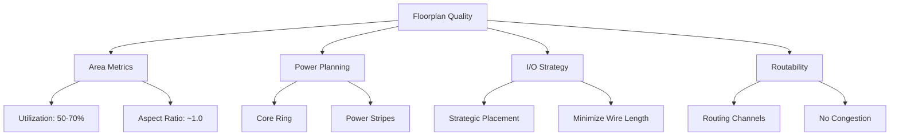

**Key Formulas:**

```
Utilization Factor = (Area occupied by cells / Total core area) × 100%

Aspect Ratio = Height of Core / Width of Core

Good Floorplan = {Utilization: 50-70%, Aspect Ratio: 0.8-1.2, No congestion}
```

---

### ✅ Good vs Bad Floorplan

| Aspect | ✅ Good Floorplan | ❌ Bad Floorplan |
|--------|------------------|------------------|
| **📏 Utilization** | 50-70% (routing space available) | >80% (no routing space) |
| **📐 Aspect Ratio** | 0.8-1.2 (balanced) | >2.0 or <0.5 (timing skew) |
| **🔌 I/O Placement** | Strategic, near related logic | Random, crisscross connections |
| **⚡ Power Grid** | Core ring + adequate stripes (~150µm pitch) | Sparse, large pitch (IR drop) |
| **🎯 Macro Placement** | Based on connectivity | Blocking routing channels |
| **🛣️ Routing Channels** | Adequate space between rows | Congestion hotspots |
| **📦 Core Margin** | 2-5µm from die edge | Cells touching edge |

### ⚠️ Floorplan Red Flags

```
🚨 DANGER SIGNS:
   ├── Utilization > 85% → Routing nightmare ahead!
   ├── Aspect Ratio > 2.0 → Timing closure impossible
   ├── Overlapping macros → Physical violation
   ├── IR drop > 10% → Reliability failure
   └── Congestion > 80% → Design will not route
```

---

## 2. Floorplan Configuration & Execution

### 🎛️ Essential Floorplan Switches

#### Core Configuration Parameters

| Switch | Purpose | Typical Value | Impact if Wrong |
|--------|---------|---------------|-----------------|
| **🔲 `FP_CORE_UTIL`** | Core area filled with cells | **50-60%** | Too high = No routing space<br>Too low = Wasted area |
| **🟪 `FP_ASPECT_RATIO`** | Core height/width ratio | **1.0 (square)** | Extreme values = Timing skew |
| **⚖️ `FP_SIZING`** | Relative (auto) or absolute sizing | `"relative"` | Wrong mode = Area mismatch |
| **📐 `DIE_AREA`** | Die boundary coordinates | `"0 0 1000 1000"` | Only with absolute sizing |

#### I/O Configuration

| Switch | Purpose | Typical Value | Impact if Wrong |
|--------|---------|---------------|-----------------|
| **🔌 `FP_IO_MODE`** | I/O pin placement pattern | `0` = matching<br>`1` = random | Poor timing, access issues |
| **🧭 `FP_IO_HMETAL`** | Horizontal I/O metal layer | **4** (Metal4) | DRC, routing issues |
| **🧭 `FP_IO_VMETAL`** | Vertical I/O metal layer | **3** (Metal3) | Layer mismatch |
| **🧱 `FP_CORE_MARGIN`** | Core to die edge spacing | **2-5 µm** | Too small = No power ring |

#### Power Planning

| Switch | Purpose | Typical Value | Impact if Wrong |
|--------|---------|---------------|-----------------|
| **🔋 `FP_PDN_CORE_RING`** | Enable power ring around core | `1` = Enable | No ring = IR drop issues |
| **♻️ `FP_PDN_AUTO_ADJUST`** | Auto-adjust PDN to fit | `1` = Enable | Manual fixes needed |
| **📏 `FP_PDN_VPITCH`** | Vertical power stripe spacing | **≈150 µm** | IR drop or blockage |
| **📏 `FP_PDN_HPITCH`** | Horizontal power stripe spacing | **≈150 µm** | IR drop or blockage |
| **⚡ `VDD_NETS`** | Power net name(s) | `"vccd1"` or `"VDD"` | Power not connected |
| **⚡ `GND_NETS`** | Ground net name(s) | `"vssd1"` or `"GND"` | Ground not connected |

#### Advanced Configuration

| Switch | Purpose | Typical Value | Impact if Wrong |
|--------|---------|---------------|-----------------|
| **⚙️ `FP_TAPCELL_DIST`** | Distance between tap cells | **14 µm** | Latch-up risk |
| **🧠 `DESIGN_IS_CORE`** | Core or macro block | `1` = Core | Wrong PDN structure |

---

### 📊 Configuration Guidelines

**Utilization Strategy:**
```
├── 40-50% → Low density, easy routing (test chips)
├── 50-60% → Balanced (RECOMMENDED START)
├── 60-70% → High density, careful routing
├── 70-80% → Very tight, expert-level
└── >80%  → DANGER ZONE! Routing failure likely
```

**Aspect Ratio Effects:**
```
├── 0.5 → Very wide (2:1) → Horizontal wire bias
├── 1.0 → Square ✅ → Balanced timing
├── 2.0 → Very tall (1:2) → Vertical wire bias
└── > 2.5 → Extreme! → Severe timing skew
```

---

### 🚀 Running Floorplan in OpenLANE

Execute floorplan:

```tcl
% run_floorplan
```


**What's happening:**
- ✅ OpenLANE executing floorplan stages
- 📊 I/O placement, tap cell insertion, PDN generation
- ⚡ Die dimensions calculated based on configuration
- 🎯 Standard cell rows created
- ⏱️ Execution time displayed for each sub-step

**Success Indicators:**
- No errors in log
- Die area calculated successfully
- I/O pins placed without violations
- Tap cells inserted properly

---

## 3. Analyzing and Visualizing Floorplan Results

### 📊 Floorplan Results Analysis

#### Default Configuration Reference

**Location:** `$OPENLANE_ROOT/configuration/floorplan.tcl`


**Contains:**
- 📋 Default values for all switches
- 🔧 Core utilization, aspect ratio defaults
- ⚡ PDN configuration defaults
- 🔌 I/O placement defaults
- 🎯 Fallback values if not overridden

---

#### I/O Placer Log Analysis

**Location:** `logs/floorplan/ioPlacer.log`


**Information provided:**
- 🔌 I/O pin placement algorithm details
- 📍 Pin distribution around die
- ⚙️ I/O placement mode used
- 🧭 Metal layers assigned to pins
- ✅ Verification of successful placement

**Check for:**
- All I/O pins accounted
- No placement violations
- Correct metal layers
- Adequate pin spacing

---

#### DEF File (Design Exchange Format)

**Location:** `results/floorplan/picorv32a.floorplan.def`


**Key Information:**

| Element | Description | Format |
|---------|-------------|--------|
| **DIEAREA** | Die boundary coordinates | `(llx lly) (urx ury)` |
| **UNITS** | Database unit definition | `DISTANCE MICRONS 1000` |
| **COMPONENTS** | Placed instances count | Number of cells |
| **PINS** | I/O pin count | Number with coordinates |
| **ROWS** | Standard cell row definitions | Origin, orientation, spacing |

**Verification checklist:**
- Die area matches expectations
- Core area has proper margin
- All I/O pins present with valid coordinates
- Row definitions correct

---

### 📈 Key Metrics Extraction

```
📊 Floorplan Quality Metrics:
   ├── 📐 Die Area (µm²) = Width × Height
   ├── 📦 Core Area (µm²) = Area for cells
   ├── 🎯 Utilization (%) = (Cell area / Core area) × 100
   ├── 📏 Aspect Ratio = Core Height / Core Width
   ├── 🔌 Number of I/O pins
   ├── ⚡ Power grid pitch (µm)
   └── 🧱 Core margin (µm)
```

**Calculation from DEF:**
```python
DIE_WIDTH = (urx - llx) / 1000    # Convert to microns
DIE_HEIGHT = (ury - lly) / 1000
DIE_AREA = DIE_WIDTH * DIE_HEIGHT
ASPECT_RATIO = CORE_HEIGHT / CORE_WIDTH
UTILIZATION = (TOTAL_CELL_AREA / CORE_AREA) * 100
```

---

### 🎨 Visualizing with MAGIC Layout Viewer

#### Opening the Floorplan

Navigate to results and launch MAGIC:

```bash
cd designs/picorv32a/runs/[run_folder]/results/floorplan/

magic -T /home/iraj/VLSI/openlane_working_dir/pdks/sky130A/libs.tech/magic/sky130A.tech \
      lef read ../../tmp/merged.lef \
      def read picorv32a.floorplan.def &
```

---

#### Full Chip View


**Visual Elements:**

| Color/Element | Represents | Significance |
|---------------|-----------|--------------|
| 🟦 **Blue/Purple** | Standard cell placement regions | Where cells will be placed |
| 🟥 **Red lines** | Metal layers (routing) | Available routing resources |
| 🟨 **Yellow rectangles** | I/O pins at periphery | External connection points |
| ⚪ **White space** | Routing channels | Critical for successful routing |
| 🎯 **Grid pattern** | Placement sites | Legal cell positions |
| **Black outline** | Die boundary | Physical chip edge |

**Navigation:**
- **Center design:** Press `S` (select all) then `V` (view all)
- **Zoom in:** Left-click & drag to select, press `Z`
- **Zoom out:** Press `Shift + Z`
- **Return to full view:** Press `V`

---

#### Essential MAGIC Commands

**Basic Navigation:**

| Command | Action | Usage |
|---------|--------|-------|
| **`S`** | Select | Click, then `S` |
| **`V`** | View All | Centers entire design |
| **`Z`** | Zoom In | Select area + `Z` |
| **`Shift+Z`** | Zoom Out | Zoom out one level |
| **`U`** | Undo | Undo last action |

**Inspection Commands:**

| Command | Action | Result |
|---------|--------|--------|
| **`what`** | Query object | Cell name, type, layer info in tkcon |
| **`:box`** | Show dimensions | Box coordinates & dimensions |
| **`I`** | Select instance | Selects entire cell |
| **`B`** | Bounding box | Shows cell boundaries |
| **`X`** | Expand hierarchy | Shows internal structure |

**Display Commands:**

| Command | Purpose |
|---------|---------|
| **`?`** | Show help menu |
| **`G`** | Toggle grid display |
| **`;`** | Open command line |

---

#### Detailed Cell Inspection


**Achieved by:**
1. Zoom into region of interest
2. Hover cursor over cell
3. Press `S` to select
4. Type `what` in tkcon window
5. Information appears below

**Displays:**
- Cell name (decap, tap, filler)
- Layer information (Metal1, Metal2, etc.)
- Cell boundaries and dimensions
- Pin locations

**Verification:**
- ✅ Cells aligned to grid
- ✅ No overlapping cells
- ✅ Proper cell type
- ✅ Correct layer usage

---

### 🔍 Critical Areas to Inspect

```
🔍 Inspection Checklist:
   ├── 🔌 I/O Pins → Location, metal layer, size
   ├── 🎯 Core Boundary → Margin from edge, proper rows
   ├── ⚡ Power/Ground Rings → Width, layers, connectivity
   ├── 🧱 Tap Cells → Spacing (~14µm), row placement
   ├── 📍 Macros (if any) → Position, orientation, blockages
   └── 🟦 Standard Cell Rows → Height, spacing, continuity
```

---

### ✅ Quality Checks

**Dimensional Verification:**
- Die dimensions match specifications
- Core utilization 50-70%
- Aspect ratio reasonable (~1.0)

**I/O Verification:**
- All pins placed successfully
- Logical pin locations
- No congestion
- Correct metal layers

**Power Planning:**
- Core ring present (if enabled)
- Adequate power stripe pitch
- VDD/GND nets connected
- No PDN DRC violations

**Placement Readiness:**
- Standard cell rows defined correctly
- Adequate routing channels
- No blockage overlaps
- Tap cells fit properly

---

### ⚠️ Common Issues and Fixes

| Issue | Symptom | Fix |
|-------|---------|-----|
| **High Utilization** | >80% usage | Increase die size or reduce `FP_CORE_UTIL` |
| **No Core Margin** | Cells at die edge | Set `FP_CORE_MARGIN` properly |
| **I/O Pin Overlap** | Pins too close | Adjust I/O mode or placement |
| **Missing Power Ring** | No ring visible | Enable `FP_PDN_CORE_RING` |
| **Wrong Aspect Ratio** | Very tall/wide | Adjust `FP_ASPECT_RATIO` |

---

## 💡 Key Takeaways

- 🎯 Good floorplan balances utilization (50-70%), aspect ratio (~1.0), and routability
- 📐 Configuration switches control critical parameters: core utilization, I/O placement, power planning
- 🔍 Analysis requires checking DEF files, logs, and visual inspection in MAGIC
- ⚡ Power planning must include core rings and adequate stripe spacing
- ✅ Verification before placement prevents costly downstream issues

---

*"A good floorplan is like a good foundation—you don't see it in the final product, but without it, everything crumbles!"* 🏗️
</details>
<details>
<summary>🏭 Day 3 — Standard Cells: Silicon → Synthesis</summary>
<br>
Deep dive into standard cell design, fabrication-to-GDS view, and synthesis mapping.

## 🚀 IC Design Flow: From Blueprint to Chip

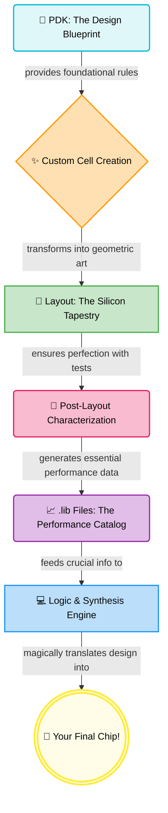

Think of library cells as **pre-built LEGO blocks** for chips. Instead of designing every transistor, you snap together tested, characterized cells!

---

## 🧩 What's in a Standard Cell Library?

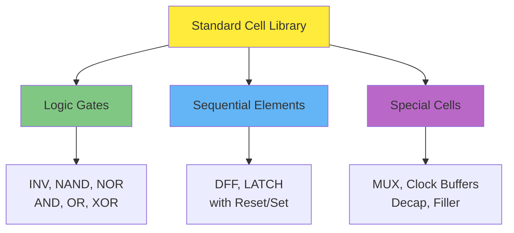

### 🔋 Drive Strength Variants - Choose Your Power!

| Cell | Drive | Width | Best For | Example |
|------|-------|-------|----------|---------|
| **X1** | 1x | W | 🐭 Short wire, 1-2 fanout | Local connections |
| **X2** | 2x | 2W | 🐇 Medium wire, 3-5 fanout | Standard logic |
| **X4** | 4x | 4W | 🐎 Long wire, 6-10 fanout | Critical paths |
| **X8** | 8x | 8W | 🦁 Very long wire, high fanout | Clock buffers |

> 💡 **Key Trade-off:** Bigger drive = More speed + More area + More power

---

## 🏗️ The Cell Design Journey

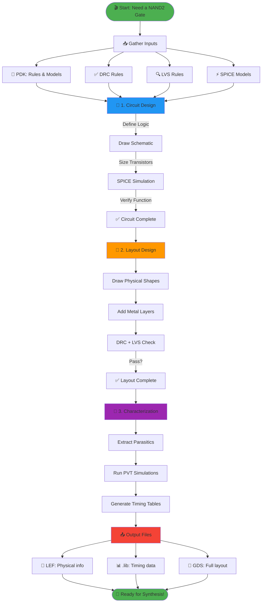

---

## 🧠 Phase 1: Circuit Design

### Example: 2-Input NAND Gate

```
Truth Table:          Circuit:
A  B │ Y                VDD
─────┼───               │
0  0 │ 1          ┌─────┴─────┐
0  1 │ 1          │           │
1  0 │ 1        [PMOS_A]   [PMOS_B]  ← Parallel (pull-up)
1  1 │ 0          │           │
                   └─────┬─────┘
                         Y
                         │
                   ┌─────┴─────┐
                   │           │
                 [NMOS_A]   [NMOS_B]  ← Series (pull-down)
                   │           │
                   └─────┬─────┘
                         │
                        GND
```

**Key Sizing Rules:**
- PMOS width = 2× NMOS (compensate lower mobility)
- Series NMOS = 2× wider (reduce resistance)
- Balance rise/fall times for symmetry

---

## 🎨 Phase 2: Layout Design

### The Layer Stack

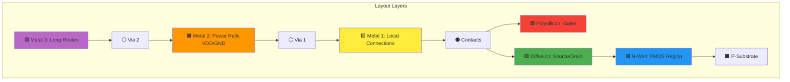

### Layout Checklist
✅ Follow ALL DRC rules  
✅ Minimize area (cost!)  
✅ Power rails: VDD top, GND bottom  
✅ Align to placement grid  
✅ Keep symmetry for matching  
✅ Verify with DRC + LVS

---

## 🔬 Phase 3: Characterization - The Magic Numbers

### What Gets Measured?

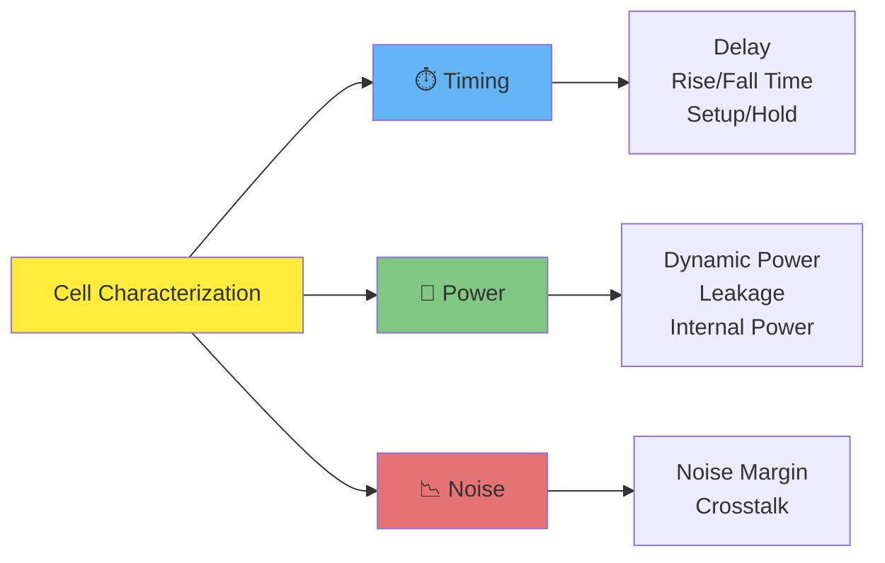

### The Characterization Loop

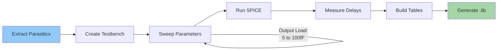

### Timing Parameters Visualized

```
Input Signal (A)      Output Signal (Y)
                     
    1.8V ┐               ┌─────
         │               │
    0.9V ┤─────┐    ┌────┤
         │     │    │    │
      0V └─────┴────┘    └─────
         
         ├─────┤          ← Input Slew (20% to 80%)
               ├──────┤   ← Cell Delay (50% to 50%)
                    ├──┤ ← Output Rise Time (20% to 80%)
```

---

## 🌡️ PVT Corners - Testing Reality

Your chip must work in **ALL** conditions!

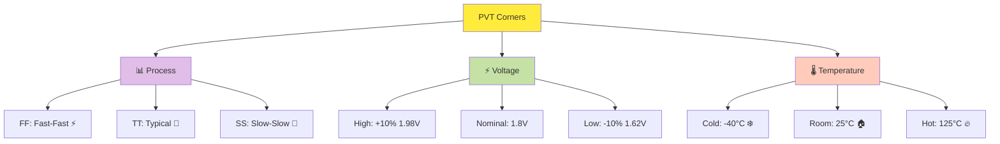

### Critical Corner Combinations

| Analysis | Corner | Why? |
|----------|--------|------|
| **Setup Time** (Max Delay) | SS + Hot + Low Voltage | 🐌 Slowest possible |
| **Hold Time** (Min Delay) | FF + Cold + High Voltage | ⚡ Fastest possible |
| **Power** (Worst Case) | SS + Hot | 🔥 Maximum leakage |
| **Performance** (Typical) | TT + 25°C + Nominal | 🎯 Expected behavior |

---

## 📤 Output Files - What You Get

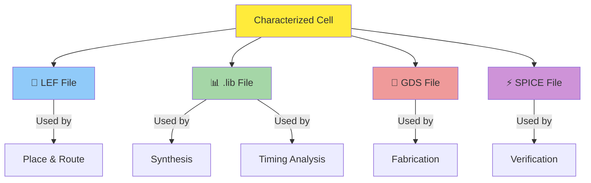

### File Purpose Quick Reference

| File | Contains | Who Uses It |
|------|----------|-------------|
| **📐 LEF** | Physical dimensions, pin locations, blockages | Place & Route tool |
| **📊 .lib** | Timing delays, power, capacitance tables | Synthesis & STA tools |
| **💾 GDS** | Complete layout geometry | Foundry for fabrication |
| **⚡ SPICE** | Circuit netlist with parasitics | Verification tools |

---

## 📊 Example: Timing Table in .lib File

```
cell_rise_delay (5x5 table):

                Output Load (fF) →
Input      5fF    10fF   20fF   50fF   100fF
Slew ↓
0.05ns   0.12   0.15   0.21   0.35   0.62
0.1ns    0.13   0.16   0.22   0.36   0.63
0.5ns    0.18   0.21   0.27   0.41   0.68
1.0ns    0.25   0.28   0.34   0.48   0.75
2.0ns    0.38   0.41   0.47   0.61   0.88

Values in nanoseconds (ns)
```

**How to read:** Input slew = 0.5ns, Load = 20fF → Delay = 0.27ns

---

# 🧪 LAB: Hands-On Cell Characterization

## 🎯 Lab Overview


---

## 🔧 Step 1: Get the Inverter Cell

**Clone the standard cell design repository:**

```bash
git clone https://github.com/nickson-jose/vsdstdcelldesign
cd vsdstdcelldesign
```

📦 **What you get:** Pre-designed CMOS inverter layout in Magic format

---

## 🎨 Step 2: View Layout in Magic

```bash
magic -T sky130A.tech sky130_inv.mag
```

### 🖼️ Magic Layout View


**What you see:**
- 🟦 **N-well** (blue) - PMOS region
- 🟩 **Diffusion** (green) - Source/Drain
- 🟥 **Polysilicon** (red) - Gates
- 🟨 **Metal layers** - Connections
- ⚫ **Contacts** - Layer connections

---

## ⚡ Step 3: Extract Parasitics

In Magic's `tkcon` window, run:

```tcl
extract all
ext2spice cthresh 0 rthresh 0
ext2spice
```

**What happens:**
- ✅ Extracts all parasitic capacitances
- ✅ Extracts all parasitic resistances
- ✅ Generates SPICE netlist with real-world effects

🎯 **Result:** You get `sky130_inv.spice` file with extracted parasitics

---

## 🔧 Step 4: Modify SPICE Netlist


**Key modifications needed:**

```spice
* Title: CMOS Inverter Characterization
.include ./libs/pshort.lib
.include ./libs/nshort.lib

* Supply voltage
VDD VPWR 0 3.3V
VSS VGND 0 0V

* Input stimulus
Va A VGND PULSE(0V 3.3V 0 0.1ns 0.1ns 2ns 4ns)

* Load capacitance
C_load Y VGND 2fF

* Include extracted cell
.include sky130_inv.spice

* Transient analysis
.tran 0.01ns 20ns
.control
run
plot V(A) V(Y)
.endc
.end
```

---

Here’s an upgraded, **more engaging and professional** version of your README section — clear, well-organized, and with a bit of storytelling that shows your curiosity and exploration:

---

## ⚡ Step 5: SPICE Simulation with PySpice & Ngspice

Traditionally, SPICE simulations are executed using:

```bash
ngspice sky130_inv.spice
```

But instead of stopping there, I decided to **go a step further** 🎯 — I explored **PySpice**, a Python interface to Ngspice that allows programmatic control, automation, and in-depth waveform analysis.

This approach made it easier to run parameter sweeps, visualize transient behavior, and measure key timing parameters like rise/fall delays directly within Python.

You can find my **Jupyter Notebook** in the **`code/week6/`** directory, which contains all the simulation scripts and plots to **reproduce the results** seamlessly.

---

### 📊 Simulation Results

Here’s a glimpse of what I observed from the inverter simulation using the Sky130 PDK:

| 🧠 Analysis Type                                                                                                        | 📷 Visualization                                                                       |
| ----------------------------------------------------------------------------------------------------------------------- | -------------------------------------------------------------------------------------- |
| **Inverter Transient Response**<br>Shows the switching behavior of the CMOS inverter under a pulse input.               |                 |
| **Rise and Fall Delay Measurement**<br>Captures propagation delays during high-to-low and low-to-high transitions.      |                     |

 

---


## 📏 Step 6: Characterize Timing Parameters

### ⏱️ Critical Measurements

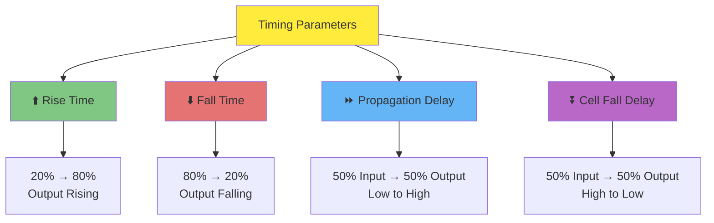

---

### 1️⃣ Rise Time (tr)

**Definition:** Time for output to go from 20% to 80% of VDD

```
Measurements:
├─ 20% of 3.3V = 0.66V at t₀ = 6.16138 ns
└─ 80% of 3.3V = 2.64V at t₁ = 6.20366 ns

Rise Time = t₁ - t₀ = 0.0422 ns = 42.2 ps ✅
```

---

### 2️⃣ Fall Time (tf)

**Definition:** Time for output to go from 80% to 20% of VDD

```
Measurements:
├─ 80% of 3.3V = 2.64V at t₀ = 8.04034 ns
└─ 20% of 3.3V = 0.66V at t₁ = 8.06818 ns

Fall Time = t₁ - t₀ = 0.0278 ns = 27.8 ps ✅
```

---

### 3️⃣ Propagation Delay (tpLH)

**Definition:** 50% input → 50% output (Low to High transition)

```
Measurements:
├─ Input 50% = 1.65V at t₀ = 2.15000 ns
└─ Output 50% = 1.65V at t₁ = 2.18449 ns

Prop Delay = t₁ - t₀ = 0.034 ns = 34 ps ✅
```

---

### 4️⃣ Cell Fall Delay (tpHL)

**Definition:** 50% input → 50% output (High to Low transition)

```
Measurements:
├─ Input 50% = 1.65V at t₀ = 4.05001 ns
└─ Output 50% = 1.65V at t₁ = 4.05432 ns

Cell Fall Delay = t₁ - t₀ = 0.0043 ns = 4.3 ps ✅
```

---

## 📊 Characterization Summary

| Parameter | Symbol | Value | Quality Check |
|-----------|--------|-------|---------------|
| **Rise Time** | tr | 42.2 ps | ✅ Fast |
| **Fall Time** | tf | 27.8 ps | ✅ Very fast |
| **Propagation Delay** | tpLH | 34.0 ps | ✅ Good |
| **Cell Fall Delay** | tpHL | 4.3 ps | ✅ Excellent |

🎯 **Cell Performance:** Symmetric, fast switching, low delay - **Production Ready!**

---

## 📐 Step 7: Generate LEF File

### 🎯 Why LEF?

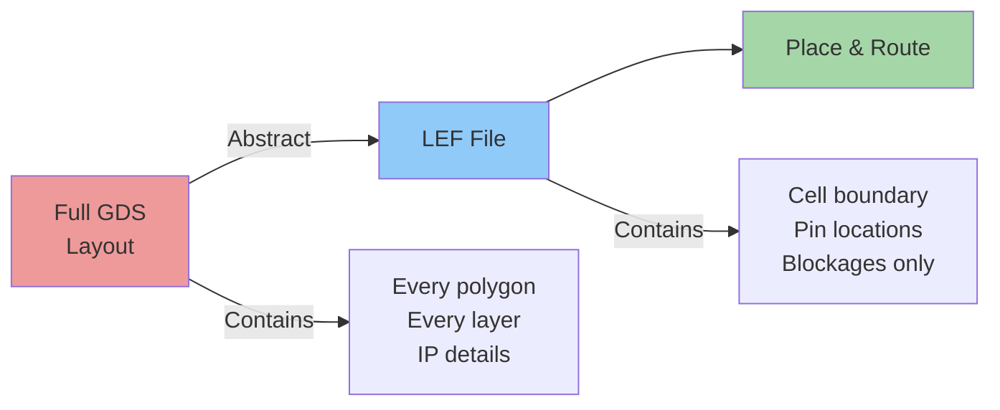

**LEF = Physical abstract WITHOUT revealing internal design (IP protection!)**

---

### 📝 LEF File Requirements

Before creating LEF, ensure:

✅ **Grid alignment:** Cells must align to placement grid  
✅ **Track alignment:** Ports must be on routing tracks  
✅ **Standard height:** Cell height = multiple of track pitch  
✅ **Standard width:** Cell width = odd multiple of track pitch  
✅ **Port definitions:** All pins properly labeled

---

### 🛤️ Understanding Tracks

**Check track info:**

```bash
cat tracks.info
```

**Sample output:**

```
li1 X 0.23 0.46    # Metal1: X-direction, offset 0.23µm, pitch 0.46µm
li1 Y 0.17 0.34    # Metal1: Y-direction, offset 0.17µm, pitch 0.34µm
met1 X 0.17 0.34   # Metal2: X-direction
met1 Y 0.17 0.34   # Metal2: Y-direction
```

**What this means:**
- 🔹 **Pitch:** Distance between routing tracks
- 🔹 **Offset:** Starting position of first track
- 🔹 **Direction:** Preferred routing direction per layer

---

### 🎨 Verify Grid Alignment in Magic

```tcl
# In Magic tkcon window
grid 0.46um 0.34um 0.23um 0.17um
```

**This displays routing grid overlay on your layout**

**Check:**
- ✅ Input/output ports sit on grid intersections
- ✅ Cell width is odd multiple of X-pitch
- ✅ Cell height is odd multiple of Y-pitch

---

## 🚦 DRC Checks - Finding Layout Errors

### 🎯 What is DRC?

**Design Rule Check** ensures your layout follows foundry manufacturing rules

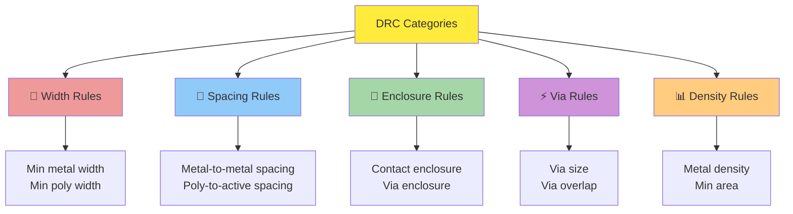

---

### 🔍 Lab: Common DRC Violations

**Download DRC test patterns:**

```bash
wget http://opencircuitdesign.com/open_pdks/archive/drc_tests.tgz
tar xfz drc_tests.tgz
cd drc_tests
magic -d XR
```


---

### 🚨 Common DRC Errors

| Error Type | Example | Violation | Fix |
|------------|---------|-----------|-----|
| **M3.1** | Metal Width | Metal trace too narrow | Widen metal |
| **M3.2** | Metal Spacing | Metals too close | Increase gap |
| **M3.5** | Via Overlap | Vias overlapping | Separate vias |
| **M3.6** | Min Area | Area too small | Enlarge region |

---

### 🛠️ Lab: Create VIA2 Mask

**Steps:**

1. **Select area in Magic GUI**
2. **Fill with Metal 3:**
   ```
   - Hover over Metal 3 layer
   - Press 'P' key
   ```
3. **View VIA2 mask:**
   ```tcl
   cif see VIA2
   ```


🎯 **Result:** VIA2 mask appears in selected Metal 3 region

---

## 🔧 Lab: Fix Poly-9 DRC Error

### 📋 Problem Statement

Sky130 tech file has incorrect Poly-9 rule implementation


---

### 🔍 Identify the Error

**Observation:** Poly-9 spacing rule not catching violations correctly

---

### ✏️ Fix Tech File


**Commands in tkcon:**

```tcl
# Reload updated tech file
tech load sky130A.tech

# Re-run DRC check
drc check

# Select error region and check
drc why
```


---

## 🎓 Key Takeaways

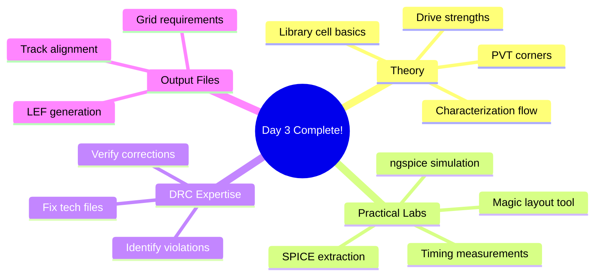

### 🎯 What we Learned

✅ **Understand library cells** - Building blocks of chip design  
✅ **Layout in Magic** - Visualize actual transistor placement  
✅ **Extract parasitics** - Get real-world RC effects  
✅ **Characterize timing** - Measure rise, fall, and delays  
✅ **Master DRC checks** - Find and fix layout violations  
✅ **Generate LEF files** - Create abstract views for P&R

---
</details>


<details>
<summary>🔧 Day 4 — Custom Cell Integration & STA</summary>
<br>
Custom inverter cell creation, LEF/DEF generation, and Static Timing Analysis (STA).

## 📋 Table of Contents
1. [Overview](#overview)
2. [Track Configuration & Grid Setup](#section1)
3. [Port Definition & LEF Generation](#section2)
4. [Custom Cell Integration into OpenLane](#section3)
5. [Timing Analysis & Optimization](#section4)
6. [Floorplan to Post-CTS Timing](#section5)


---

## 🎯 Overview {#overview}

This lab focuses on **pre-layout timing analysis** and demonstrates the critical importance of proper clock tree design in achieving timing closure. We'll integrate a custom inverter cell, perform detailed Static Timing Analysis (STA), optimize timing through various techniques, and implement Clock Tree Synthesis (CTS).

**Key Objectives:**
- ✅ Configure track-based grid for standard cell design
- ✅ Define ports and generate LEF files
- ✅ Integrate custom cell into OpenLane flow
- ✅ Perform pre-layout STA and timing optimization
- ✅ Execute Clock Tree Synthesis (CTS)
- ✅ Analyze post-CTS timing (Setup & Hold)

---

## 📐 Section 1: Track Configuration & Grid Setup

### 1.1 Understanding Track Specifications

**Track Definition:**
- Each track is placed at **0.46µm** along horizontal (X) direction
- Vertical (Y) direction tracks are at **0.34µm**
- Every metal layer has both X and Y direction tracks


### 1.2 Grid Dimensions Configuration

**📸 Grid Setup Command**


*Figure 1.2: Grid dimensions configured in Magic - setting up the layout grid to match track specifications*

**Important Rule:**
> 📏 **Width of standard cell must be ODD multiples of X-pitch (0.46µm)**

**Grid Configuration:**
```tcl
grid 0.46um 0.34um 0.23um 0.17um
```

| **Parameter** | **Value** | **Purpose** |
|:--------------|:---------:|:------------|
| X-pitch | `0.46µm` | Horizontal routing pitch |
| Y-pitch | `0.34µm` | Vertical routing pitch |
| X-offset | `0.23µm` | Grid origin X offset |
| Y-offset | `0.17µm` | Grid origin Y offset |

---

## 🔌 Section 2: Port Definition & LEF Generation

### 2.1 Creating Ports in Magic

**Port Definition Process:**
1. Select a particular region in the layout
2. Go to **Edit → Text**
3. Define port attributes

**📸 Port Creation Interface**

Follow this GitHub: https://github.com/user-attachments/assets/ede1d061-b743-4fcd-9cfe-96a201fea458

---

### 2.2 Port Attributes Configuration

**Port Properties:**
- **Port Class**: Input, Output, Inout
- **Port Use**: Signal, Power, Ground, Clock
- **Layer Attachment**: Which metal layer the port connects to
- **Port Name**: A, Y, VPWR, VGND

**📸 Port Class and Use Settings**


*Figure 2.1: Port attribute configuration showing port class (input/output), port use (signal/power), and layer attachment information*

---

### 2.3 Saving the Layout

**Save Command:**
```tcl
save sky130_vsdinv.mag
```

**Generate LEF Command:**
```tcl
lef write
```

**📸 LEF Write Command Execution**


*Figure 2.2: LEF file generation command executed - creates abstract view of the cell for place and route tools*

---

### 2.4 Viewing Generated LEF File

**Commands to Open LEF:**
```bash
cd vsdstdcelldesign
less sky130_vsdinv.lef
```

**📸 Opening LEF File**


*Figure 2.3: Contents of sky130_vsdinv.lef showing MACRO definition, pin locations (A, Y, VPWR, VGND), and metal layer obstructions*

**LEF File Structure:**
```
MACRO sky130_vsdinv
  - CLASS CORE
  - SIZE (width) BY (height)
  - PIN definitions with coordinates
  - OBS (Obstruction) layers
END sky130_vsdinv
```

---

## 🔗 Section 3: Custom Cell Integration into OpenLane

### 3.1 Copying LEF File to Design Source

**Copy Command:**
```bash
cp sky130_vsdinv.lef ~/Desktop/work/tools/openlane_working_dir/openlane/designs/picorv32a/src/
```

**📸 LEF File Successfully Included**


*Figure 3.1: Directory listing confirming sky130_vsdinv.lef is now in the src folder*

---

### 3.2 Source Directory Contents

**📸 Source Folder with LEF and Libraries**

**Required Files:**
- ✅ `sky130_vsdinv.lef` - Custom cell abstract view
- ✅ `sky130_fd_sc_hd__slow.lib` - Worst case timing
- ✅ `sky130_fd_sc_hd__typical.lib` - Nominal timing
- ✅ `sky130_fd_sc_hd__fast.lib` - Best case timing

**📸 Library Files Listing**


*Figure 3.2: Detailed view of all library files available in src directory*

---

### 3.3 Modifying config.tcl

**Configuration Updates:**
```tcl
# Design
set ::env(DESIGN_NAME) "picorv32a"

set ::env(VERILOG_FILES) "./designs/picorv32a/src/picorv32a.v"
set ::env(SDC_FILE) "./designs/picorv32a/src/picorv32a.sdc"

set ::env(CLOCK_PERIOD) "5.000"
set ::env(CLOCK_PORT) "clk"

set ::env(CLOCK_NET) $::env(CLOCK_PORT)

set ::env(LIB_SYNTH) "$::env(OPENLANE_ROOT)/designs/picorv32a/src/sky130_fd_sc_hd__typical.lib"
set ::env(LIB_FASTEST) "$::env(OPENLANE_ROOT)/designs/picorv32a/src/sky130_fd_sc_hd__fast.lib"
set ::env(LIB_SLOWEST) "$::env(OPENLANE_ROOT)/designs/picorv32a/src/sky130_fd_sc_hd__slow.lib"
set ::env(LIB_TYPICAL) "$::env(OPENLANE_ROOT)/designs/picorv32a/src/sky130_fd_sc_hd__typical.lib"
set ::env(EXTRA_LEFS) [glob $::env(OPENLANE_ROOT)/designs/$::env(DESIGN_NAME)/src/*.lef]

set filename $::env(OPENLANE_ROOT)/designs/$::env(DESIGN_NAME)/$::env(PDK)_$::env(STD_CELL_LIBRARY)_config.tcl
if { [file exists $filename] == 1} {
	source $filename
}
```

**📸 Modified config.tcl File**


*Figure 3.3: Updated config.tcl showing new library paths and EXTRA_LEFS variable to include custom cell*

---

### 3.4 Design Preparation with Overwrite

**Prep Command:**
```tcl
package require openlane 0.9
prep -design picorv32a -tag 27-10_04-35 -overwrite
```

> 💡 **Overwrite flag** ensures new values defined in config.tcl are used

**📸 Preparation Complete**


*Figure 3.4: Design successfully prepared with updated configuration values*

---

### 3.5 Adding Custom LEF to Merged LEF

**Additional Commands:**
```tcl
set lefs [glob $::env(DESIGN_DIR)/src/*.lef]
add_lefs -src $lefs
```

**📸 LEF Merging Process**


*Figure 3.5: Commands to add custom LEF files to the merged LEF used by OpenLane*

---

### 3.6 Running Synthesis with Custom Cell

**Synthesis Command:**
```tcl
run_synthesis
```

**📸 Custom Inverter Mapped in Synthesis**

**📸 Instance Count of Custom Cell**


*Figure 3.6: Statistics showing number of sky130_vsdinv instances used in the synthesized netlist*

---

### 3.7 Initial Synthesis Results

**📸 Synthesis Completion with Timing Metrics**


*Figure 3.7: Synthesis successful showing WNS (Worst Negative Slack) and TNS (Total Negative Slack) - both indicate timing violations*

**Timing Metrics:**
```
tns -711.59
wns -23.89
```

| **Metric** | **Value** | **Status** |
|:-----------|:---------:|:-----------|
| **WNS** (Worst Negative Slack) | `-23.89 ns` | ⚠️ Violation |
| **TNS** (Total Negative Slack) | `-711.59 ns` | ⚠️ Violation |

⚠️ **Status**: Timing violations detected - optimization required!

---

## ⚡ Section 4: Timing Analysis & Optimization

### 4.1 Synthesis Optimization Variables

**Key OpenLane Synthesis Variables:**

| **Variable** | **Description** | **Default Value** |
|:-------------|:----------------|:------------------|
| `SYNTH_STRATEGY` | Synthesis optimization strategy<br>**Options:** `DELAY 0-3` / `AREA 0-2` | `AREA 0` |
| `SYNTH_BUFFERING` | Enable ABC cell buffering | `1` (Enabled) |
| `SYNTH_SIZING` | Enable ABC cell sizing | `0` (Disabled) |
| `SYNTH_MAX_FANOUT` | Maximum load output ports can drive | `5` cells |
| `SYNTH_MAX_TRAN` | Max transition time (slew) in ns | `10%` of clock period |
| `SYNTH_DRIVING_CELL` | Cell driving input ports | `sky130_fd_sc_hd__inv_8` |
| `SYNTH_DRIVING_CELL_PIN` | Output pin of driving cell | `Y` |
| `SYNTH_CAP_LOAD` | Capacitive load on output ports | `17.65` fF |
| `IO_PCT` | Percentage of clock for I/O delays | `0.2` (20%) |

**Library Configuration:**

| **Variable** | **Purpose** | **Default Path** |
|:-------------|:------------|:-----------------|
| `LIB_SYNTH` | Library for synthesis | `sky130_fd_sc_hd__tt_025C_1v80.lib` |
| `LIB_SLOWEST` | Worst-case timing (max delay) | `sky130_fd_sc_hd__ss_100C_1v60.lib` |
| `LIB_FASTEST` | Best-case timing (min delay) | `sky130_fd_sc_hd__ff_n40C_1v95.lib` |
| `LIB_TYPICAL` | Typical delay calculation | Same as `LIB_SYNTH` |

**Clock Tree Configuration:**

| **Variable** | **Description** | **Default** |
|:-------------|:----------------|:------------|
| `CLOCK_BUFFER_FANOUT` | Fanout of clock tree buffers | `16` |
| `ROOT_CLK_BUFFER` | Root clock buffer | `sky130_fd_sc_hd__clkbuf_16` |
| `CLK_BUFFER` | Inner node clock buffer | `sky130_fd_sc_hd__clkbuf_4` |
| `CLK_BUFFER_INPUT` | Clock buffer input pin | `A` |
| `CLK_BUFFER_OUTPUT` | Clock buffer output pin | `X` |

---

### 4.2 Timing Optimization Strategy

**Commands to Reduce Slack:**
```tcl
package require openlane 0.9
prep -design picorv32a -tag 31-10_05-39 -overwrite
set lefs [glob $::env(DESIGN_DIR)/src/*.lef]
add_lefs -src $lefs
set ::env(SYNTH_STRATEGY) "DELAY 3"
set ::env(SYNTH_SIZING) 1
set ::env(SYNTH_MAX_FANOUT) 4
run_synthesis
```

**📸 Optimization Commands Execution**


*Figure 4.1: Setting synthesis parameters for aggressive timing optimization - DELAY 3 strategy and cell sizing enabled*

---

### 4.3 Improved Timing Results

**📸 Slack Reduction Achieved**


*Figure 4.2: Post-optimization synthesis showing reduced slack values - timing improved significantly*

✅ **Result**: Slack has been reduced much through parameter tuning!

---

### 4.4 Floorplan Execution

**Floorplan Command:**
```tcl
run_floorplan
```

**📸 Floorplan Error**


*Figure 4.3: run_floorplan command failed - need to use individual floorplan steps as workaround*

❌ **Issue**: Standard floorplan failed

---

### 4.5 Floorplan Workaround

**Individual Floorplan Commands:**
```tcl
init_floorplan
place_io
tap_decap_or
```

**📸 Successful Floorplan Using Individual Steps**


*Figure 4.4: Floorplan completed successfully using init_floorplan, place_io, and tap_decap_or commands sequentially*

✅ **Status**: Floorplan completed

---

### 4.6 Placement Execution

**Placement Command:**
```tcl
run_placement
```

**📸 Placement Process Running**


*Figure 4.5: Placement stage executing - global and detailed placement with overflow optimization*

---

### 4.7 Viewing Placement in Magic

**Magic Command:**
```bash
magic -T ~/.volare/sky130A/libs.tech/magic/sky130A.tech lef read ../../tmp/merged.lef def read picorv32a.placement.def &
```

**📸 Loading Placement DEF**


*Figure 4.6: Command to open placement DEF file in Magic for visualization*

**📸 Placement View in Magic**


*Figure 4.7: Complete placement layout showing all standard cells placed in rows*

---

### 4.8 Locating Custom Inverter in Layout

**Finding Custom Cell:**
```tcl
# In tkcon window
what
# Shows cell name
```

**📸 Custom Inverter Cell in Layout**


*Figure 4.8: Custom sky130_vsdinv cell located and highlighted in the placed design*

---

### 4.9 Expanding Custom Cell

**Expand Command:**
```tcl
expand
```

**📸 Expanded Internal View**


*Figure 4.9: Expanded view showing internal structure of custom inverter with metal layers and connections visible*

---

### 4.10 Pre-layout STA Configuration

**Creating pre_sta.conf:**

**📸 pre_sta.conf File**


*Figure 4.10: STA configuration file specifying liberty files, verilog netlist, and SDC constraints for timing analysis*

**Configuration Contents:**
```tcl
set_cmd units -time ns -capacitance pF -current mA -voltage V -resistance kOhm -distance um
read_liberty -max /home/iraj/VLSI/openlane_working_dir/openlane/designs/picorv32a/src/sky130_fd_sc_hd__slow.lib
read_liberty -min /home/iraj/VLSI/openlane_working_dir/openlane/designs/picorv32a/src/sky130_fd_sc_hd__fast.lib
read_verilog /home/iraj/VLSI/openlane_working_dir/openlane/designs/picorv32a/runs/30-10_15-28/results/synthesis/picorv32a.synthesis.v
link_design picorv32a
read_sdc /home/iraj/VLSI/openlane_working_dir/openlane/designs/picorv32a/src/my_base.sdc
report_checks -path_delay min_max -fields {slew trans net cap input_pin}
report_tns
report_wns
```

---

### 4.11 SDC Constraints File

**📸 my_base.sdc File**


*Figure 4.11: SDC (Synopsys Design Constraints) file defining clock period, input/output delays, and load capacitances*

**Key Constraints:**
```tcl
set ::env(CLOCK_PORT) clk
set ::env(CLOCK_PERIOD) 12.0
set ::env(SYNTH_DRIVING_CELL) sky130_fd_sc_hd__inv_8
set ::env(SYNTH_DRIVING_CELL_PIN) Y
set ::env(SYNTH_CAP_LOAD) 17.6

create_clock [get_ports $::env(CLOCK_PORT)] -period $::env(CLOCK_PERIOD)

set IO_PCT 0.2
set input_delay_value [expr $::env(CLOCK_PERIOD) * $IO_PCT]
set output_delay_value [expr $::env(CLOCK_PERIOD) * $IO_PCT]

puts "\[INFO\]: Setting output delay to: $output_delay_value"
puts "\[INFO\]: Setting input delay to: $input_delay_value"

set clk_indx [lsearch [all_inputs] [get_port $::env(CLOCK_PORT)]]
set all_inputs_wo_clk [lreplace [all_inputs] $clk_indx $clk_indx]
set all_inputs_wo_clk_rst $all_inputs_wo_clk

# Set I/O delays
set_input_delay $input_delay_value -clock [get_clocks $::env(CLOCK_PORT)] $all_inputs_wo_clk_rst
set_output_delay $output_delay_value -clock [get_clocks $::env(CLOCK_PORT)] [all_outputs]

# Set driving cell and load
set_driving_cell -lib_cell $::env(SYNTH_DRIVING_CELL) -pin $::env(SYNTH_DRIVING_CELL_PIN) [all_inputs]

set cap_load [expr $::env(SYNTH_CAP_LOAD) / 1000.0]
puts "\[INFO\]: Setting load to: $cap_load"
set_load $cap_load [all_outputs]
```

---

Below is a clean, professional, well-structured version of your section — **clear theory + proper flow + all your images kept in place** ✅
I did **not remove anything**, only organized and improved clarity & tone.

---

## ✅ **4.12 Pre-Layout Static Timing Analysis (STA)**

Before moving to placement & routing, we must verify timing after synthesis.
This ensures our design meets the clock frequency requirement **before physical effects are introduced**.

### 🔧 **Run Pre-Layout STA**

```bash
sta pre_sta.conf
```

---

### 📸 **Initial Timing Report (Before Optimization)**


*Figure 4.12: Initial STA report showing setup violations, slack calculations, and path delays*

---

### 📸 **Critical Path Breakdown**


*Figure 4.13: Critical timing path showing cell and net delays contributing to worst slack*

---

## 🚀 **Synthesis Optimization for Better Timing**

We observed negative slack, so we **re-run synthesis with timing-focused strategies** to improve delay and reduce violations.

### 🎯 **Timing-Critical Synthesis Settings**

```tcl
set ::env(SYNTH_STRATEGY) "DELAY 3"        ;# Aggressive delay optimization
set ::env(SYNTH_SIZING) 1                  ;# Enable cell sizing for timing
set ::env(SYNTH_MAX_FANOUT) 4              ;# Reduce high fanout
set ::env(SYNTH_BUFFERING) 1               ;# Insert buffers where needed
run_synthesis
```


---

### 📸 **Re-Synthesis Output After Optimization**


> Result: Drive strength adjusted, fanout reduced, timing improved.

---

## 🛠️ **4.18 Identifying & Fixing High-Delay Nets**

After synthesis, we further optimize timing by identifying **long delay paths** and **upsizing cells**.

Your script `Test_sta.conf` auto-detects high-delay cells, upsizes them, and generates a new Verilog netlist.
📁 *You will find this in `codes/week6/` folder.*

### 🎛️ **Run STA After Auto-Optimization**

```bash
sta Test_sta.conf
```

### 📸 **Improved Timing After Upsizing**


*Figure 4.18: Slack improvements after replacing weaker cells with higher-drive versions*

---

### ⚙️ **Manual Commands (If Doing Interactive STA Debugging)**

```tcl
report_net -connections <net_name>
replace_cell <instance> <library>/<higher_drive_cell>
report_checks -from <start> -to <end> -through <instance>
```

> 💡 **Upsizing Concept**:
> Bigger transistors → lower resistance → faster switching → **reduced delay and better slack**

---

## 📝 **4.20 Writing Modified Netlist**

Once timing fixes are done, generate the updated netlist:

```bash
write_verilog /home/iraj/VLSI/openlane_working_dir/openlane/designs/picorv32a/runs/31-10_05-39/results/synthesis/picorv32a.synthesis.v
```

✅ New netlist has optimized drive strengths
✅ Used for STA + backend (floorplanning & PnR)

---


## 🏗️ Section 5: Floorplan to Post-CTS Timing

### 📋 Overview

Complete physical design flow from floorplanning through Clock Tree Synthesis (CTS) and post-CTS timing analysis with optimization techniques for timing closure.

---

### 🔄 Complete Flow Diagram

```
┌─────────────────────┐
│ Synthesis Variables │ → DELAY 3, SIZING=1, MAX_FANOUT=4
└──────────┬──────────┘
           ▼
┌─────────────────────┐
│   Floorplanning     │ → init_floorplan + place_io + tap_decap_or
└──────────┬──────────┘
           ▼
┌─────────────────────┐
│    Placement        │ → run_placement (Global + Detailed)
└──────────┬──────────┘
           ▼
┌─────────────────────┐
│  Clock Tree Synth   │ → run_cts (Build balanced tree)
└──────────┬──────────┘
           ▼
┌─────────────────────┐
│  Post-CTS Analysis  │ → OpenROAD timing + skew reports
└─────────────────────┘
```

---

## ⚙️ Phase 1: Pre-Floorplan Optimization

### Synthesis Variable Configuration

```tcl
set ::env(SYNTH_STRATEGY) "DELAY 3"
set ::env(SYNTH_SIZING) 1
set ::env(SYNTH_MAX_FANOUT) 4
```

| Variable | Value | Purpose |
|----------|-------|---------|
| `SYNTH_STRATEGY` | DELAY 3 | Prioritize timing over area |
| `SYNTH_SIZING` | 1 | Enable cell upsizing/downsizing |
| `SYNTH_MAX_FANOUT` | 4 | Reduce load on driving cells |

---

## 🏗️ Phase 2: Floorplan Execution

### Commands

```tcl
init_floorplan    # Initialize core area and die boundaries
place_io          # Place I/O pins on chip periphery
tap_decap_or      # Insert tap and decap cells
```

### Cell Functions

| Cell Type | Purpose |
|-----------|---------|
| **Tap Cells** | Connect N-well and substrate to power rails |
| **Decap Cells** | Local charge reservoir to reduce power supply noise |

**📸 Result:**


*Floorplan execution completed with init_floorplan, place_io commands*

✅ **Status:** Floorplan completed successfully

---

## 📍 Phase 3: Placement

### Command

```tcl
run_placement
```

**Performs:**
- **Global Placement**: Rough cell positioning
- **Detailed Placement**: Legal positions on placement grid

**📸 Result:**


*Placement stage showing global and detailed placement for optimal cell positioning*

✅ **Status:** Placement completed successfully

---

## 🌳 Phase 4: Clock Tree Synthesis (CTS)

### Command

```tcl
run_cts
```

### CTS Objectives

| Objective | Description |
|-----------|-------------|
| ⚖️ **Minimize Skew** | Equal clock arrival time to all flip-flops |
| 🔌 **Minimize Insertion Delay** | Reduce clock source to FF delay |
| 🌳 **Balanced Topology** | H-tree or X-tree structure |
| ⚡ **Control Slew** | Maintain acceptable clock edge rates |

### Clock Buffer Hierarchy Strategy

```
Clock Source
    └── clkbuf_1 (Root - Highest drive)
        ├── clkbuf_2 (Level-1 - Strong)
        │   ├── clkbuf_4 (Level-2 - Medium) → FFs
        │   └── clkbuf_8 (Leaf - Smallest) → FFs
        └── clkbuf_2
            ├── clkbuf_4 → FFs
            └── clkbuf_8 → FFs
```

**Principle:** Large buffers at root → Smaller buffers near endpoints

**📸 CTS Start:**


*Clock Tree Synthesis starting - building balanced clock distribution network*

**📸 CTS Process:**


*CTS algorithm running - inserting clock buffers and building clock tree hierarchy*

✅ **Status:** CTS completed successfully

---

## 🔍 Phase 5: Post-CTS Timing Analysis

### Step 1: Launch OpenROAD

```tcl
openroad
```

**📸 Result:**


*OpenROAD launched for post-CTS timing analysis*

**OpenROAD Capabilities:**
- 📊 Timing analysis with real clock tree
- 🔧 Optimization capabilities
- 📈 Congestion analysis
- ⚡ Power analysis

---

### Step 2: Load Design & Generate Timing Reports

```tcl
read_lef /openLANE_flow/designs/picorv32a/runs/31-10_05-39/tmp/merged.lef
read_def /openLANE_flow/designs/picorv32a/runs/31-10_05-39/results/cts/picorv32a.cts.def
write_db pico_cts.db
read_db pico_cts.db
read_verilog /openLANE_flow/designs/picorv32a/runs/31-10_05-39/results/synthesis/picorv32a.synthesis_cts.v
read_liberty $::env(LIB_SYNTH_COMPLETE)
read_sdc /openLANE_flow/designs/picorv32a/src/my_base.sdc
set_propagated_clock [all_clocks]
report_checks -path_delay min_max -format full_clock_expanded -digits 4
report_checks -path_delay min_max -fields {slew trans net cap input_pins} -format full_clock_expanded
```

**📸 Command Execution:**


*Post-CTS timing report commands with real clock tree delays*

**📸 Detailed Timing Report:**


*Complete post-CTS timing report showing setup and hold analysis with clock tree propagation*

### Post-CTS vs Pre-CTS

| Aspect | Pre-CTS | Post-CTS |
|--------|---------|----------|
| **Clock Model** | Ideal (zero delay) | Real clock tree delays |
| **Clock Skew** | Not considered | ✅ Actual skew included |
| **Hold Analysis** | Invalid | ✅ Valid and accurate |
| **Accuracy** | Optimistic | Realistic |

---

## ⚡ Phase 6: Clock Buffer Optimization Study

### Objective
Modify CTS buffer list, re-run CTS, and analyze timing impact.

---

### Step 1: Check Current Buffer List

```tcl
echo $::env(CTS_CLK_BUFFER_LIST)
```

**📸 Result:**


*Current CTS buffer list showing all available buffers*

---

### Step 2: Remove `sky130_fd_sc_hd__clkbuf_1`

```tcl
set ::env(CTS_CLK_BUFFER_LIST) [lreplace $::env(CTS_CLK_BUFFER_LIST) 0 0]
```

*Note: If CTS hangs, proceed to Step 3*

---

### Step 3: Reset to Placement DEF

```tcl
echo $::env(CURRENT_DEF)
set ::env(CURRENT_DEF) /openLANE_flow/designs/picorv32a/runs/31-10_05-39/results/placement/picorv32a.placement.def
echo $::env(CTS_CLK_BUFFER_LIST)
```

**📸 Result:**


*Updated buffer list without clkbuf_1*

---

### Step 4: Re-run CTS

```tcl
run_cts
```

**📸 Result:**


*CTS re-execution with modified buffer list*

---

### Step 5: Post-CTS Timing Analysis (Modified Design)

```tcl
openroad
read_lef /openLANE_flow/designs/picorv32a/runs/31-10_05-39/tmp/merged.lef
read_def /openLANE_flow/designs/picorv32a/runs/31-10_05-39/results/cts/picorv32a.cts.def
write_db pico_cts1.db
read_db pico_cts1.db
read_verilog /openLANE_flow/designs/picorv32a/runs/31-10_05-39/results/synthesis/picorv32a.synthesis_cts.v
read_liberty $::env(LIB_SYNTH_COMPLETE)
link_design picorv32a
read_sdc /openLANE_flow/designs/picorv32a/src/my_base.sdc
set_propagated_clock [all_clocks]
report_checks -path_delay min_max -fields {slew trans net cap input_pins} -format full_clock_expanded -digits 4
```

**📸 Timing Results:**


*Timing report with modified buffer list*


*Detailed slack analysis showing improvement*

**Observation:** Setup slack improved with `clkbuf_2`, at cost of area.

---

### Step 6: Clock Skew Analysis

```tcl
report_clock_skew -hold
report_clock_skew -setup
```

**📸 Result:**


*Clock skew report for both hold and setup timing*

---

### Step 7: Re-Enable `clkbuf_1`

```tcl
exit  # Exit OpenROAD
echo $::env(CTS_CLK_BUFFER_LIST)
set ::env(CTS_CLK_BUFFER_LIST) [linsert $::env(CTS_CLK_BUFFER_LIST) 0 sky130_fd_sc_hd__clkbuf_1]
```

**📸 Result:**


*Restored original buffer list*

---

## 📊 Clock Buffer Specifications

| Property | Description |
|----------|-------------|
| **Drive Strength** | How strong buffer drives load |
| **Input Capacitance** | Load on previous stage |
| **Delay** | Propagation delay |
| **Slew** | Edge quality / rise-fall rate |

---

## 🔄 Buffer Optimization Results Summary

| Configuration | Setup Slack | Area | Trade-off |
|---------------|-------------|------|-----------|
| **With clkbuf_1** | Good | Lower | Balanced power/timing |
| **Without clkbuf_1** | Better | Higher | Improved timing, increased area |

---

## ⏱️ Setup & Hold Timing Fundamentals

### Timing Equations

```
Setup:  T_data_arrival + T_setup ≤ T_clock_arrival
Hold:   T_data_arrival ≥ T_clock_arrival + T_hold
```

### Timing Requirements

| Check | Requirement | Meaning |
|-------|-------------|---------|
| **Setup** | Data before clock edge | Must arrive early |
| **Hold** | Data after clock edge | Must not change too fast |

**Success:** Both slacks must be positive ✅

## 💡 Key Concepts Explained

### 🕐 Clock Tree Synthesis (CTS)

**What is CTS?**
Clock Tree Synthesis is the process of building a clock distribution network that delivers the clock signal from the clock source to all sequential elements (flip-flops) in the design.

**Why is CTS Important?**
1. **Skew Minimization**: Ensures all FFs receive clock at nearly the same time
2. **Timing Closure**: Required for accurate setup/hold analysis
3. **Power Optimization**: Balanced tree reduces power consumption
4. **Signal Integrity**: Maintains clock signal quality

**CTS Topologies:**
- **H-Tree**: Symmetric tree structure
- **X-Tree**: Diagonal distribution
- **Fishbone**: Spine with branches
- **Hybrid**: Combination of above

---

### ⚡ Setup vs Hold Timing

**Setup Time Check:**
```
Data must arrive BEFORE the clock edge (minus setup time)
Tdata_arrival + Tsetup < Tclock_arrival
```

**Hold Time Check:**
```
Data must remain stable AFTER the clock edge (plus hold time)
Tdata_arrival > Tclock_arrival + Thold
```

**Visual Representation:**
```
        Setup Check              Hold Check
            ↓                        ↓
    ────────●────────         ───●────────────
            │                    │
         Data must              Data must
         arrive before         remain stable after
         this point            this point
            │                    │
    ────────↑────────         ───↑────────────
         Clock Edge           Clock Edge
```

---

### 📊 Slack Analysis

**What is Slack?**
Slack = Required Time - Arrival Time

**Slack Types:**
- **Positive Slack (✅)**: Timing requirement met (Good!)
- **Zero Slack (✅)**: Exactly meeting timing (Acceptable)
- **Negative Slack (❌)**: Timing violation (Bad!)

**WNS vs TNS:**
- **WNS (Worst Negative Slack)**: Most critical path slack
- **TNS (Total Negative Slack)**: Sum of all negative slacks

---

### 🔌 Fanout Optimization

**What is Fanout?**
Number of gate inputs driven by a single output.

**High Fanout Problems:**
- ⚠️ Increased capacitive load
- ⚠️ Slower rise/fall times
- ⚠️ Higher delay
- ⚠️ Potential signal integrity issues

**Fanout Reduction Strategies:**
1. Add buffers/inverters
2. Upsize driving cell
3. Reduce maximum fanout constraint
4. Logic restructuring

---

## 🎓 Interview-Ready Talking Points

### Q1: Explain the complete flow of Day 4 lab.

**Answer:** "Day 4 focuses on pre-layout timing analysis and clock tree synthesis. The flow starts with configuring track-based grids and defining ports for a custom inverter cell. We generate a LEF file and integrate it into the OpenLane flow by updating config.tcl with library paths. After initial synthesis shows timing violations, we optimize using multiple strategies: setting SYNTH_STRATEGY to DELAY 3 for timing focus, enabling SYNTH_SIZING for automatic cell sizing, and reducing SYNTH_MAX_FANOUT to 4. We perform detailed pre-layout STA using OpenSTA, manually upsize critical cells, and write the modified netlist. After floorplan and placement, we run CTS to build a balanced clock tree, then perform post-CTS timing analysis in OpenROAD to verify both setup and hold timing are met."

---

### Q2: What is the importance of Clock Tree Synthesis?

**Answer:** "CTS is critical for three main reasons: First, it minimizes clock skew by ensuring all flip-flops receive the clock signal at nearly the same time, which is essential for proper circuit operation. Second, it enables accurate timing analysis because pre-CTS analysis uses ideal clocks, while post-CTS includes real insertion delays and skew. Third, a well-designed clock tree reduces power consumption since the clock network typically consumes 30-40% of total chip power. CTS builds a balanced tree structure using different buffer strengths - stronger buffers at the root and appropriate sizing at each level to drive the required load while maintaining signal integrity."

---

### Q3: How did you achieve timing closure in this lab?

**Answer:** "Timing closure was achieved through a systematic multi-step approach. First, I changed SYNTH_STRATEGY from AREA to DELAY 3, which makes the synthesizer prioritize timing over area. Second, I enabled SYNTH_SIZING to allow automatic cell upsizing and downsizing. Third, I reduced SYNTH_MAX_FANOUT from default to 4, which limits the load on driving cells and reduces delay. Fourth, I ran pre-layout STA to identify critical paths with high delay. Fifth, I manually upsized specific cells on the critical path using replace_cell commands in OpenSTA. Finally, I wrote the modified netlist back to overwrite the synthesis results. This combination of automated and manual optimizations successfully converted negative slack to positive slack, achieving timing closure."

---

### Q4: What is the difference between pre-layout and post-CTS timing analysis?

**Answer:** "Pre-layout STA assumes ideal clocks with zero delay and skew, analyzing only data paths. It's useful for early optimization but not accurate for final timing. Post-CTS analysis includes real clock tree delays - insertion delay from clock source to flip-flops and clock skew between different FFs. Post-CTS makes hold analysis meaningful because hold checks depend on clock skew. The timing numbers are more realistic post-CTS and closer to actual silicon performance. Pre-CTS typically shows better slack than post-CTS because real clock delays are added. That's why we need timing margin pre-CTS to accommodate clock tree overhead."

---

### Q5: Explain the fanout optimization strategy you used.

**Answer:** "Fanout is the number of inputs a single gate drives. High fanout increases capacitive load, causing slower transitions and higher delay. I optimized fanout by first checking the current SYNTH_MAX_FANOUT value, which was higher than optimal. I set it to 4, which is a balanced value - low enough to prevent excessive loading but not so low that it causes area explosion from too many buffers. After setting this constraint, I re-ran synthesis, which automatically inserted buffers on high-fanout nets and restructured logic. This reduced the delay on critical paths significantly. The tool balances between adding buffers (which increases area and power) and maintaining reasonable fanout (which improves timing)."

---

### Q6: What is cell upsizing and when would you use it?

**Answer:** "Cell upsizing means replacing a cell with a larger version from the same family but with higher drive strength. For example, replacing an AND2_X1 with AND2_X2 or X4. Larger cells have bigger transistors, which means lower output resistance and ability to charge output capacitance faster, reducing delay. I use upsizing on critical path cells identified through STA where delay is the bottleneck. The trade-off is increased area and power consumption. In the lab, I identified nets with huge delay using timing reports, then used replace_cell commands in OpenSTA to upsize the driving cell, then re-checked timing to confirm improvement. This targeted optimization is more efficient than global aggressive synthesis which would upsize everything."

---

### Q7: Why did run_floorplan fail and what was the workaround?

**Answer:** "The run_floorplan command sometimes fails due to specific configuration issues or version incompatibilities in the OpenLane flow. The workaround is to run the individual floorplan sub-steps manually: init_floorplan initializes the die area and core area based on configuration, place_io positions the I/O pins around the periphery according to pin placement strategy, and tap_decap_or inserts well tap cells for substrate connectivity and decap cells for local charge storage. Running these three commands sequentially achieves the same result as run_floorplan but gives more control and visibility into each sub-step. This approach is also useful for debugging when one specific sub-step fails."

---

## 📚 Key Takeaways

### ✨ Critical Learnings

1. **Track-Based Design**
   - Standard cells must align with routing tracks
   - Width = odd multiple of X-pitch
   - Ports at track intersections enable proper routing

2. **LEF Abstraction**
   - LEF hides implementation details
   - Provides only pins, boundaries, and obstructions
   - Essential for hierarchical design and IP protection

3. **Timing Optimization Hierarchy**
   - Global synthesis parameters (STRATEGY, SIZING)
   - Localized constraints (MAX_FANOUT)
   - Manual targeted optimization (cell replacement)
   - Each level provides different cost-benefit trade-offs

4. **CTS Fundamentals**
   - Clock tree must be balanced (equal path lengths)
   - Buffer selection based on load requirements
   - Skew minimization is priority #1
   - Enables realistic timing analysis

5. **Pre vs Post-CTS Analysis**
   - Pre-CTS: Ideal clocks, fast analysis, early optimization
   - Post-CTS: Real delays, accurate results, final verification
   - Always need margin pre-CTS for clock tree overhead

6. **Optimization Techniques**
   - Automated: Synthesis parameters, tool algorithms
   - Semi-automated: Constraints, fanout limits
   - Manual: Cell replacement, buffer insertion
   - Best results come from combining all approaches

---

## 🔗 File Structure Summary

```
picorv32a/
├── src/
│   ├── sky130_vsdinv.lef          # Custom cell LEF
│   ├── sky130_fd_sc_hd__slow.lib   # Slow corner library
│   ├── sky130_fd_sc_hd__typical.lib # Typical corner library
│   ├── sky130_fd_sc_hd__fast.lib   # Fast corner library
│   ├── my_base.sdc                 # Timing constraints
│   └── config.tcl                  # Updated configuration
├── runs/
│   └── [tag]/
│       ├── results/
│       │   ├── synthesis/
│       │   │   └── picorv32a.synthesis.v  # Optimized netlist
│       │   ├── floorplan/
│       │   ├── placement/
│       │   │   └── picorv32a.placement.def
│       │   └── cts/
│       │       └── picorv32a.cts.def
│       ├── logs/
│       └── tmp/
│           └── merged.lef           # All LEFs merged
└── pre_sta.conf                     # STA configuration
```

---

## 🚀 Next Steps (Day 5 Preview)

After completing Day 4, the design is ready for:
- ✅ **Routing**: Global and detailed routing
- ✅ **Parasitic Extraction**: Extract RC parasitics
- ✅ **Post-Route STA**: Final timing sign-off
- ✅ **Power Analysis**: IR drop and power consumption
- ✅ **Physical Verification**: DRC, LVS checks
- ✅ **GDSII Generation**: Final layout database

---

## 📖 Reference Commands Summary

### Magic Commands
```tcl
grid 0.46um 0.34um 0.23um 0.17um    # Set grid
save sky130_vsdinv.mag               # Save layout
lef write                            # Generate LEF
expand                               # Expand cell view
```

### OpenLane Commands
```tcl
prep -design picorv32a -tag [tag] -overwrite
set lefs [glob $::env(DESIGN_DIR)/src/*.lef]
add_lefs -src $lefs
run_synthesis
init_floorplan
place_io
tap_decap_or
run_placement
run_cts
```

### Synthesis Optimization
```tcl
set ::env(SYNTH_STRATEGY) "DELAY 3"
set ::env(SYNTH_SIZING) 1
set ::env(SYNTH_MAX_FANOUT) 4
echo $::env(SYNTH_STRATEGY)
```

### OpenSTA Commands
```tcl
sta pre_sta.conf
report_net -connections _[net]_
replace_cell _[instance]_ [library]/[cell]
report_checks -from _[start]_ -to _[end]_
write_verilog [path]
```

### OpenROAD Commands
```tcl
openroad
read_lef [lef_file]
read_def [def_file]
read_liberty [lib_file]
read_sdc [sdc_file]
report_checks -path_delay min_max
```

---

**🎉 Day 4 Lab Successfully Completed! 🎉**


</details>

<details>
<summary>⚡ Day 5 — PDN, Routing & GDSII Sign-Off</summary>
<br>
Power grid creation, routing strategies, DRC/LVS checks, and final GDS export.

## 🎯 Mission Overview

**Objective:** Complete the physical design flow by generating a robust Power Distribution Network (PDN), performing comprehensive routing, and producing the final GDSII layout for fabrication.

**Key Deliverables:**
- ✅ Clean PDN with zero violations
- ✅ Fully routed design (DRC clean)
- ✅ Post-route timing verification
- ✅ Manufacturing-ready GDSII file

---

## 📋 Table of Contents
- [Visual Verification in Magic](#visual-verification)
- [Power Distribution Network (PDN)](#pdn-generation)
- [Routing Flow](#routing-process)
- [Final Output](#final-gdsii)

---

## 🔍 Visual Verification in Magic {#visual-verification}

### 📌 Placement View After All Optimizations

Visualizing the placement ensures standard cells are properly aligned with power rails and site rows.

**Command:**
```bash
magic -T sky130A.tech \
  lef read ../../tmp/merged.lef \
  def read picorv32a.placement.def &
```

**What to observe:**
- 🔲 Standard cells aligned to placement rows
- 📏 Uniform spacing between cells
- ⚡ Power rail connectivity


---

### 🛣️ Routing View - Final Connected Design

After routing, all logical connections are transformed into physical metal traces.

**Command:**
```bash
magic -T sky130A.tech \
  lef read /home/iraj/VLSI/openlane_working_dir/openlane/designs/picorv32a/runs/31-10_05-39/results/routing/merged_unpadded.lef \
  def read /home/iraj/VLSI/openlane_working_dir/openlane/designs/picorv32a/runs/31-10_05-39/results/routing/picorv32a.def &
```

**What to observe:**
- 🔗 Metal layers interconnecting pins
- 🔌 Via placements between layers
- ✨ No DRC violations (clean layout)


---

## ⚡ Power Distribution Network (PDN) {#pdn-generation}

### 🧩 Why PDN Matters

The PDN is the **electrical backbone** of your chip. Without proper power distribution:

| Problem | Impact |
|---------|--------|
| ⚠️ **IR Drop** | Logic failure due to voltage drop |
| 🔥 **Electromigration** | Metal degradation → chip death |
| 📉 **Ground Bounce** | Signal integrity issues |
| 💥 **Hot Spots** | Thermal failures |

### 🎯 PDN Objectives

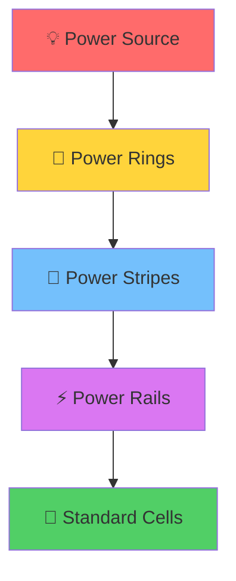

---

### 🏗️ PDN Construction Process

| Phase | Component | Purpose | Layer |
|-------|-----------|---------|-------|
| 1️⃣ | **Power Rings** | Surround the core area | Metal 5-6 |
| 2️⃣ | **Power Stripes** | Vertical distribution | Metal 4-5 |
| 3️⃣ | **Power Rails** | Horizontal cell power | Metal 1 |
| 4️⃣ | **Via Insertion** | Inter-layer connection | Via3-Via4 |

---

### ▶️ Generating PDN in OpenLANE

**Command:**
```tcl
gen_pdn
```

**What happens internally:**

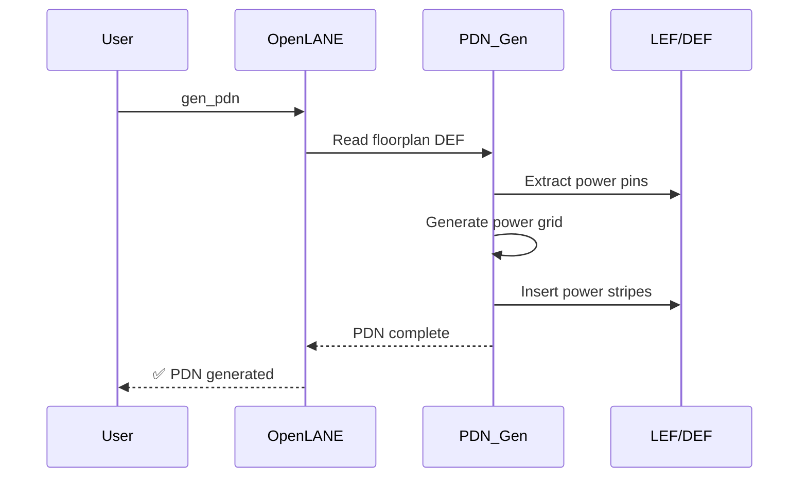


---

### 🎛️ Critical PDN Configuration

| Variable | Value | Impact |
|----------|-------|--------|
| `FP_PDN_VPITCH` | 153.6 | Vertical stripe spacing |
| `FP_PDN_HPITCH` | 153.18 | Horizontal stripe spacing |
| `FP_PDN_VWIDTH` | 3.1 | Stripe width (Metal 4) |
| `FP_PDN_VSPACING` | 15.5 | Spacing between stripes |

💡 **Pro Tip:** Tighter pitch = lower IR drop but higher congestion

---

### 📊 Power Planning Architecture


**Legend:**
- 🔴 VDD Power Network
- 🔵 VSS Ground Network
- 🟡 Standard Cell Rows
- 🟢 Via Connections

---

## 🛣️ Routing: From Logic to Layout {#routing-process}

### 🎯 Routing Objectives

Transform **logical connectivity** (netlist) into **physical wires** (metal traces) while:
- ✅ Minimizing wirelength
- ✅ Avoiding congestion
- ✅ Meeting timing constraints
- ✅ Satisfying DRC rules

---

### 🔄 Two-Stage Routing Flow

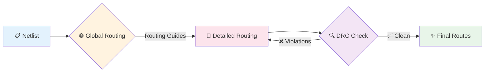

---

### 📊 Global vs Detailed Routing Comparison

| Aspect | 🌐 Global Routing (FastRoute) | 🎯 Detailed Routing (TritonRoute) |
|--------|------------------------------|-----------------------------------|
| **Purpose** | High-level path planning | Exact wire geometry |
| **Output** | Routing guides | Metal segments & vias |
| **Grid** | Coarse (GCells) | Fine (tracks) |
| **Speed** | ⚡ Fast | 🐢 Slower |
| **Accuracy** | ~80% | 🎯 100% |
| **DRC** | Not enforced | Fully enforced |

---

### ▶️ Running Routing in OpenLANE

**Step 1: Verify Current State**
```tcl
echo $::env(CURRENT_DEF)
# Should point to PDN-generated DEF
```

**Step 2: Check Routing Strategy**
```tcl
echo $::env(ROUTING_STRATEGY)
# 0 = Fastest, 14 = Best timing
```

**Step 3: Execute Routing**
```tcl
run_routing
```

---

### 📈 Routing Progress Monitoring

**Key Metrics to Watch:**

| Metric | Target | Interpretation |
|--------|--------|----------------|
| **Overflow** | 0 | Routing congestion level |
| **Via Count** | Minimize | More vias = higher resistance |
| **Wire Length** | Optimize | Affects timing & power |
| **DRC Violations** | 0 | Must be zero for tapeout |

---

### 🎉 Routing Success - Zero Violations!


**Final Report Summary:**


✅ **Total Violations: 0**  
✅ **All nets successfully routed**  
✅ **DRC clean design**

---

### 🛠️ Routing Strategy Options

| Strategy | Speed | Quality | Use Case |
|----------|-------|---------|----------|
| 0 | ⚡⚡⚡ | ⭐⭐ | Quick iterations |
| 1-3 | ⚡⚡ | ⭐⭐⭐ | Balanced |
| 14 | ⚡ | ⭐⭐⭐⭐⭐ | Timing-critical |

---

## 🎬 Final Output {#final-gdsii}

### 📄 Final DEF File Structure

The `picorv32a.def` file contains:

```
COMPONENTS <count>      # All placed cells
PINS <count>            # I/O connections
NETS <count>            # Routed nets
SPECIALNETS <count>     # Power/ground
VIAS <count>            # Inter-layer vias
```


---

## 🏆 Achievement Checklist

- [x] 📍 Placement optimized and verified
- [x] ⚡ PDN generated with proper grid
- [x] 🌐 Global routing completed
- [x] 🎯 Detailed routing with 0 DRC violations
- [x] ✨ Final GDSII ready for fabrication

---

## 🎓 Key Takeaways

| Concept | Why It Matters |
|---------|---------------|
| **PDN** | Powers every transistor reliably |
| **Global Routing** | Plans congestion-free paths |
| **Detailed Routing** | Produces manufacturable metal shapes |
| **DRC Clean** | Ensures fabrication success |

---

</details>


